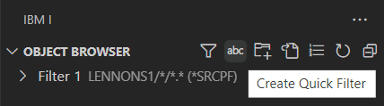

El Navegador de Objetos te permite interactuar con bibliotecas, archivos, archivos fuente, programas y otros tipos de objetos. Filtra los objetos con los que deseas trabajar creando un filtro o filtros.

### Crear el Primer Filtro

<!-- panels:start -->

<!-- div:left-panel -->

Haz clic en la indicación **+ Crear nuevo filtro** para crear tu primer filtro (o haz clic en el icono de filtro):

<!-- div:right-panel -->

<!-- panels:end -->

---

<!-- panels:start -->

<!-- div:left-panel -->

Completa el diálogo del nuevo filtro. El texto explicativo en el diálogo Crear Filtro explica las opciones.

**Haz clic en 'Guardar configuración' para crear el nuevo filtro.**

<!-- div:right-panel -->

<!-- panels:end -->

---

<!-- panels:start -->

<!-- div:left-panel -->

El ejemplo de filtro anterior enumera todos los archivos fuente en la biblioteca `LENNONS1`:

> [!NOTE]
> El nombre del filtro tiene la definición del filtro a la derecha.

<!-- div:right-panel -->

<!-- panels:end -->

---

### Crear Filtros Adicionales

<!-- panels:start -->

<!-- div:left-panel -->

Para crear otro filtro, haz clic en el icono de filtro para abrir el nuevo diálogo de filtro.

<!-- div:right-panel -->

<!-- panels:end -->

---

### Crear Filtros Rápidos

<!-- panels:start -->

<!-- div:left-panel -->

Para crear rápidamente filtros sin tener que completar el diálogo de filtro, haz clic en el icono **Crear Filtro Rápido**. Cuando se te solicite, ingresa un filtro que coincida con uno de los siguientes formatos:

- `LIB*`
- `LIB/OBJ/MBR.MBRTYPE (OBJTYPE)`

<!-- div:right-panel -->

<!-- panels:end -->

> [!NOTE]
> Todos los parámetros excepto la biblioteca son opcionales. Para los parámetros que no se proporcionen, se utilizarán los mismos valores predeterminados que en el diálogo de filtro.

### Mantener Filtros

<!-- panels:start -->

<!-- div:left-panel -->

Cambiar la definición de un filtro es rápido y fácil. Simplemente haz clic derecho en el filtro y elige **Mantener filtro** para abrir el diálogo del filtro. O elige **Eliminar filtro** para quitar la definición del filtro.

<!-- div:right-panel -->

<!-- panels:end -->

---

### Ejemplos de Filtros

**Filtro de un Solo Archivo**

**Ejemplo de miembro fuente subset**

Un solo archivo fuente que subconjunta solo algunos miembros:

**Ejemplo que no es de fuente**

Algunos programas en una biblioteca:

