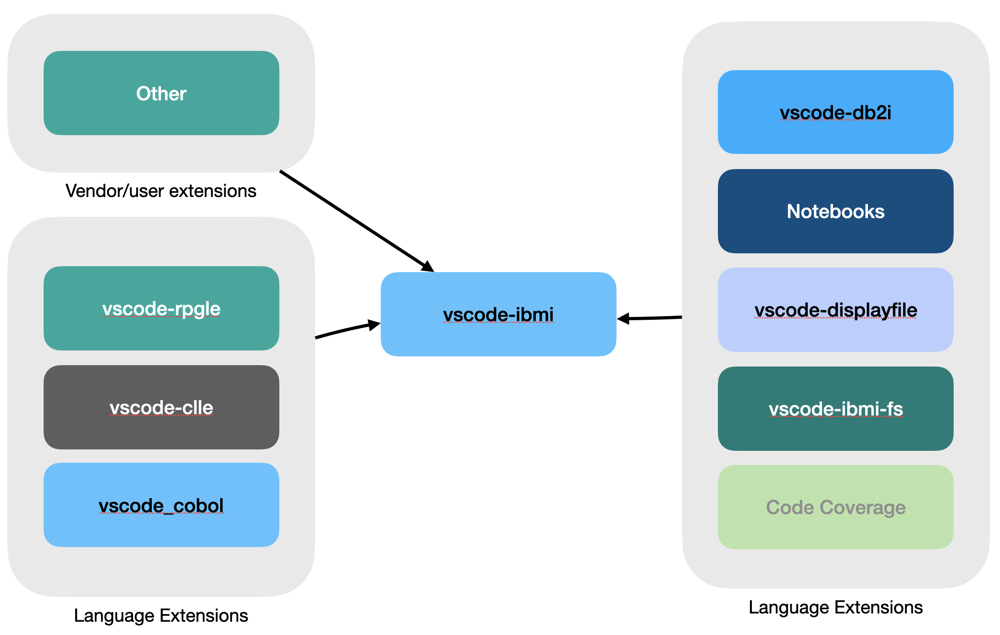

## Alcance del Proyecto

Hasta el año 2023, el proyecto Code for IBM i ha crecido considerablemente. Mientras que Code for IBM i generalmente puede referirse a muchas extensiones, en realidad se refiere a vscode-ibmi. La extensión vscode-ibmi es la extensión Code for IBM i que sirve de base para muchas otras extensiones.

## Code for IBM i

vscode-ibmi generalmente proporciona la experiencia de usuario base para el desarrollo de aplicaciones en IBM i, lo cual incluye:

* Gestionar conexiones y mantener la conexión para el usuario.
* Abrir y explorar objetos/archivos en QSYS.LIB o en el IFS.
* Mantener y ejecutar Acciones para ejecutar comandos en el servidor, generalmente para compilar código fuente y mostrar errores de compilación.
* Mantener la lista de bibliotecas del usuario, la biblioteca actual y los perfiles que se utilizarán cuando se ejecuten Acciones.
* Proporcionar una interfaz de usuario para el depurador IBM i para objetos ILE y OPM.

vscode-ibmi gestiona la conexión, pero proporciona una API que otras extensiones pueden utilizar para realizar muchas tareas:

* Ejecutar comandos ILE o PASE en el servidor de conexión.
* Analizar y mostrar resultados de archivos EVFEVENT de la mayoría de los compiladores ILE (C, C++, COBOL, RPGLE, etc.).
* Ejecutar consultas SQL en el servidor.
* Listar directorios en múltiples sistemas de archivos (incluyendo QSYS.LIB y el IFS), así como descargar/subir archivos y/o gestionar su contenido.

**vscode-ibmi no está destinado** a proporcionar herramientas para un lenguaje, tiempo de ejecución o característica específicos. Toda la funcionalidad actual es lo más genérica posible, manteniendo una experiencia liviana.

## ¿Qué hago si quiero agregar una nueva característica?

Considera dónde realmente pertenece tu característica.

* ¿Estás construyendo una característica para un lenguaje específico? Tal vez pertenezca a una de las muchas extensiones de lenguaje (vscode-rpgle, vscode-clle, etc.).
* ¿Estás construyendo una característica de UX para la base de datos? Entonces probablemente pertenezca a la extensión vscode-db2i.
* ¿Quieres poder ver el contenido de un objeto como un `BNDDIR`, `MSGF`, etc.? Entonces probablemente pertenezca a la extensión vscode-ibmi-fs.
* ¿Quieres corregir un error en la base, o agregar una característica que sea genérica para IBM i y se aplique a todos los lenguajes? Entonces tal vez pertenezca a la base (vscode-ibmi).
