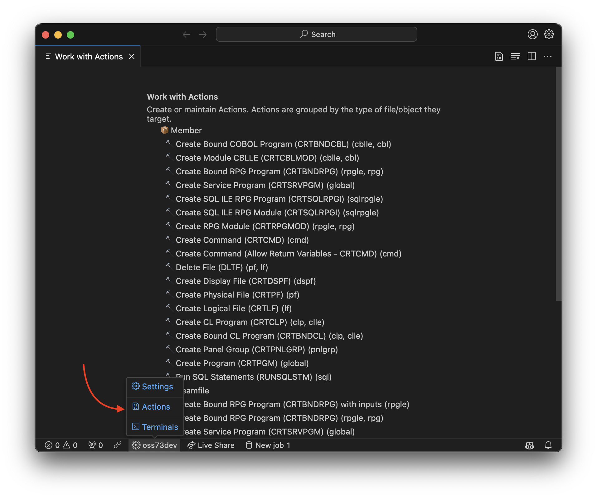
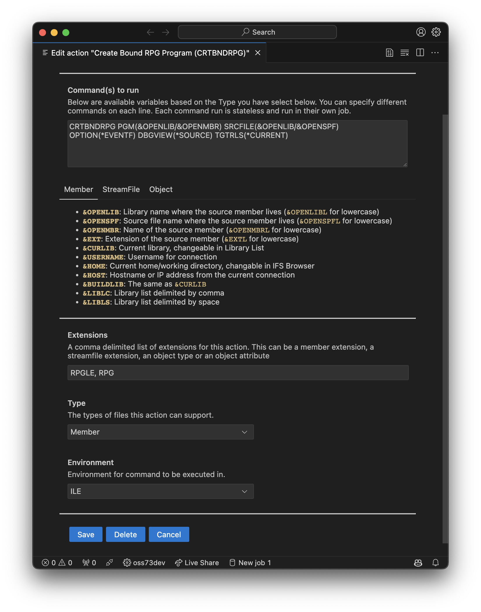

# ¿Qué son las Acciones?

Una acción se utiliza para realizar una tarea en un miembro, archivo de flujo u otro tipo de objeto. Un conjunto completo de acciones predeterminadas se carga directamente desde la extensión. También puedes cambiar o agregar fácilmente acciones, consulta *Ver/Cambiar/Agregar Acciones*, a continuación.

Las acciones son comandos definidos que se utilizan para realizar tareas en miembros, archivos de flujo y otros tipos de objetos. Por ejemplo, para compilar un archivo fuente. Las acciones se pueden ejecutar desde dos lugares diferentes:

- Mientras estás escribiendo código. Por ejemplo, para compilar un programa o módulo.
- Al hacer clic derecho en un miembro, archivo de flujo o un objeto desde el NAVEGADOR DE OBJETOS.

Se proporciona un conjunto completo de Acciones, pero puedes agregar más o cambiar las proporcionadas.

## Ejecutar una Acción

Para ejecutar una Acción, abre un miembro fuente (o archivo de flujo IFS) y presiona la tecla de acceso directo:

- Windows: Control + E
- Mac: Command + E

Esto muestra un menú desplegable de las Acciones disponibles para el archivo abierto. Usa las teclas de flecha para seleccionar qué Acción ejecutar y presiona Enter para seleccionarla.

Ejemplo: para ejecutar la Acción 'CRTBNDRPG', debes abrir un miembro fuente con la extensión `RPG` o `RPGLE`. Luego, cuando uses la tecla de acceso directo Ejecutar Acción (arriba), verás la lista de Acciones disponibles.

## Ver/Cambiar/Agregar Acciones

<!-- panels:start -->

<!-- div:left-panel -->

**Coloca el cursor sobre el nombre de tu conexión** en la barra de estado y cuando aparezca el menú, selecciona Acciones para mostrar una lista de Acciones disponibles.

- Haz clic en una acción para cambiarla.
- Agrega acciones con Nueva Acción.
- Copia una acción existente y modifícala con Duplicar.

<!-- div:right-panel -->

<!-- panels:end -->

---

<!-- panels:start -->

<!-- div:left-panel -->

Agregar o cambiar Acciones muestra la misma interfaz.

En el ejemplo, estamos editando 'Crear programa RPG vinculado (CRTBNDRPG)'. Podemos cambiar cualquiera de las propiedades.

- '**Comando a ejecutar**' es el comando que se ejecutará. Observa que tiene porciones de texto que comienzan con un `&` (y comercial) - ese texto es una "variable" que se sustituirá cuando se ejecute la acción. Los comandos pueden tener diferentes variables según el 'Tipo' (miembro, archivo de flujo, objeto) especificado. Además de las variables proporcionadas, puedes crear tus propias variables. Consulta "Variables personalizadas", a continuación.

- '**Extensiones**' define la lista de extensiones que pueden usar esta Acción. Para `CRTBNDRPG`, generalmente significa solo `RPGLE` y `RPG`, por lo que ingresaríamos: `RPGLE, RPG`.

- '**Tipos**' determina qué tipo de objeto puede ejecutar esta acción. Por ejemplo, si tu Acción solo se aplica a miembros fuente, elige 'Miembro' en el menú desplegable.

- '**Entorno**' determina dónde se debe ejecutar el comando. En este caso, `CRTBNDRPG` debe ejecutarse en el entorno ILE ya que es un comando ILE. También tienes la opción de ejecutar comandos a través de PASE o QShell.

Cuando hayas terminado, **haz clic en Guardar**. Si simplemente cierras la pestaña, nada se guardará.

<!-- div:right-panel -->

<!-- panels:end -->

---

### Almacenamiento de Acciones

Si cambias o agregas acciones como se muestra a continuación, entonces todas las acciones se guardan en la sección `code-for-ibmi.actions` en `settings.json`. También puedes editar la sección `code-for-ibmi.actions` manualmente. Si no existe, puedes crear tu propia sección `code-for-ibmi.actions` en `settings.json`.

> [!ADVERTENCIA]
> Cuando existe una sección `code-for-ibmi.actions` en `settings.json`, el conjunto de acciones se carga desde allí, no desde el conjunto predeterminado en la extensión. No recomendamos editar manualmente `settings.json` y en su lugar usar la vista de Acciones.
