# Depuración ILE

Ahora es posible depurar programas ILE dentro de Visual Studio Code. Se ha agregado una interfaz de usuario para garantizar que la configuración del Servicio de Depuración sea un proceso rápido.

## Comenzando la depuración

<!-- panels:start -->

<!-- div:left-panel -->

Después de configurar el Servicio de Depuración, iniciar una sesión de depuración está a solo un clic de distancia. Cuando tengas un código fuente activo abierto, aparecerá un nuevo botón de Depuración en la barra de navegación. Los puntos de interrupción pueden establecerse antes o durante la sesión de depuración.

<!-- div:right-panel -->

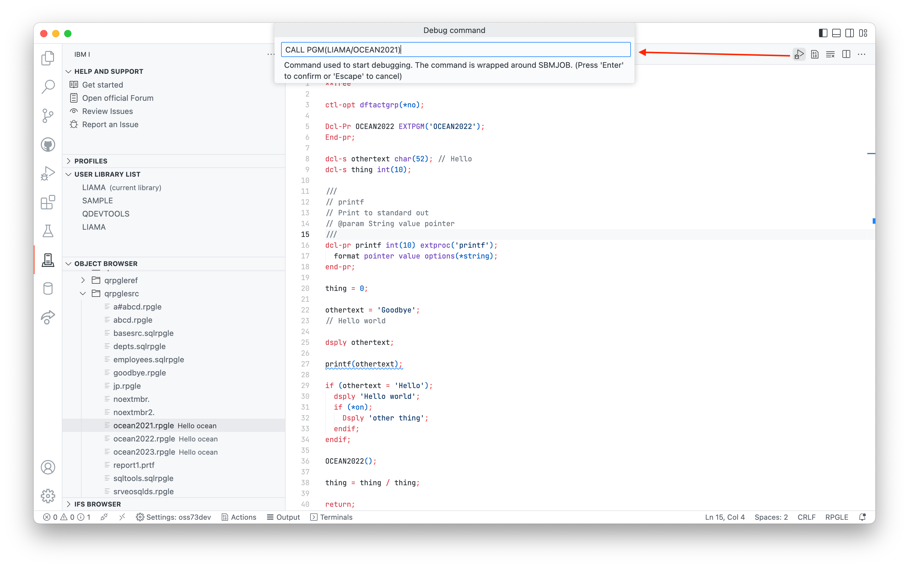

<!-- panels:end -->

---

<!-- panels:start -->

<!-- div:left-panel -->

Hacer clic en el botón de Depuración mostrará un cuadro de entrada que permitirá al usuario personalizar el comando que inicia el trabajo de depuración. Esto permite al desarrollador pasar parámetros o llamar a otro programa para iniciar la sesión de depuración.

Después de iniciar la sesión de depuración, cada sesión se detendrá al entrar. Puedes obtener más información sobre la interfaz de usuario de depuración en la [sección de acciones de depuración en la documentación de Visual Studio Code](https://code.visualstudio.com/docs/editor/debugging#_debug-actions).

<!-- div:right-panel -->

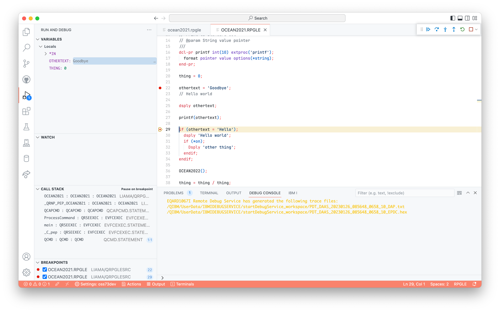

<!-- panels:end -->

---

<!-- panels:start -->

<!-- div:left-panel -->

Para depurar un programa desde el Explorador de Objetos, haz clic derecho en el objeto del programa y selecciona la opción **Depurar Programa**. Como antes, esto también mostrará un cuadro de entrada para modificar el comando que inicia el trabajo de depuración.

<!-- div:right-panel -->

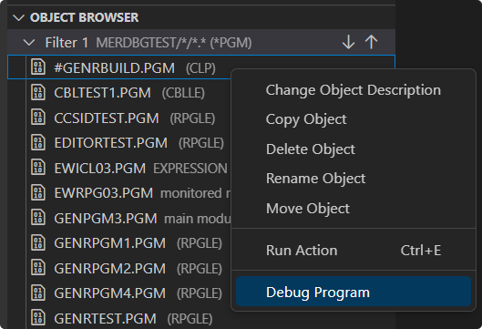

<!-- panels:end -->

# Configurando el depurador

## Requisitos generales

* PTFs
* Configuración de certificados en el servidor
   * creados en `/QIBM/ProdData/IBMiDebugService/bin/certs`
* Extensión de Depuración IBM i
   * instalada en Visual Studio Code
* Cliente local de certificados (**opcional**)
   * puede importarse con el comando 'Importar certificado local'

## PTFs requeridos

Para utilizar el Servicio de Depuración, necesitas los siguientes PTFs:

* Depurador del host en 5770SS1:
   * IBM i 7.5 PTF SI83666 y SI81035
   * IBM i 7.4 PTF SI83683 y SI81031
   * IBM i 7.3 PTF SI83692 y SI80858

Después de instalar los PTFs, la conexión dentro de Visual Studio Code deberá reiniciarse.

## Configurando y comenzando el servicio

<!-- panels:start -->

<!-- div:left-panel -->

Después de conectarte a un sistema en Code for IBM i, si los PTFs están instalados pero el servicio no está configurado (es decir, los certificados no existen), verás un aviso preguntando si quieres abrir el Asistente para configurar el Servicio de Depuración. Hacer clic en el botón abrirá el Asistente.

<!-- div:right-panel -->

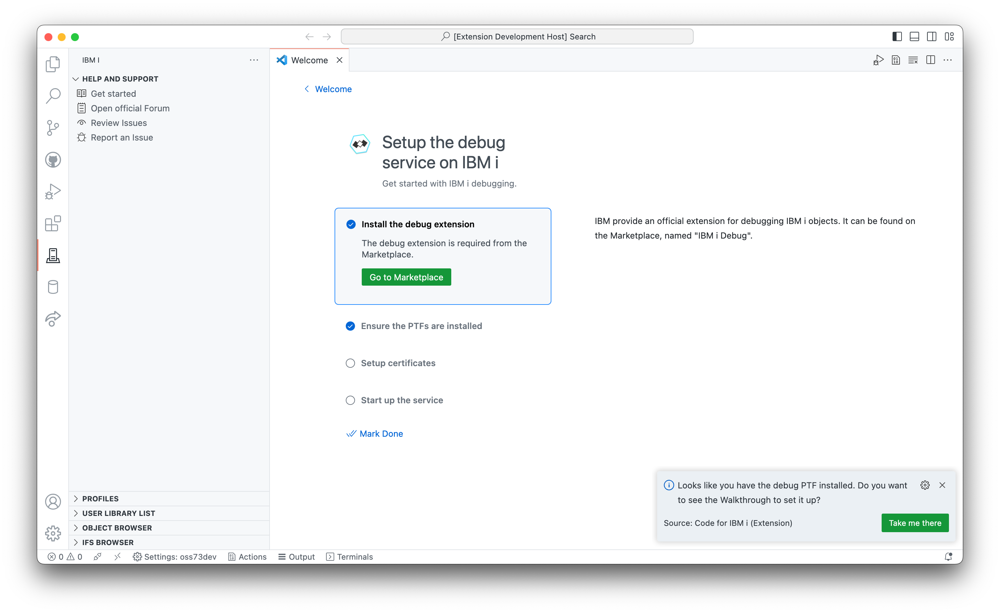

<!-- panels:end -->

---

> [!CONSEJO]
> Solo debe haber una instancia del Servicio de Depuración en ejecución. Todos los desarrolladores comparten el Servicio de Depuración.

### Generando certificados

<!-- panels:start -->

<!-- div:left-panel -->

Este Asistente puede configurar fácilmente el Servicio de Depuración y ponerlo en marcha. Los últimos pasos tienen botones para 'Generar certificados' y 'Iniciar servicio de depuración'. Ejecutarlos en orden hará todo el trabajo para configurar el servicio.

*Te pedirá que confirmes la inicialización.*

<!-- div:right-panel -->

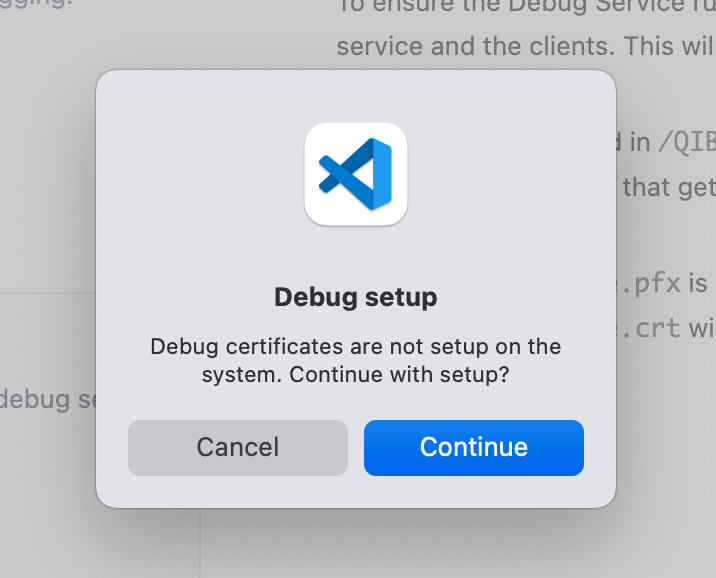

<!-- panels:end -->

---

### Iniciando el servidor

<!-- panels:start -->

<!-- div:left-panel -->

El botón 'Iniciar servicio de depuración' pondrá en marcha el Servicio de Depuración. Si el Servicio de Depuración ya está en ejecución, te preguntará si deseas finalizar la instancia existente antes de iniciar una nueva, ya que es un requisito. No se recomienda ejecutar dos instancias del Servicio de Depuración a la vez.

<!-- div:right-panel -->

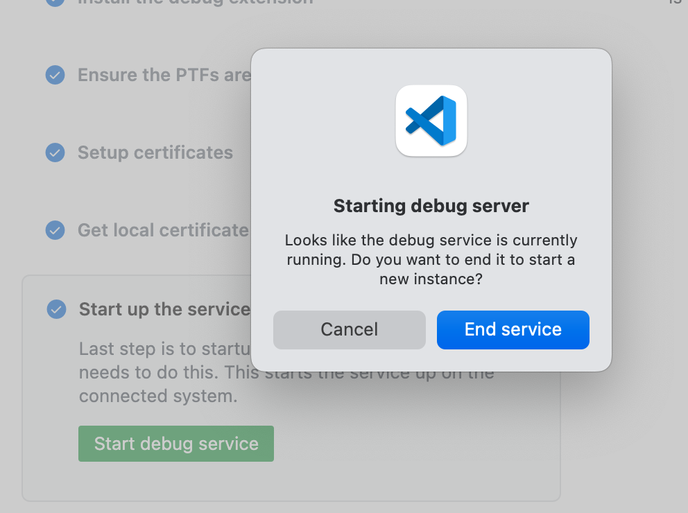

<!-- panels:end -->

<!-- panels:start -->

<!-- div:left-panel -->

También puedes iniciar el Servicio de Depuración desde el menú de comandos:

<!-- div:right-panel -->

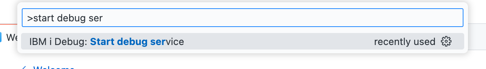

<!-- panels:end -->

---

## Puertos del Servicio de Depuración

El Servicio de Depuración depende de dos puertos de forma predeterminada:

* Puerto 8001 (puerto no seguro)
   * este puerto no se utiliza para nada en relación con la depuración, aunque es necesario para iniciar y detener el Servicio de Depuración
* Puerto 8005 (puerto seguro)
   * este puerto es utilizado por todos los clientes de depuración y es necesario para iniciar el Servicio de Depuración.

Estos puertos pueden cambiarse en `/QIBM/ProdData/IBMiDebugService/bin/DebugService.env`, en `DBGSRV_PORT` y `DBGSRV_SECURED_PORT` respectivamente.

Si se cambia `DBGSRV_SECURED_PORT`, asegúrate de:

* reiniciar el Servicio de Depuración
* cambiar el número de puerto del Servicio de Depuración en la configuración de conexión a tu nuevo puerto (`DBGSRV_SECURED_PORT`). **Cada usuario deberá hacer este paso.**

# Preguntas frecuentes

### ¿Cuál es la diferencia entre el Servicio de Depuración y el Servidor de Depuración?

<!-- panels:start -->

<!-- div:left-panel -->

Como se muestra en este diagrama, el cliente (VS Code, IBM i Debug) se conecta al Servicio de Depuración, que se comunica con el Servidor de Depuración.

* El Servicio de Depuración se inicia dentro de Visual Studio Code como se documenta anteriormente. En el futuro, también será posible iniciarlo desde Navigator for i.
* El Servidor de Depuración se inicia con `STRDBGSVR`. Puedes recibir un mensaje de error en VS Code si intentas depurar cuando el Servidor de Depuración no está en ejecución.

<!-- div:right-panel -->

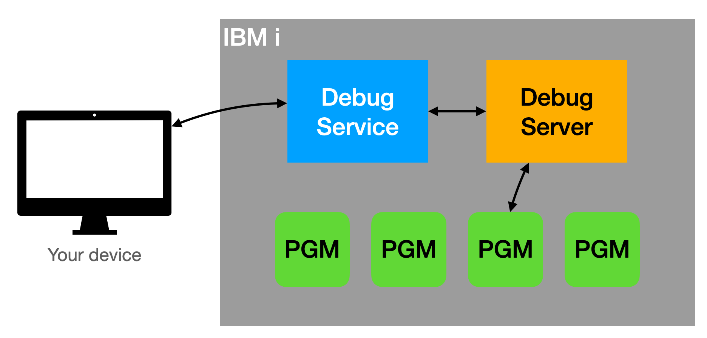

<!-- panels:end -->

### No puedo ver las variables al depurar CL

<!-- panels:start -->

<!-- div:left-panel -->

Esto es una limitación para CL. Las variables locales no se mostrarán en la vista de Variables para CL. Puedes agregar una variable local a la vista Watch para inspeccionar su valor. La limitación de CL también existe en RDi.

[Ver problema en GitHub aquí](https://github.com/halcyon-tech/vscode-ibmi/issues/1069).

<!-- div:right-panel -->

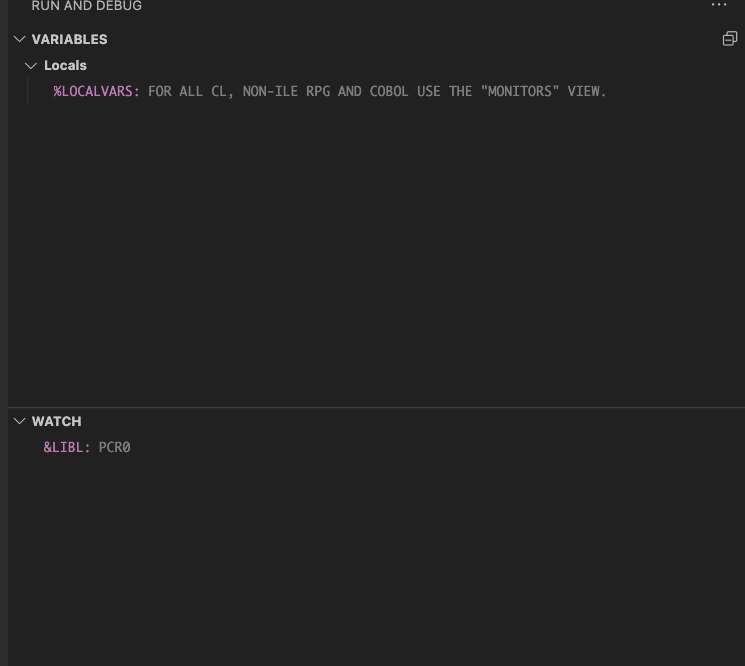

<!-- panels:end -->

# Problemas comunes

## La depuración se cuelga

Hay un [problema conocido](https://github.com/halcyon-tech/vscode-ibmi/issues/1059) que cuando inicias la depuración desde VS Code, el depurador se cuelga y no se inicia.

La solución es verificar si tienes un trabajo de depuración anterior bloqueado en `MSGW`. Puedes hacer esto con `WRKACTJOB`, o un comando similar como `WRKSBSJOB QBATCH`.

**Los usuarios ya no deberían enfrentar este problema** ya que ahora enviamos trabajos de depuración a `QSYSWRK` con `QSYSNOMAX`.

## Requisito de `STRDBGSVR`

El Servicio de Depuración que se inicia depende del Servidor de Depuración tradicional.

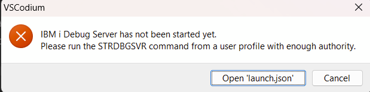

Si recibes este mensaje, haz lo que dice. Simplemente inicia el Servidor de Depuración con `STRDBGSVR` desde una pantalla verde.

## IP no en la lista de certificados

**Siempre se recomienda usar un nombre de host en la configuración de conexión para aprovechar el depurador cuando esté en modo seguro**.

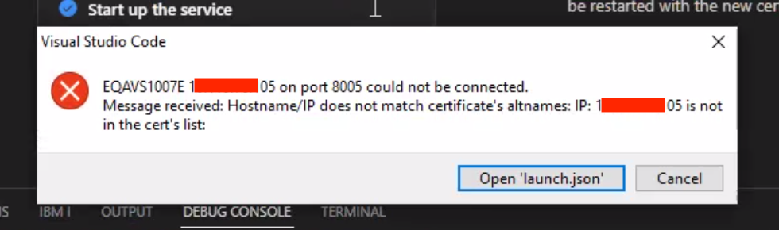

*Error que se muestra al conectar al depurador si se utiliza una dirección IP.*

Este error ocurre cuando el nombre de host utilizado para conectarse al depurador (que podría ser la dirección IP configurada en la configuración de conexión) no es el mismo que el nombre de host creado como parte del certificado.

Si estás utilizando un sistema que no tiene un nombre de host (por ejemplo, `TUSISTEMA` o `pub400.com`), se debe agregar una entrada al archivo 'hosts' de tu dispositivo. Esta entrada debe ser la misma en todos los dispositivos de tu red para asegurar que todos estén utilizando el mismo nombre de host.

* Windows: `c:\Windows\System32\Drivers\etc\hosts`
* Mac: `/etc/hosts`

Tu entrada podría parecerse a esto:


```hosts
# IP HOSTNAME
192.168.0.20 MYIBMI
```
Si descubres que has agregado la entrada de tu nombre de host local y el error aún ocurre, es posible que necesites eliminar los certificados existentes de `/QIBM/ProdData/IBMiDebugService/bin/certs` en el IFS y generarlos nuevamente en el Asistente.
