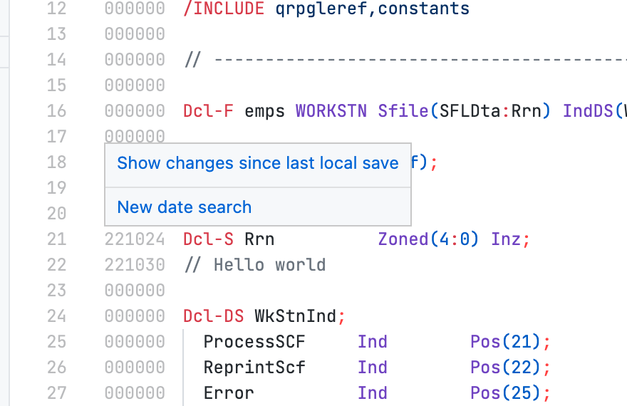
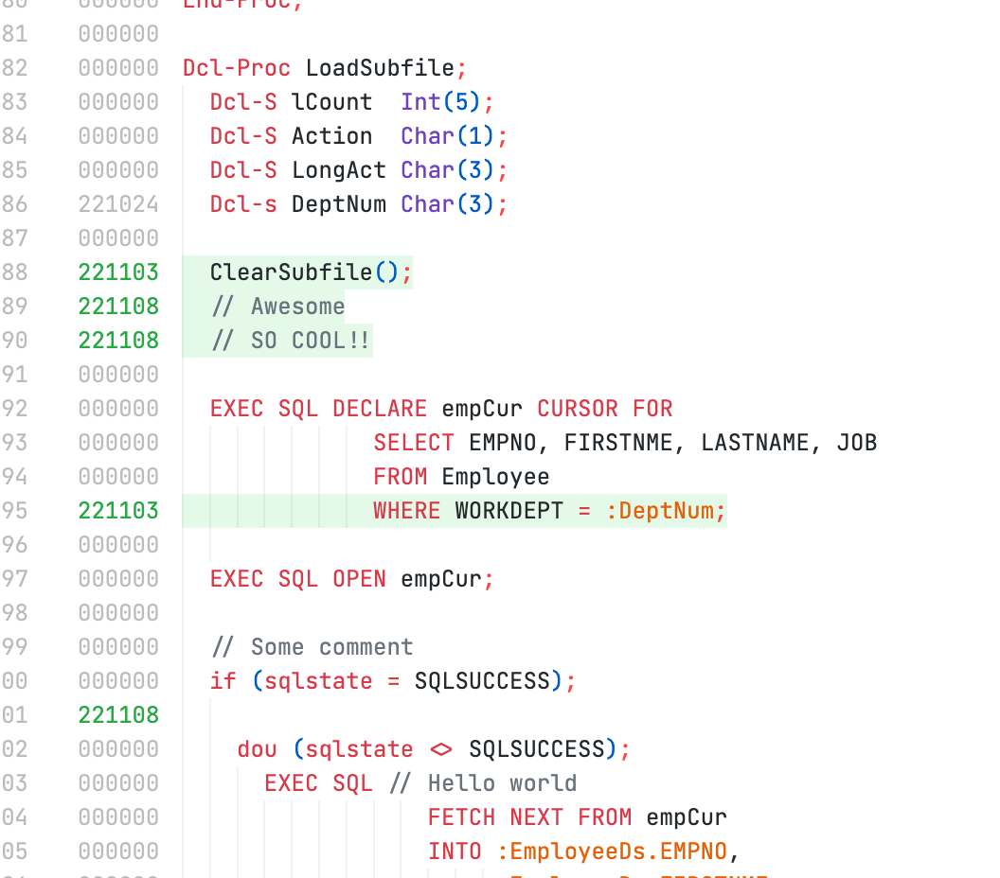

Las fechas de origen son compatibles con Code for IBM i, pero no están habilitadas de forma predeterminada.

## Prerrequisitos para usar fechas de origen
Para habilitar las fechas de origen, el valor del sistema QCCSID no debe ser 65535. Consulta [nuestra documentación sobre codificación](../tips/ccsid.md) y [la documentación de IBM sobre el valor del sistema QCCSID](https://www.ibm.com/docs/en/i/7.5?topic=faqs-i-system-value-qccsid).

## Configuración de fechas de origen

Las fechas de origen se pueden habilitar en la configuración de la conexión.

Hay tres opciones relacionadas con las fechas de origen:

* *Habilitar fechas de origen*: si la compatibilidad con las fechas de origen está habilitada para los miembros de origen
* *Modo de seguimiento de fechas de origen*: qué tipo de modo se debe utilizar para realizar un seguimiento de los cambios. Más abajo.
* *Fechas de origen en el gutter*: si las fechas de origen deben aparecer en el margen de la ventana del editor cuando están habilitadas

## Modos de seguimiento

Existen dos tipos de modos de edición para las fechas de origen

* *Modo de edición*, que es el estilo tradicional para la edición. Cuando cambia una línea, la fecha de origen de esa línea se actualizará. No comprende deshacer/rehacer. Se considera el modo 'tonto'.
* *Modo de diferencia* es el enfoque moderno para el seguimiento de fechas de origen. En lugar de realizar un seguimiento de las ediciones línea por línea, realiza [una diferencia](https://en.wikipedia.org/wiki/Diff) para comprender qué ha cambiado en el documento. Compara el documento base (desde la última apertura o última guardada) con la versión sucia más reciente del documento. Esta es una mejora de prueba. Comprende deshacer/rehacer. Se considera el modo 'más inteligente' de los dos modos.

## Filtrado de fechas de origen

<!-- panels:start -->

<!-- div:left-panel -->

Esta función solo está habilitada cuando se utiliza el seguimiento en 'Modo de diferencia', así como tener habilitado el margen de fechas de origen.

Al pasar el ratón sobre el margen, se mostrarán dos botones para:

* mostrar los cambios desde la última guardada, lo que abre una nueva vista de diferencias con los cambios
* iniciar una nueva búsqueda basada en la fecha de origen

<!-- div:right-panel -->

<!-- panels:end -->

---

<!-- panels:start -->

<!-- div:left-panel -->

Iniciar una búsqueda basada en la fecha permitirá al usuario ingresar un nuevo filtro de fecha en formato `YYMMDD`. El margen resaltará cualquier fecha en o después de la fecha que ingresó el usuario.

Al pasar el ratón sobre el margen nuevamente, se mostrará otro botón para borrar el filtro.

También hay un botón en la barra de estado que el usuario puede utilizar para iniciar un nuevo filtro de fecha.

<!-- div:right-panel -->

<!-- panels:end -->

--- 
