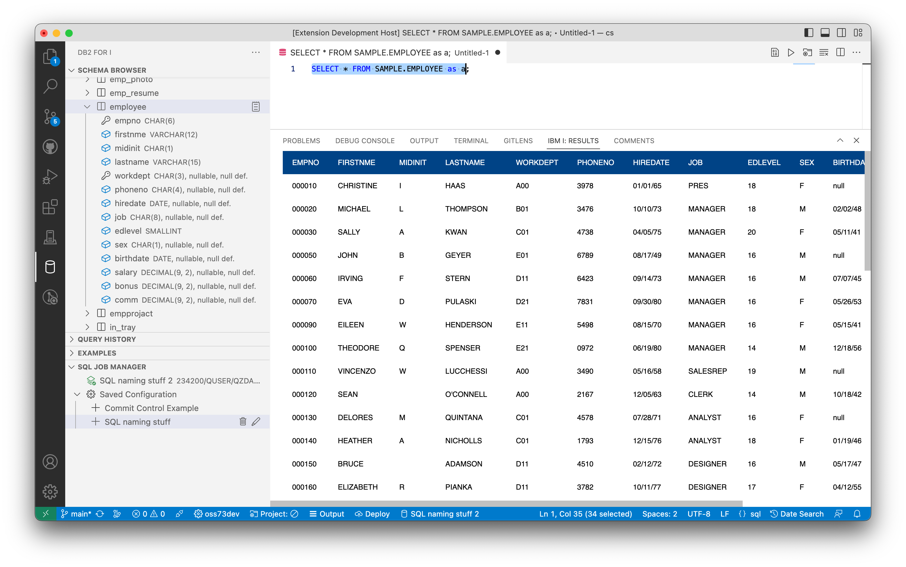
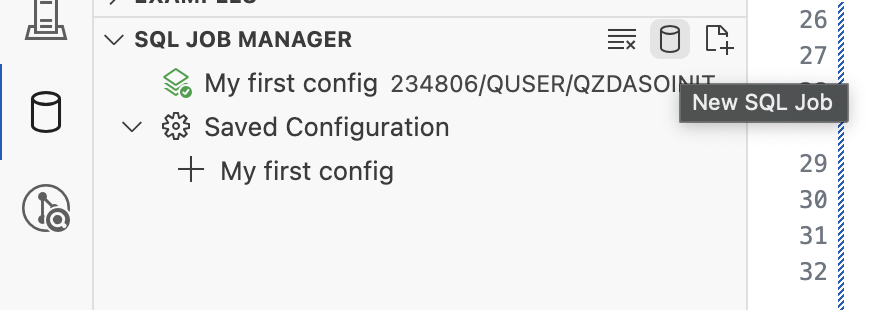

La extensión Db2 for i permite a los usuarios explorar esquemas de bases de datos, ejecutar declaraciones SQL y más en un sistema IBM i.



## Instalación

La extensión se puede [instalar desde el Marketplace](https://marketplace.visualstudio.com/items?itemName=HalcyonTechLtd.vscode-db2i) y también es parte del [Paquete de Desarrollo de IBM i](https://marketplace.visualstudio.com/items?itemName=HalcyonTechLtd.ibm-i-development-pack).

### Componente del Servidor

A partir de la versión 0.3.0, la extensión Db2 for i requiere un componente del servidor. Este componente proporciona un rendimiento mejorado y facilita la adición de funciones avanzadas. La extensión Db2 for i administra la instalación del componente del servidor cuando te conectas a un IBM i con Code for IBM i y pedirá al usuario que confirme cualquier instalación o actualización. El componente del servidor se instala en `$HOME/.vscode`, lo que significa una instalación por usuario. [El componente del servidor también es de código abierto](https://github.com/ThePrez/CodeForIBMiServer).

## Ejecución de declaraciones

Ya sea:

- Abrir un archivo `.sql` existente (miembro fuente, archivo de flujo o archivo local).
- Crear un nuevo archivo.
    1. Crear un archivo (control / comando + N).
    2. Cambiar el ID del lenguaje a `sql`.

Una vez que tengas abierto un archivo SQL, puedes:

- Mover el cursor sobre la declaración que deseas ejecutar y:
    - Utilizar el botón de reproducción en la esquina superior derecha para ejecutar.
    - Utilizar el atajo (control / comando + R) para ejecutar la declaración.

El conjunto de resultados aparecerá debajo de la declaración. A medida que te desplazas por el conjunto de resultados, se cargará más datos. Cuando ejecutas una declaración SQL, se añadirá a tu vista de Historial de Consultas, donde permanece fácilmente accesible.

Las declaraciones SQL se ejecutan utilizando el trabajo activo seleccionado en la vista SQL Job Manager.

### Procesadores SQL

Las versiones más recientes de SQL proporcionadas por Db2 for i te permiten ejecutar comandos CL en un script. También hay procesadores `json`, `csv` y `sql`, que abrirán el conjunto de resultados en el formato elegido.

```sql
-- result set as normal table
select * from sample.employee;

-- result set as JSON, will open in a new file
json: select * from sample.employee;

-- result set as CSV, will open in a new file
csv: select * from sample.employee;

-- result set as SQL insert statement
sql: select * from sample.employee;

-- run CL commands. output is directed to IBM i output channel
cl: dspffd sample/employee
```
## SQL Job Manager

Esta vista permite a los usuarios gestionar diferentes trabajos de SQL, cada uno con su propia configuración única de JDBC. Se puede crear un nuevo trabajo haciendo clic en el icono de la base de datos en la barra de título del Administrador de Trabajos de SQL. O, si aún no has creado un nuevo trabajo, hay un gran botón para realizar la misma acción.



Tu trabajo activo se marcará con un icono resaltado. **El trabajo activo se utiliza para todas las ejecuciones de declaraciones SQL,** incluidas las SQL que alimentan el Navegador de Esquemas, declaraciones SQL ejecutadas por el usuario, etc. Puedes cambiar el trabajo activo simplemente haciendo clic en el trabajo que elijas usar. Verás que el icono resaltado cambia para indicar el trabajo activo.

### Edición de la configuración del trabajo

Puedes utilizar el icono de lápiz en cualquier trabajo para editar las propiedades de JDBC. Cuando se presiona el botón "Aplicar cambios", se guardan los cambios y se reinicia el trabajo para aplicar completamente los cambios.

Puedes hacer clic con el botón derecho en cualquier trabajo para guardar esos ajustes de trabajo, lo que permite su reutilización fácil. Al utilizar la acción de clic derecho "Guardar configuración en el archivo" se te pedirá que ingreses un nombre para la configuración. Una vez guardada, verás aparecer una carpeta de 'Configuraciones Guardadas', con todas tus configuraciones guardadas. Haciendo clic en una configuración guardada lanzará un nuevo trabajo con esos ajustes predefinidos. Puedes utilizar el icono de lápiz en cualquier configuración guardada para editarla.

## Uso del Navegador de Esquemas

La extensión Db2 for i agrega una vista llamada Navegador de Esquemas que permite al usuario agregar esquemas existentes a la lista y les permite explorar objetos de base de datos existentes. Puedes hacer clic con el botón derecho en objetos SQL para mostrar más acciones. Cada tipo de objeto SQL puede tener acciones únicas.

### Ver el contenido de la tabla

Si estás utilizando el Navegador de Esquemas para explorar objetos, puedes utilizar el icono 'Ver contenido' al pasar el ratón sobre una tabla, vista o alias para generar y ejecutar una declaración SQL básica de selección.
