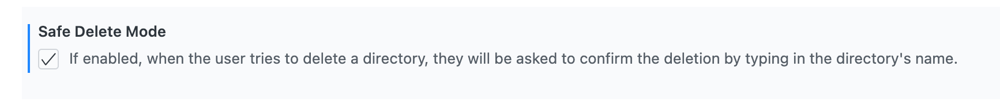

# Configuración Global

Estas son las configuraciones que afectan a la extensión (y, por ende, a *cada* conexión). Para ajustar la configuración global de la extensión, puedes:

- Utilizar la combinación estándar de teclas de VS Code <kbd>Ctrl</kbd> + <kbd>,</kbd> y hacer clic en Extensiones.
- O hacer clic en Archivo/Preferencias/Configuración y hacer clic en Extensiones.
- O presionar <kbd>F1</kbd>, buscar `Preferences: Open Settings (UI)` y hacer clic en Extensiones.

<!-- panels:start -->

<!-- div:left-panel -->

Las configuraciones para la extensión estarán bajo `Code for IBM i`

La mayoría de las configuraciones tienen una descripción autoexplicativa. Algunas tienen notas a continuación.

**No se recomienda editar manualmente el JSON. Si lo haces, reinicia/recarga VS Code para que Code for IBM i pueda aplicar los cambios.**

<!-- div:right-panel -->


<!-- panels:end -->

---

### Advertencia de eliminación de IFS (Eliminar seguro)

Si está habilitada, cuando el usuario intenta eliminar un directorio, se le pedirá que confirme la eliminación escribiendo el nombre del directorio.



### Acciones

Las acciones se pueden editar en settings.json, pero también de manera más fácil haciendo clic en **Actions** en la barra de estado. Ver *Acciones*, arriba.

### Conexiones

Las conexiones se pueden editar en settings.json, pero normalmente agregarías conexiones adicionales como en *Conectar por Primera Vez*, arriba.

Puedes utilizar las siguientes variables en cualquiera de las cadenas dentro de Conexiones:
- `${userHome}` = se reemplaza con el directorio de inicio del usuario.
- `${pathSeparator}` = se reemplaza con el separador de rutas. (Típicamente "\\" en Windows o "/" en Mac/Unix/Linux.)

### Configuración de Conexión

Estas son las diversas configuraciones relacionadas con los elementos en los navegadores, por ejemplo, la lista de archivos fuente en el NAVEGADOR DE OBJETOS. Aunque se pueden editar en settings.json, la mayoría se pueden mantener más fácilmente haciendo clic o haciendo clic derecho en un elemento en el navegador.

### Registrar la Salida de Compilación

<!-- panels:start -->

<!-- div:left-panel -->

Cuando está habilitado, los archivos de spool se registrarán desde la ejecución del comando.
Estos archivos de spool se pueden encontrar bajo la pestaña **Output** (Ver->Output, o Ctrl + Shift + U). Selecciona **IBM i Output** en el menú desplegable a la derecha.

<!-- div:right-panel -->


<!-- panels:end -->

Puedes borrar la pestaña de Output usando el ícono **Clear Output** en la esquina derecha.


Puedes cambiar el tamaño de fuente en la pestaña OUTPUT en tu settings.json de la siguiente manera:

```json
"[Log]": {
    "editor.fontSize": 11
},
