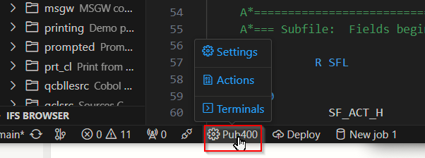

# Terminal en Code for IBM i

En Code for IBM i, puedes abrir un terminal 5250 en su propia pestaña, de modo que casi todas las necesidades del desarrollador estén integradas en el editor. Puedes lanzar tanto un terminal 5250 como una terminal PASE directamente en el editor.

_Muestra el explorador, código RPGLE, problemas, vista de esquema y terminal 5250._

## Inicio del Terminal

<!-- paneles:inicio -->

<!-- div:panel-izquierdo -->

Pasa el cursor sobre el sistema conectado en la barra de estado.

<!-- div:panel-derecho -->

<!-- paneles:fin -->

---

<!-- paneles:inicio -->

<!-- div:panel-izquierdo -->

Haz clic en **Terminales** en el menú de selección rápida y luego elige un terminal:

* **PASE** se lanzará en el entorno PASE.
* **5250** lanzará un emulador 5250 para el sistema conectado.

<!-- div:panel-derecho -->

<!-- paneles:fin -->

## Requisitos y Configuración del Terminal 5250

Para iniciar un emulador 5250, debes tener tn5250 instalado en el sistema remoto. Esto se puede [instalar mediante yum](https://www.seidengroup.com/php-documentation/how-to-set-up-the-ibm-i-open-source-environment/).

Después de instalar tn5250, deberías poder lanzar el terminal 5250, pero si no puedes: antes de conectarte a tu servidor, haz clic derecho en el servidor y elige "Conectar y Recargar Configuración del Servidor".

Code for IBM i proporciona configuraciones adicionales para que puedas configurar tu terminal según tus preferencias. La configuración más común es probablemente la configuración de asignación de CCSID, que te permite establecer la codificación para el terminal.

## Preguntas Frecuentes (FAQ)

- **¿Funcionan las teclas de función?** Sí.
- **¿Es posible hacer una solicitud al sistema?** Sí. Usa Command+C.
- **¿Cómo cierro mi sesión?** Usa el icono de la papelera en VS Code.
- **¡Estoy atascado con `Cursor in protected area of display.`!** Usa Command+A para llamar la atención, luego usa F12 para retroceder.
- **¿Cuáles son todas las combinaciones de teclas?** [Consúltalas aquí](https://linux.die.net/man/1/tn5250).
Now configure the Code for IBM i connection using `id_rsa.pem` instead of `id_rsa`. In this way, your original key is still there to make connections as always, and you have a new copy in PEM format using which Code for IBM i connections operate correctly.
