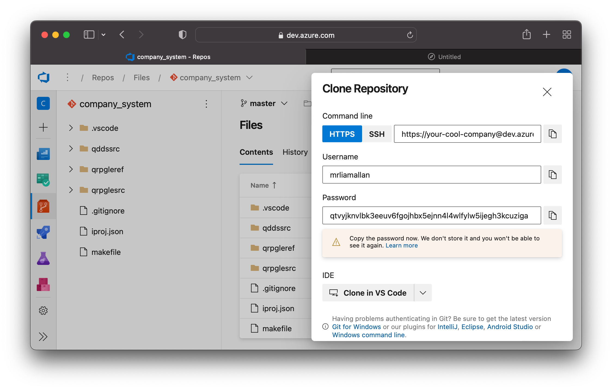
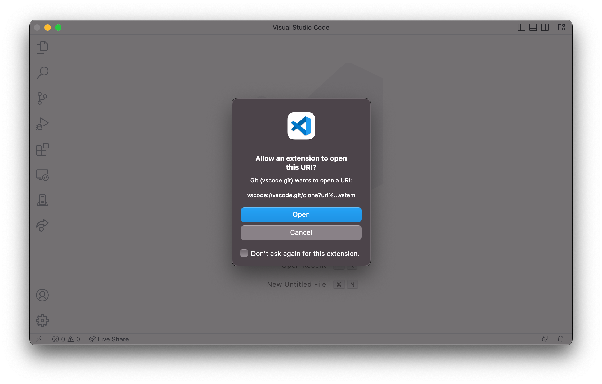
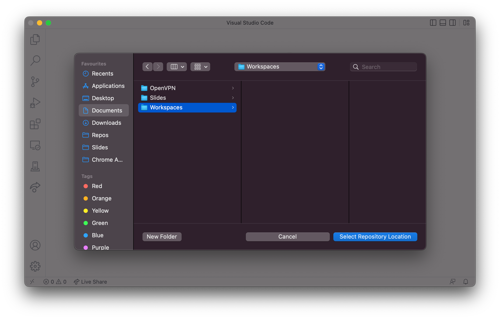
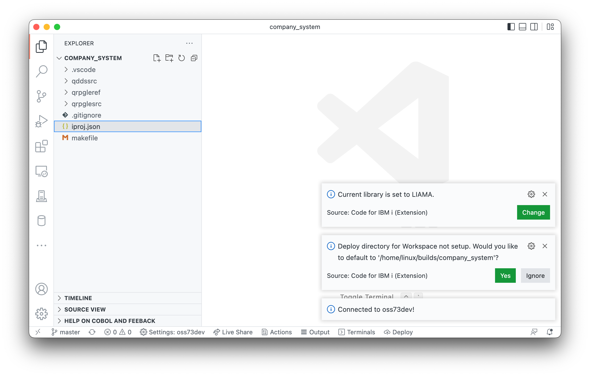

Lorsque vous utilisez Visual Studio Code et git, il est possible d'ouvrir le projet automatiquement à partir d'Azure DevOps.

Trouver le référentiel avec lequel vous souhaitez travailler sur Azure DevOps et appuyez sur le bouton `Clone`. Assurez-vous que HTTPS est sélectionné et avant de continuer, assurez-vous que les informations d'identification GIT soient visibles - Elles seront utilisées plus tard.

Lorsque vous êtes prêt, copiez le mot de passe dans votre presse-papiers et sélectionnez `Clone in VS Code`. Cela lancera VS code et s'assure que l'utilisateur souhaite exécuter cette action:

VS Code vous demande où vous souhaitez cloner le référentiel 

Lorsque le clone est terminé, il vous demandera si vous souhaitez ouvrir le dossier cloné. Sélectionnez `Open` pour l'ajouter à l'espace de travail.

Maintenant que le code source est sur votre machine locale, vous pouvez vous connecter à votre IBM i de développement. Comme il s'agit d'un tout nouveau dossier, il vous sera demandé si vous souhaitez définir le répertoire de déploiement par défaut.Il est recommandé d'utiliser la valeur par défaut.

Maintenant, vous pouvez commencer à développer et à compiler. Si c'est votre première fois, assurez-vous de lire la documentation [développement local](/fr-FR/pages/developing/local/getting-started.md) pour comprendre à quoi sert le répertoire de déploiement et comment exécuter les commandes de compilation.