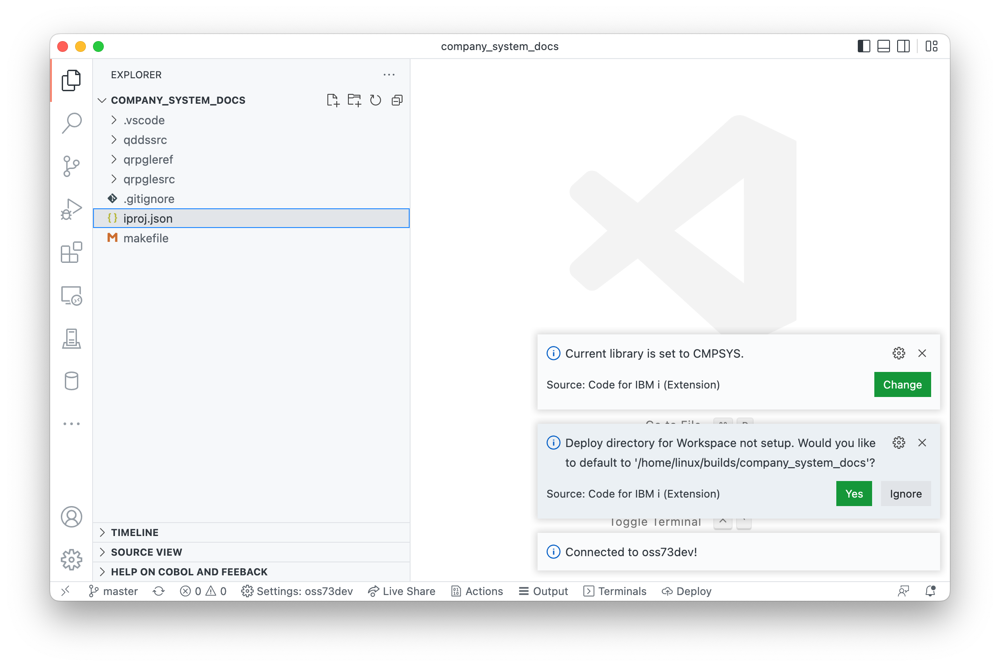
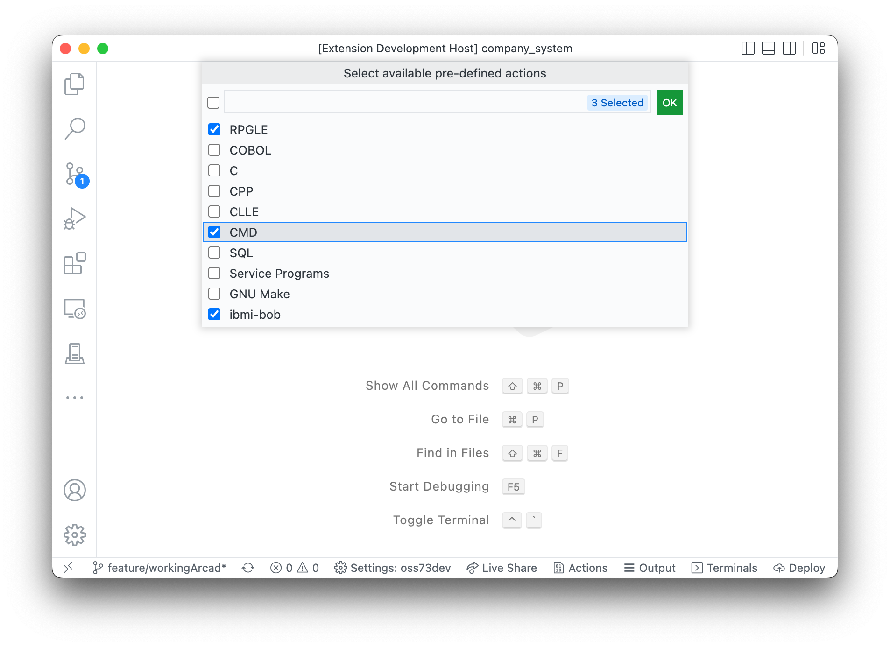

Il est possible de développer dans un dossier local puis déployer et compiler sur IBM I.

Si l'utilisateur ouvre un espace de travail puis se connecte à un IBM I:

1. Une message d'information indique la bibliothèque courante (current) à l'utilisateur,
2. Si c'est la première connexion depuis cet espace de travail (workspace) , il sera 
   * l'utilisateur est invité à définir un répertoire de déploiement par défaut, 
   * Si le fichier `actions.json` file n'est pas trouvé, on demande à l'utilisateur s'il souhaite en créer un par défaut
3. Une nouvelle option sur clic droit apparaît sur les répertoires IFS pour déployer dans ce répertoire
4. Un bouton `Deploy`» apparaît dans la barre d'état

## Guides

* Un guide pas à pas [dans le rpg-git-book](https://worksofliam.github.io/rpg-git-book/7-tooling-vscode.html).
* Un [tutoriel en video YouTube](https://www.youtube.com/watch?v=XuiGyWptgDA&t=425s), détaille cette procédure du début à la fin.
* En clonant un projet depuis [Azure DevOps](azure.md).

## 1. Ouverture d'un dossier comme espace de travail

L'ouverture d'un dossier dans Visual Studio Code ajoute ce dossier à un espace de travail.Vous avez besoin d'au moins un dossier ouvert dans l'espace de travail du code Visual Studio pour le développement local.

## 2. Définition de l'emplacement du déploiement

S'il s'agit de la première connexion avec l'espace de travail, l'utilisateur est invité à définir un répertoire de déploiement par défaut.



Si vous préférez modifier l'emplacement par défaut, l'utilisateur peut cliquer avec le bouton droit sur n'importe quel répertoire du navigateur IFS et sélectionner l'option  `Deploy Workspace to location`.

L'utilisateur peut modifier le répertoire de déploiement en utilisant la même option de clic droit sur un autre répertoire.

## 3. Le bouton `Deploy` / exécution du processus de déploiement

L'utilisation du bouton `Deploy` de la barre d'état lance le processus de déploiement. Si l'espace de travail a plus d'un dossier, l'utilisateur devra sélectionner le dossier qu'il souhaite déployer.

Il y a trois options pour le déploiement:

1. `Working Changes`: Cela ne fonctionne que si le dossier d'espace de travail choisi est un référentiel GIT.Code For IBM i examine le statut GIT ("status") pour déterminer les fichiers qui ont été modifiés depuis le dernier commit (unstaged and staged) et déploie uniquement ces fichiers.
2. `Staged Changes`: idem que l'option "Working Changes", mais déploie seuelement les fichiers (staged/indexed).
3. `All`: déploie tous les fichiers dans le dossier d'espace de travail choisi. Les fichiers qui font partie du fichier '.gitignore' sont ignorés.

L'utilisateur peut également définir des actions pour le type «fichier» (local) pour exécuter le déploiement avant d'exécuter l'action.

## 4. Actions de l'espace de travail (deploy & build)

Semblable aux autres paramétrages, les utilisateurs peuvent stocker des actions au niveau de l'espace de travail. Les utilisateurs peuvent créer un  ficher `.vscode/actions.json` dans l'espace de travail qui peut contenir des actions spécifiques à cet espace de travail. Ce fichier de configuration doit être versionné par GIT pour cette application. Si vous utilisez [le nouveau fichier standard `iproj.json`](https://ibm.github.io/ibmi-bob/#/prepare-the-project/project-metadata), les commandes de `build` et de `compile` sont crées automatiquement.

Il existe un outil qui peut générer un fichier initial `Actions.json` pour vous. Après vous être connecté à un système, ouvrez la palette de commande (F1) and recherchez `Launch Actions Setup`. L'utilisateur peut choisir la technologie de déploiement à utiliser (make,bob) dans une fenêtre. Sur la base de cette sélection, le fichier `actions.json` est créé.



Voici un exemple de configuration `actions.json`, qui exige que le déploiement ait lieu avant de déclencher `BOB`. VS Code propose une assistance à la saisie lorsque vous travaillez avec le fichier `actions.json`. Vous pouvez remplacer `BOB` avec n'importe quel système de `BUILD` (c.a.d, make, ou peut-être un outil spécifique d'un fournisseur.).

```json
[
  {
    "name": "Deploy & build with ibmi-bob 🔨",
    "command": "error=*EVENTF lib1=&CURLIB makei -f &BASENAME",
    "extensions": [
      "GLOBAL"
    ],
    "environment": "pase",
    "deployFirst": true
  },
  {
    "name": "Deploy & build with GNU Make 🔨",
    "command": "/QOpenSys/pkgs/bin/gmake &BASENAME BIN_LIB=&CURLIB",
    "extensions": [
      "GLOBAL"
    ],
    "environment": "pase",
    "deployFirst": true
  }
]
```

Maintenant, lorsque l'utilisateur demande à lancer une action depuis le fichier courant (via `Control/Command + E`), les actions du  fichier `actions.json` apparaissent dans la liste. 

