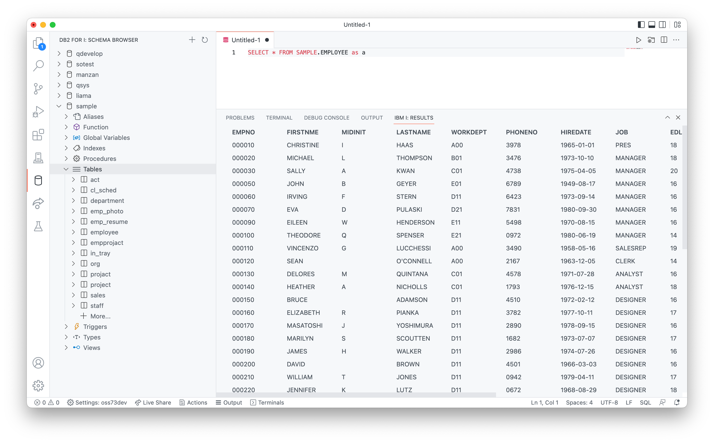

Le DB2 for I est une extension séparée qui permet aux utilisateurs de parcourir les schémas de base de données sur n'importe quel système connecté.

## Installation
L'extension s'installe depuis la [Marketplace](https://marketplace.visualstudio.com/items?itemName=HalcyonTechLtd.vscode-db2i).  
Elle est incluse dans l'extension [IBM i Development Pack](https://marketplace.visualstudio.com/items?itemName=HalcyonTechLtd.ibm-i-development-pack).

## Utilisation

L'extension DB2 for I ajoute une nouvelle vue appelée explorateur de schéma (Schema Browser), qui permet à l'utilisateur d'ajouter des schémas existants à la liste puis de parcourir les objets existants de ces schémas.  
L'utilisateur peut également exécuter des requêtes SQL et afficher les résultats dans VS Code.
Lors de la modification des sources SQL, l'utilisateur aura également accès à l'assistance à la saisie.

### Respect de la bibliothèque/ schéma courante

L'extension Db2 for i respecte la bibliothéque courante configurée dans l'explorateur de la liste des bibliothèques utilisateur. Vous pouvez également faire un clic droit sur les schémas de l'explorateur de schéma et modifier le schéma courant de cette façon.

### Assistant de saisie

Lorsque vous rédigez des sources SQL, vous aurez accès à une assistance sur la saisie de contenu sur:

* objets à l'intérieur d'un schéma (tables, vues, alias, functions, procédures)
* colonnes à l'intérieur d'une table déclarée avec la clause `as` clause

Si vous ne qualifiez pas le nom d'un objet, il utilisera par défaut d'utiliser le schéma courant.

### Exécution de requêtes

Soit:

* Ouvrez un fichier `.sql` existant (membre source, fichier Stream ou local)
* Créer un nouveau fichier
    1. Créer un fichier(`control / command + N`)
    2. Changer l'ID de langue en `sql`

Après avoir ouvert une source SQL, vous pouvez soit:

* Déplacez votre curseur sur l'instruction que vous souhaitez exécuter et:
    * Utilisez le bouton `play` en haut à droite pour exécuter
    * Utilisez le raccourci (`control / command + R`) pour exécuter l'instruction

L'ensemble des résultats apparaîtra sous l'instruction.  
Lorsque vous défilez parmi l'ensemble des résultats, plus de données se chargeront.Cela permet d'optimiser les performances de la requête.

Les instructions SQL sont exécutées avec la dénomination SQL. (schémas.table)

### Affichage du contenu de la table

Si vous utilisez l'explorateur de schéma pour parcourir des objets, vous pouvez utiliser l'icône `view` sur une de table.  
Cela ouvre automatiquement une fenêtre d’exécution avec une instruction SELECT basique.