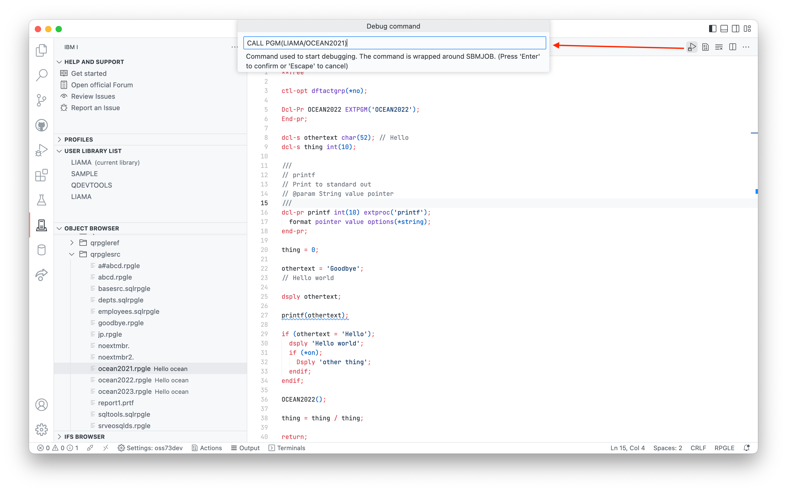
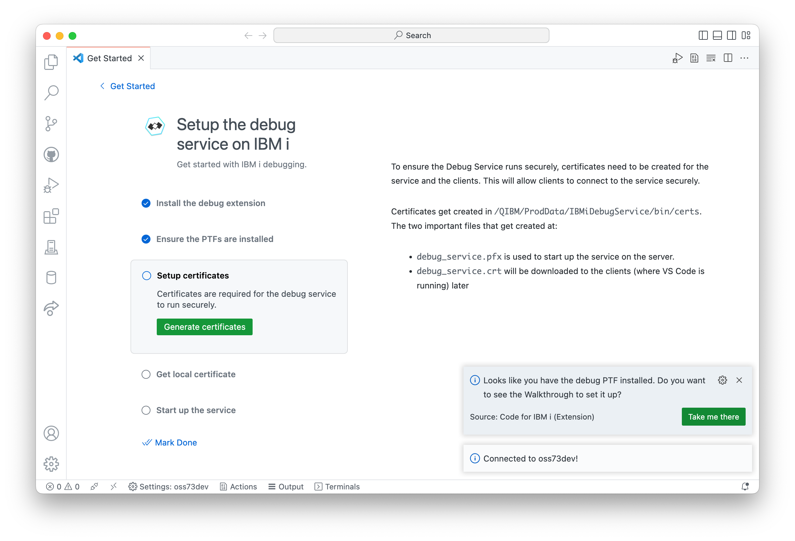
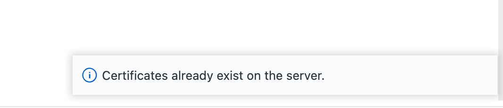
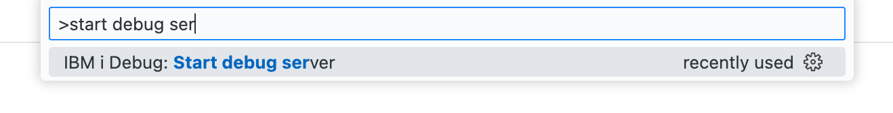

# ILE Debugging

Debugging ILE programs is now available inside of Visual Studio Code. We've added UI to make sure setting up the Debug Service to be a swift process.

# Starting to debug

After configuring the Debug Service, launching a debug session is a click of a button away. When you have active source open, a new Debug button will appear in the navigation bar. Breakpoints can be set prior to debugging, or during the debugging session.



Clicking the Debug button will display an input box which will allow the user to customise the command which starts the debug job. This allows the developer to pass in parameters, or call another program to launch the debug session.

After the debug session has started, every session will break on entry. You can read more about the debugging UI on the [Debug actions section on the Visual Studio Code documentation](https://code.visualstudio.com/docs/editor/debugging#_debug-actions).


# Configuring the debugger

## General requirements

* PTFs
* Certificates setup on the server
   * created in `/QIBM/ProdData/IBMiDebugService/bin/certs`
* Local client certificate
   * created in the home directory on the device running Visual Studio Code
* IBM i Debug extension
   * installed into Visual Studio Code

## Required PTFs

To make use of the Debug Service, you need the following PTFs:

* Host debugger in 5770SS1:
   * IBM i 7.5 PTF SI80368 and SI81035
   * IBM i 7.4 PTF SI80364 and SI81031
   * IBM i 7.3 PTF SI79707 and SI80858

After you have installed the PTFs, the connection inside of Visual Studio Code will need to be restarted.

## Configuring & starting the service

It's important to note that there only needs to be one instance of the Debug Service running. All developers share the Debug Service.

After connecting to a system in Code for IBM i, if the PTFs are installed but the service is not configured (i.e. the certificates don't exist) you will see a notice asking if you'd like to open the Walkthrough to configure the Debug Service. Clicking the button will open the Walkthrough.



### Generating certificates

This Walkthrough can easily configure the Debug Service and start it up. The last three steps have buttons to 'Generate certificates', 'Download certificate' and 'Start debug service'. Running them in order will do all the work to setup the service.


*It will ask you to confirm the initialisation.*



*It will not let you regenerate certificates. The existing certificates have to be deleted manually. This is a safety measure.*

Whenever you generate new certificates on the server, it will automatically download the client certificate. Now, because the client certificate exists on the server, Code for IBM i will be automatically downloaded onto other users devices when they connect to the server.

### Starting the server

The 'Start debug service' button will spin up the Debug Service. If the Debug Service is already running, it will ask you if you want to end the existing instance before starting a new one - this is a requirement. It is not recommended to run two instances of the Debug Service at once.


You can also start the Debug Service through the command palette:



# Common issues

## IP not in cert list

**It is always recommended you use a hostname in the connection settings** to make use of the debugger.

For now, it is **not** recommended to use an IP address to connect to the debugger (when running in secure mode).


*Error that is shown when connecting to the debugger if connecting using an IP address.*

This error occurs when the hostname used to connect to the debugger (which might be the IP address that was configured in the connection settings) is not the same as the host name created as part of the certificate.

If you are using a system that doesn't have a host name (for example `YOURSYSTEM`, or `pub400.com`), then an entry should be added to your device's 'hosts' file. This entry should be the same on all devices in your network to ensure that everyone is using the same hostname.

* Windows: `c:\Windows\System32\Drivers\etc\hosts`
* Mac: `/etc/hosts`

Your entry might look like this:

```hosts
# IP HOSTNAME
192.168.0.20 MYIBMI
```

If you find that you've added your local hostname entry and the error is still occurring, then you may need to delete the existing certificates from `/QIBM/ProdData/IBMiDebugService/bin/certs` on the IFS and generate them again in the Walkthrough.