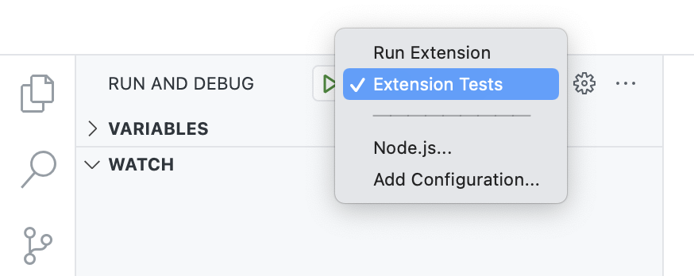
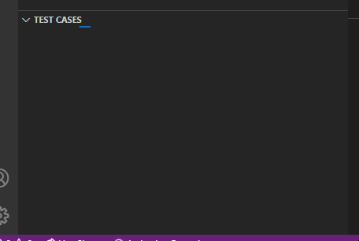
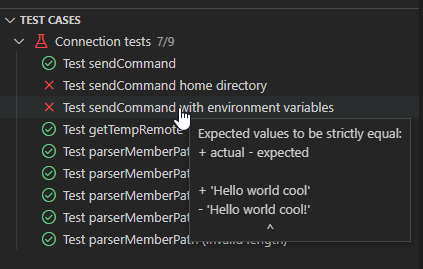

import { CardGrid, Card, Aside, Icon } from '@astrojs/starlight/components';

It's very easy to work with the vscode-ibmi extension.

### Developing and debugging

1. clone repo
2. `npm i`
3. 'Run extension' from VS Code debug.

### Creating a `.vsix`

To build a .`vsix` of the extension, you can use:

```bash title="terminal"
npm run package
```

### Developing the docs

To work on this documentation:

- clone repo docs repo: github.com/codefori/docs
- install astro ```npm i```
- run local with ```npm run dev```
- by default, runs on http://localhost:4321/docs/
- test build with ```npm run build```
- Read more about [Astro](https://starlight.astro.build/getting-started/)<Icon name="rocket" color="rebeccapurple" class="icon-inline" />


### Running tests

We have two types of test suites:

1. Backend test cases which run using vitest
2. Frontend extension test cases which run inside of the Visual Studio Code Extension Host while debugging.

The backend test cases are primarily for testing the API and the frontend test cases are for testing the extension's UI and VS Code commands.

#### Run backend test cases

1. Make a copy of `src/api/.env.sample` named `.env` and enter details of the system for the tests to run on
2. `npm run test`

<Aside type="tip">
   Install the [Vitest extension](https://marketplace.visualstudio.com/items?itemName=vitest.explorer) to debug the test cases through Visual Studio Code.
</Aside>

#### Run runtime test cases

To run the tests, start debugging the **Extension Tests** configuration and connect to a system for the tests to run.



After the Extension Host is launched, connect to a system - this system is where the test runs. The tests should not alter any system configuration or existing files.

<CardGrid>

<Card>

After you've connected, the tests will launch automatically. You can see which tests are being executed in the Test Cases view.

</Card><Card>



</Card></CardGrid>

---

<CardGrid>

<Card>

If a test fails, you can see the result by hovering over the failed test.

</Card><Card>



</Card></CardGrid>