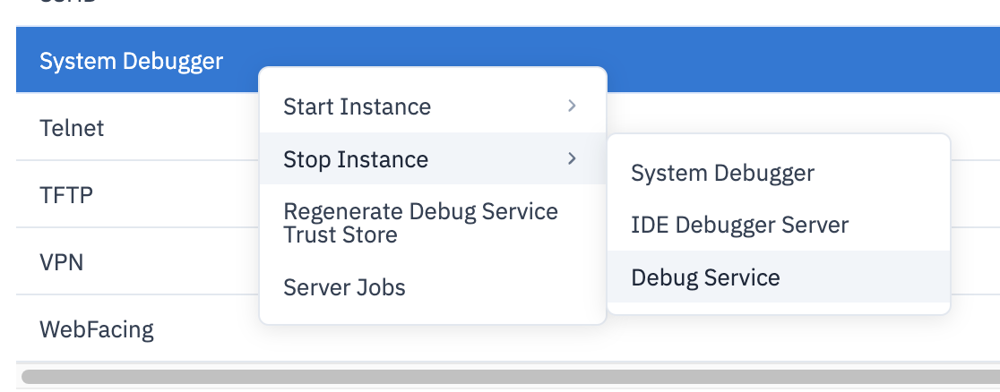
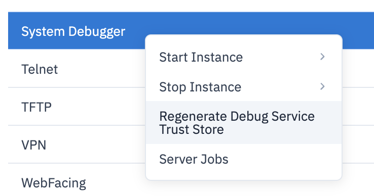
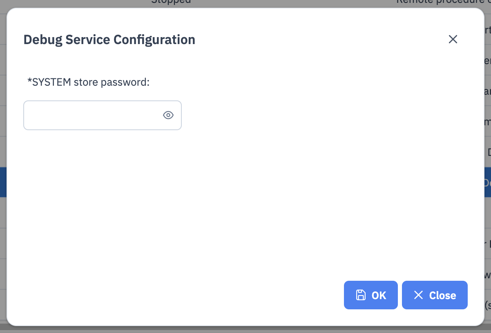
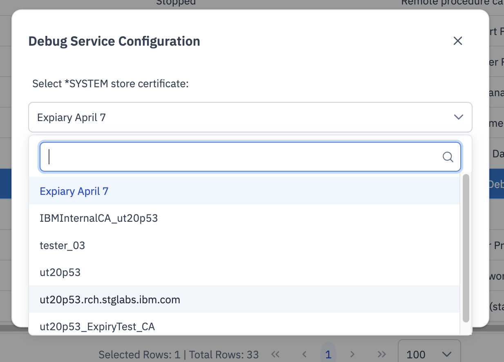
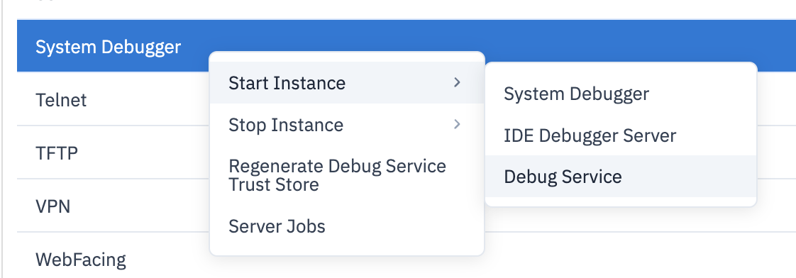

import { Aside, CardGrid, Card, Icon, Tabs, TabItem } from '@astrojs/starlight/components';

## General requirements

* PTFs (see below)
* IBM i Debug extension ([marketplace](https://marketplace.visualstudio.com/items?itemName=IBM.ibmidebug))
  * installed into Visual Studio Code
* Debug Service Certificates setup
  * As of Code for IBM i 2.16.0, the Debug Service is configured inside of Navigator for IBM i. **If you're using Code for IBM i 2.16.0**, then you are required to use this method to configure and start the Debug Service. Code for IBM i 2.16.0+ supports only Debug Service 3+.

## Required PTFs

To make use of the Debug Service, you need the following PTFs:

<Tabs>
<TabItem label="Version 3.0.3" >

* IBM i 7.6
   * Debug Service PTF SJ08472
   * HTTP Group PTF SF99962 level 7 or higher
   * Java 17 LPP 5770JV1 Option 20 (not Java from Yum)
* IBM i 7.5
   * Debug Service PTF  SJ08535
   * HTTP Group PTF SF99952 level 26 or higher
   * Java 11 is required via LPP 5770JV1 Option 19 (not Java from Yum)
* IBM i 7.4
   * Debug Service PTF SJ08540
   * HTTP Group PTF SF99662 level 48 or higher
   * Java 11 is required via LPP 5770JV1 Option 19 (not Java from Yum)
* IBM i 7.3
   * Debug Service PTF SJ08544
   * HTTP Group PTF SF99722 level 64 or higher
   * Java 11 is required via LPP 5770JV1 Option 19 (not Java from Yum)

**All OS versions require** 5770WDS option 60 (Workstation Tools - Base).

<Aside type="note">You need to restart the ADMIN1 server after applying a Navigator PTF.</Aside>

</TabItem>
<TabItem label="Version 3.0.2" >

* IBM i 7.6
   * Debug Service PTF SJ08175 (and SJ08174 prereq)
   * HTTP Group PTF SF99962 level 6 or higher
   * Java 17 LPP 5770JV1 Option 20 (not Java from Yum)
* IBM i 7.5
   * Debug Service PTF SJ08182 (and SJ08176 prereq)
   * HTTP Group PTF SF99952 level 25 or higher
   * Java 11 is required via LPP 5770JV1 Option 19 (not Java from Yum)
* IBM i 7.4
   * Debug Service PTF SJ08192 (and SJ08177 prereq)
   * HTTP Group PTF SF99662 level 47 or higher
   * Java 11 is required via LPP 5770JV1 Option 19 (not Java from Yum)
* IBM i 7.3
   * Debug Service PTF SJ08201 (and SJ08187 prereq)
   * HTTP Group PTF SF99722 level 63 or higher
   * Java 11 is required via LPP 5770JV1 Option 19 (not Java from Yum)

**All OS versions require** 5770WDS option 60 (Workstation Tools - Base).

<Aside type="note">You need to restart the ADMIN1 server after applying a Navigator PTF.</Aside>
<Aside type="caution">Please upgrade to 3.0.3 if you apply the PTF at IPL as a delayed PTF.</Aside>

</TabItem>
<TabItem label="Version 3.0.1" >

* IBM i 7.6
   * Debug Service PTF SJ06921 (and SJ06919 prereq)
   * Navigator for i PTF SJ06431 and HTTP Group PTF SF99962 level 4 or higher
   * Java 17 LPP 5770JV1 Option 20 (not Java from Yum)
* IBM i 7.5
   * Debug Service PTF SJ06931 (and SJ06928 prereq)
   * Navigator for i PTF SJ06353 and HTTP Group PTF SF99952 level 23 or higher
   * Java 11 is required via LPP 5770JV1 Option 19 (not Java from Yum)
* IBM i 7.4
   * Debug Service PTF SJ06934 (and SJ06933 prereq)
   * Navigator for i PTF SJ06355 and HTTP Group PTF SF99662 level 45 or higher
   * Java 11 is required via LPP 5770JV1 Option 19 (not Java from Yum)
* IBM i 7.3
   * Debug Service PTF SJ07259 (and SJ06940 prereq)
   * Navigator for i PTF SJ06783 and HTTP Group PTF SF99722 level 61 or higher
   * Java 11 is required via LPP 5770JV1 Option 19 (not Java from Yum)

**All OS versions require** 5770WDS option 60 (Workstation Tools - Base).

<Aside type="note">You need to restart the ADMIN1 server after applying a Navigator PTF. </Aside>

</TabItem>

<TabItem label="Version 3" >

* IBM i 7.6
   * Debug Service PTF SJ04601
   * Navigator for i PTF SJ04647
   * Java 17 LPP 5770JV1 Option 20 (not Java from Yum)
* IBM i 7.5
   * Debug Service PTF SJ05012
   * Navigator for i PTF SJ03406
   * Java 11 is required via LPP 5770JV1 Option 19 (not Java from Yum)
* IBM i 7.4
   * Debug Service PTF SJ05013
   * Navigator for i PTF SJ03404
   * Java 11 is required via LPP 5770JV1 Option 19 (not Java from Yum)
* IBM i 7.3
   * Debug Service PTF SJ05014
   * Navigator for i PTF SJ03402
   * Java 11 is required via LPP 5770JV1 Option 19 (not Java from Yum)

**All OS versions require** 5770WDS option 60 (Workstation Tools - Base).

* Java 11 information:
   * `/QOpenSys/QIBM/ProdData/JavaVM/jdk11/64bit`
   * [IBM documentation for PTFs](https://www.ibm.com/support/pages/download-installation-and-usage-java-11-ibm-i-os)

<Aside type="note">
   IBM i 7.5 Java PTF Group SF99955 level 15 and IBM i 7.4 Java PTF Group SF99665 level 28 contained two defective PTF's for Java 11. These PTF's has now been superceded by newer PTF's included in PTF Group SF99955 level 16 for 7.5 and PTF Group SF99665 level 29 for 7.4.

   For more information, read [this IBM Support document](https://www.ibm.com/support/pages/node/7239287)
</Aside>

</TabItem>

<TabItem label="Version 2.0.2" >

* IBM i debug client v2.0.2 requires the following host PTFs:
   * 7.5 PTF SJ03030
   * 7.4 PTF SJ03026
   * 7.3 PTF SJ02996
* Java 11 is required via LPP 5770JV1 Option 19 (not Java from Yum)
   * `/QOpenSys/QIBM/ProdData/JavaVM/jdk11/64bit`
   * [IBM documentation for PTFs](https://www.ibm.com/support/pages/download-installation-and-usage-java-11-ibm-i-os)
* 5770WDS option 60 is required
   * Workstation Tools - Base

</TabItem>
<TabItem label="Version 2.0.0" >

* Host debugger in 5770SS1:
   * IBM i 7.5 PTF SI86229 and SI82343
   * IBM i 7.4 PTF SI86178 and SI82335
   * IBM i 7.3 PTF SI85976 and SI82198
* Java 11 is required via LPP 5770JV1 Option 19 (not Java from Yum)
   * `/QOpenSys/QIBM/ProdData/JavaVM/jdk11/64bit`
   * [IBM documentation for PTFs](https://www.ibm.com/support/pages/download-installation-and-usage-java-11-ibm-i-os)
* 5770WDS option 60 is required
   * Workstation Tools - Base

</TabItem>
<TabItem label="Version 1">

* Host debugger in 5770SS1:
   * IBM i 7.5 PTF SI83666 and SI81035
   * IBM i 7.4 PTF SI83683 and SI81031
   * IBM i 7.3 PTF SI83692 and SI80858
* Java 8 is required
   * `/QOpenSys/QIBM/ProdData/JavaVM/jdk80/64bit`

</TabItem>
</Tabs>

After you have installed the PTFs, the connection inside of Visual Studio Code will need to be restarted.

## Configuring & starting the service

This must be done with user that has *ALLOBJ and *SYSADM privlages.
Below are the base requirements to configure the certificate:
- Master key 1 is set (this can be done in Navigator for IBM i under Security > Cryptographic Services Key Management > Manage Master Keys)
- *SYSTEM store is populated with a valid certificate (this can be done in Digital Certificate Manager)

1. On Navigator for IBM i, go to Network > Servers > TCP/IP Servers
2. Scroll down to System Debugger and right click
3. Hover over Stop Instance, select Debug Service

4. Right click System Debugger again, select Regenerate Debug Service Trust Store

5. Enter in the password for the *SYSTEM store, click OK

6. Select the certificate you want to use, click OK

7. Right click System Debugger again, hover over Start Instance, select Debug Service

**NOTE:** This needs to be done each time you renew or replace that certificate, it does not automatically update when you update the *SYSTEM store

## Updating the service

When there are newer Debug service or Navigator/HTTP Group PTFs, the following steps are required:
1. Restart ADMIN1 server
   - If HTTP Group PTF does not show as applied, IPL might be required.
2. Regenerate debug service trust store (as described above)

