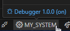
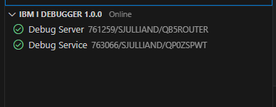
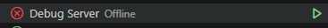
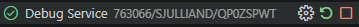
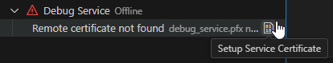
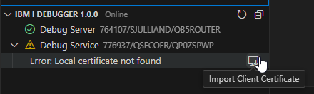
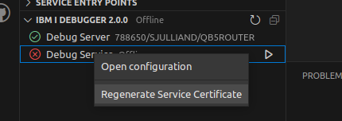
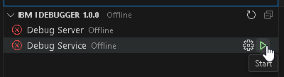
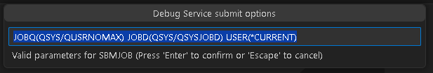

import { Aside, CardGrid, Card, Icon, Tabs, TabItem } from '@astrojs/starlight/components';

# ILE Debugging

Debugging ILE programs is now available inside of Visual Studio Code. We've added UI to make sure setting up the Debug Service to be a swift process.

<Aside type="note">You must have `bash` set as your default shell. [See Bash Shell Required](/docs/tips/bash/) for more info. </Aside>

# Starting to debug

<CardGrid>

<Card>

After configuring the Debug Service, launching a debug session is a click of a button away. When you have active source open, a new Debug button will appear in the navigation bar. Breakpoints can be set prior to debugging, or during the debugging session.

</Card><Card>


</Card></CardGrid>

---

<CardGrid>

<Card>

Clicking the Debug button will display an input box which will allow the user to customise the command which starts the debug job. This allows the developer to pass in parameters, or call another program to launch the debug session.

After the debug session has started, every session will break on entry. You can read more about the debugging UI on the [Debug actions section on the Visual Studio Code documentation](https://code.visualstudio.com/docs/editor/debugging#_debug-actions)<Icon name="external" color="cyan" class="icon-inline" />.

</Card><Card>


</Card></CardGrid>

---

<CardGrid>

<Card>

To debug a program from the Object Browser, right-click on the program object and select the **Debug Program** option. Like before this will also display an input box to modify the command which starts the debug job.

</Card><Card>


</Card></CardGrid>

# Configuring the debugger

## General requirements

* PTFs (see below)
* IBM i Debug extension ([marketplace](https://marketplace.visualstudio.com/items?itemName=IBM.ibmidebug))
  * installed into Visual Studio Code
* Debug Service Certificates setup
  * created in `/QIBM/UserData/IBMiDebugService/certs` by default
  * Debug Service certificate `debug_service.pfx`
  * Debug Service client certificate `debug_service.crt`

## Required PTFs

To make use of the Debug Service, you need the following PTFs:

<Tabs>
<TabItem label="Version 2.0.2" >

* IBM i debug client v2.0.2 requires the following host PTFs:
   * 7.5 PTF SJ03030
   * 7.4 PTF SJ03026
   * 7.3 PTF SJ02996
* Java 11 is required via LPP 5770JV1 Option 19 (not Java from Yum)
   * `/QOpenSys/QIBM/ProdData/JavaVM/jdk11/64bit`
   * [IBM documentation for PTFs](https://www.ibm.com/support/pages/download-installation-and-usage-java-11-ibm-i-os)   
* 5770WDS option 60 is required
   * Workstation Tools - Base

</TabItem>
<TabItem label="Version 2.0.0" >

* Host debugger in 5770SS1:
   * IBM i 7.5 PTF SI86229 and SI82343
   * IBM i 7.4 PTF SI86178 and SI82335
   * IBM i 7.3 PTF SI85976 and SI82198
* Java 11 is required via LPP 5770JV1 Option 19 (not Java from Yum)
   * `/QOpenSys/QIBM/ProdData/JavaVM/jdk11/64bit`
   * [IBM documentation for PTFs](https://www.ibm.com/support/pages/download-installation-and-usage-java-11-ibm-i-os)   
* 5770WDS option 60 is required
   * Workstation Tools - Base

</TabItem>
<TabItem label="Version 1">

* Host debugger in 5770SS1:
   * IBM i 7.5 PTF SI83666 and SI81035
   * IBM i 7.4 PTF SI83683 and SI81031
   * IBM i 7.3 PTF SI83692 and SI80858
* Java 8 is required
   * `/QOpenSys/QIBM/ProdData/JavaVM/jdk80/64bit`

</TabItem>
</Tabs>

After you have installed the PTFs, the connection inside of Visual Studio Code will need to be restarted.

## Configuring & starting the service

<CardGrid>
<Card>
After connecting to a system in Code for IBM i, you can hover over the connection in the bottom status bar to check the Debugger version and status. The status will be `on` if both the Debug Server and Debug Service are running.
</Card>
<Card>

</Card>
</CardGrid>
<CardGrid>
<Card>
Clicking on the Debugger status will take you to the IBM i Debugger view. This view shows the status of the Debug Server and the Debug Service. It also allows to start/stop the Debug Server and manage the Debug Service.
</Card>
<Card>

</Card>
</CardGrid>

### Start/stop the Server and Service
<CardGrid>
<Card>
The start/stop/restart actions are located on the right of each status. Running one of these actions will refresh the statuses once it's done.
</Card>
<Card>


</Card>
</CardGrid>

<Aside type="tip">
   Starting and stopping the Debug Server and Service requires the *ALLOBJ special authority.
</Aside>

### Managing the Debug Service
<CardGrid>
<Card>
If the Debug Service is not correctly configured, a warning sign will appear next to it. Expanding the Debug Service node will show the cause of the issue.
</Card>
<Card>


</Card>
</CardGrid>

<Aside type="tip">
   There only needs to be one instance of the Debug Service running and therefore the certificates should only be generated once. All developers share the Debug Service.
</Aside>

#### Generating certificates
The Debug Service needs a certificate to be able to be started. This is required because the Debug Service is basically a web server exposing web services through HTTPS, and encrypting the traffic on HTTPS requires a certificate. Supported formats for the certificate are `PKCS12` and `JKS`. If Code for IBM i is used to generate the certificate, it will use the PKCS12 format.

By default, certificates are generated in `/QIBM/UserData/IBMiDebugService/certs` (which is the recommended location). The path to the Debug Service certificate is set in `/QIBM/ProdData/IBMiDebugService/bin/DebugService.env` with `DEBUG_SERVICE_KEYSTORE_FILE`.

If the certificate is missing, the IBM i Debugger view will show this error:


Clicking on the Setup Service Certificate button will start a process that offers to either generate a certificate or import an existing one (`PKCS12` format only). Once the certificate is successfully generated or imported, two files will be found under `/QIBM/UserData/IBMiDebugService/certs`:
* `debug_service.pfx`
  * the Debug Service certificate, used by the service to encrypt the communication.
* `debug_service.crt`
  * the client certificate that clients must download to be able to connect to the Debug Service.

Generating the certificates will also update the Debug Service configuration file `/QIBM/ProdData/IBMiDebugService/bin/DebugService.env` to set the correct path to the required JDK and save the encrypted certificate password.

If these certificates are deleted for some reason, they can be simply regenerated from the IBM i Debugger view as described above. They are used only to encrypt the traffic between the clients and Debug Service.

It also possible to regenerate the certificates by right-clicking on the Debug Service and choosing `Regenerate service certificate`



If the client certificate cannot be found locally or does not match the remote certificate, Code for IBM i will show a warning in the IBM i Debugger view and offer an action to import the client certificate.


#### Starting the Debug Service from Code for IBM i
Starting the Debug Service can be done from the IBM i Debugger view and requires `*ALLOBJ` special authority.



Clicking on the action to start the Service will first show a prompt showing `SBMJOB` parameters. Since the shell script that starts the service will be submitted, this lets you modify the submission parameters if needed. Only the `CMD` and `JOB` parameters are imposed.



Once the prompt is validated, the SBMJOB command will be executed and Code for IBM i will monitor its execution until the Debug Service is actually started (or fails to start).

#### Starting the Debug Service outside of Code for IBM i
If the Debug Service was configured from Code for IBM i (i.e the certificate was generated from Code for IBM i), then it is possible to start the Debug Service by running the same `SBMJOB` command that Code for IBM i uses:

```
SBMJOB CMD(STRQSH CMD('/QOpenSys/pkgs/bin/bash -c /QIBM/ProdData/IBMiDebugService/bin/startDebugService.sh')) JOB(DBGSVCE) JOBQ(QSYS/QUSRNOMAX) JOBD(QSYS/QSYSJOBD) USER(*CURRENT)
```

<Aside type="tip">
   This will only work if Code for IBM i was used to configure the Service and generate its certificate.
</Aside>
---

## Debug Service ports

The Debug Service depends on three ports by default:

* Port 8001 (unsecure port)
   * this port is not used for anything in regards to debugging, though it is required to start and stop the Debug Service
* Port 8005 (secure port)
   * this port is used by all debugging clients and is required to start the Debug Service.
* Port 8008
   * this port is used for Service Entry Breakpoint (*only applies to version 2 of the Debug Service*)

While you can configure the ports in the Connection Settings, it is recommended the defaults are used for consistency.

{/* These ports can be changed in `/QIBM/ProdData/IBMiDebugService/bin/DebugService.env`, both `DBGSRV_PORT` and `DBGSRV_SECURED_PORT` respectively.

If `DBGSRV_SECURED_PORT` is changed, make sure to:

* restart the Debug Service
* reconnect every Code for IBM i instances. **Every user will need to do this step.** */}

# FAQ

### What's the difference between the Debug Service and Debug Server?

<CardGrid>

<Card>

As depicted in this diagram, the client (VS Code, IBM i Debug) connects to the Debug Service, which talks to the Debug Server.

* The Debug Service is started up inside of Visual Studio Code as documented above. In the future it will also be possible to start it from Navigator for i.
* The Debug Server is started up with `STRDBGSVR`. You may get an error message in VS Code if you attempt to debug when the Debug Server is not running.

</Card><Card>


</Card></CardGrid>

### I can't see the variables when debugging CL

<CardGrid>

<Card>

This is a limitation for CL. The local variables will not show up in the Variables view for CL. You can add a local variable to the Watch view to inspect its value. The CL limitation also exists in RDi.

[See GitHub issue here](https://github.com/codefori/vscode-ibmi/issues/1069)<Icon name="github" class="icon-inline" />.

</Card><Card>


</Card></CardGrid>

# Common issues

## Debug hangs

There is a [known issue](https://github.com/codefori/vscode-ibmi/issues/1059)<Icon name="github" class="icon-inline" /> that when you start debugging from VS Code, the debugger hangs and doesn't launch.

The fix is to check if you've got a prior debug job stuck in `MSGW`. You can do this with `WRKACTJOB`, or a similar command like `WRKSBSJOB QBATCH`.

**Users should no longer face this issue** as we now submit debug jobs to `QSYSWRK` with `QSYSNOMAX`.

## `STRDBGSVR` requirement

The Debug Service that is started depends on the traditional Debug Server.


If you receive this message, do as it says. Simply start the Debug Server with `STRDBGSVR` from a greenscreen.

## IP not in cert list

**It is always recommended you use a hostname in the connection settings to make use of the debugger**.


*Error that is shown when connecting to the debugger if connecting using an IP address.*

This error occurs when the hostname used to connect to the debugger (which might be the IP address that was configured in the connection settings) is not the same as the host name created as part of the certificate.

If you are using a system that doesn't have a host name (for example `YOURSYSTEM`, or `pub400.com`), then an entry should be added to your device's 'hosts' file. This entry should be the same on all devices in your network to ensure that everyone is using the same hostname.

* Windows: `c:\Windows\System32\Drivers\etc\hosts`
* Mac: `/etc/hosts`

Your entry might look like this:

```txt title="hosts" {2}
# IP HOSTNAME
192.168.0.20 MYIBMI
```

If you find that you've added your local hostname entry and the error is still occurring, then you may need to delete the existing certificates from `/QIBM/ProdData/IBMiDebugService/bin/certs` on the IFS and generate them again in the Walkthrough.
