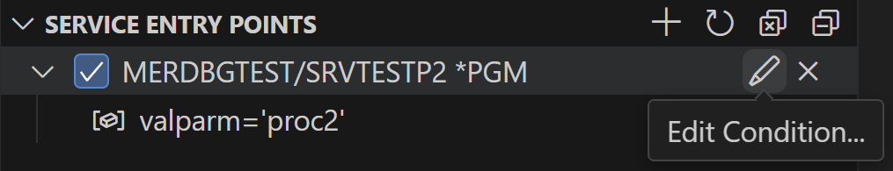

import { Aside, CardGrid, Card, Icon, Tabs, TabItem } from '@astrojs/starlight/components';

## Debugging

Debugging IBM i programs is now available inside of Visual Studio Code. 

<Aside type="note">You must have `bash` set as your default shell. [See Bash Shell Required](/docs/tips/bash/) for more info. </Aside>

### Supported Features

Supported language types:

 - RPG (including RPGLE and OPM RPG)
 - COBOL
 - C/C++
 - CL

Supported batch debug features:

 - Debugging of batch programs
 - Passing parameters to a batch program when starting a debug session
 - Setting line breakpoints
 - Saving breakpoints across debug sessions
 - Stepping (step into/over/return)
 - Viewing variable values in the Locals view
 - Monitoring expressions in the Watch view
 - Displaying variable values in debug editor hover
 - Debugging with the \*SOURCE and \*LIST views
 - Debugging with the **Update Production Files** option


Supported Service Entry Point (SEP) debug features:

 - Setting a service entry point on a program, service program, module or procedure
 - Enabling, disabling and removing a service entry point 
 - Setting a condition on a service entry point
 - Modifying the user profile of a service entry point
 - Logging service entry point activities in an output channel
 - Saving service entry points across multiple client sessions
 - Refreshing service entry points after programs are recompiled

### Limitations

The following features are not supported in the current release:
-	Code coverage
-   Additional source lookup path. If the debug source is moved to a different location after the program is compiled, there is no way to instruct the debugger to lookup the source in a different location.


## Starting to debug

<CardGrid>

<Card>

After [configuring](../configure/) the Debug Service, launching a debug session is a click of a button away. To start a batch debug session, right-click on a program object from the Object Browser and select the **Start Debugging > Debug as Batch** action.

</Card><Card>


</Card></CardGrid>

---

<CardGrid>

<Card>

Selecting the Debug action will display an input box which allows the user to customise the command that starts the debug job. This allows the developer to pass in parameters, or call another program to launch the debug session.

After the debug session has started, every session will break on entry. You can read more about the debugging UI on the [Debug actions section on the Visual Studio Code documentation](https://code.visualstudio.com/docs/editor/debugging#_debug-actions)<Icon name="external" color="cyan" class="icon-inline" />.

</Card><Card>


</Card></CardGrid>

---

<CardGrid>

<Card>

The debug source will be opened in the editor area. A floating Debug panel which contains the common debug actions (e.g. continue, step over, stop, etc) will appear at the top. Breakpoints can be set prior to debugging, or during the debugging session. You can see the value of a local variable in the **Variables** view. You can also hover over a variable in the debug editor to show its value. A monitored expression can be added to the **Watch** view.

</Card><Card>


</Card></CardGrid>


### Managing Service Entry Points
<CardGrid>

<Card>

Service Entry Point (SEP) can be set using the **Set Service Entry Point** popup menu action from the **Object Browser**. SEP can also be set using the **Create Service Entry Point** toolbar action from the **Service Entry Points** view in the **Run and Debug** side bar. The action will prompt for the service entry point location. The service entry point location can be in a short format which includes the library name and program name (e.g. `MY_LIB/MY_PGM`), or in a long format which also includes the program type, module name and procedure name (e.g. `MY_LIB/MY_PGM *PGM/MY_MOD/MY_PROC`). The supported program types are `*PGM` and `*SRVPGM`.

</Card><Card>



</Card></CardGrid>

- A checkbox at a SEP indicates that the SEP is enabled. You can clear the checkbox to disable the SEP.
- You can use the **Edit Condition…** inline action to set a condition on a SEP. The condition is an expression that is evaluated to a boolean value at the given context.
- You can use the **Remove Service Entry Point** inline action to remove the selected SEP, or the **Remove All Service Entry Points** toolbar action to remove all SEPs from the view.
- You can use the **Modify User Profile...** context menu action to modify the owner of the job where the service entry point is hit. The default owner user profile is the currently logged on user.
- Service entry point related messages appear in the **IBM i Service Entry Points** output channel.
- Service entry points are saved in the debug service job on the host. When a new debug client connects to a running debug service, it will restore the saved service entry points for the current user.
- If a program or service program is recompiled, you can use the **Refresh** action from the context menu to refresh the selected SEP, or use the **Refresh All Service Entry Points** toolbar action to refresh all SEPs in the **Service Entry Points** view.

### Settings

The following settings are available from the **Debugger** tab of the **IBM i: Connection Settings** page. The page can be accessed from the Command Palette.

- **Debug port**: The secure debug port.

- **SEP debug port**: The Service Entry Point daemon port.

- **Update production files**: Enable updating of production files during debugging.

- **Debug trace**: Enable tracing for **Debug Adapter Protocol**.

The debug port and SEP debug port are specified in the DebugService.env file on the host.


## Common issues

### `STRDBGSVR` requirement

The Debug Service that is started depends on the traditional Debug Server.


If you receive this message, do as it says. Simply start the Debug Server with `STRDBGSVR` from a green screen.

### Self-signed certificate issue

If you are getting a self-signed certificate error or a certificate signature failure when starting a batch debug session or setting a SEP, please use the following steps for diagnostics:

- Find out the certificate location on the client machine

    * Turn on **Debug trace** (see details in FAQ entry "Can I get trace information for the debug service?" )

    * Inspect the "Connection settings" line in the Debug Console when starting a batch debug session or setting a SEP.

    * The "capath" field under "Connection Settings" contains the fully qualified path of the client certificate.

    * If the "capath" field is undefined, update your IBM i Debug extension to v3.0.3; otherwise continue with the next step.

- Inspect the TrustStore and debug_service.crt files on the host

    * When you use Navigator to generate the debug service trust store, you will get the following two files on the host:

        /QIBM/UserData/IBMIDEBUGSERVICE/TrustStore

        /QIBM/UserData/IBMIDEBUGSERVICE/certs/debug_service.crt

    * Verify that the debug_service.crt file has the same contents as the certificate on the client machine, which is indicated by the "capath" value in the previous step. Both .crt files are text files. You can open a .crt file in a text editor to inspect its contents. If the certificate on the client machine is different from the debug_service.crt file on the host, you can remove the certificate on the client machine. Code for IBM i will download the client certificate again upon the next connection to the host.


### IP not in cert list

**It is always recommended you use a hostname in the connection settings to make use of the debugger**.


*Error that is shown when connecting to the debugger if connecting using an IP address.*

This error occurs when the hostname used to connect to the debugger (which might be the IP address that was configured in the connection settings) is not the same as the host name created as part of the certificate.

If you are using a system that doesn't have a host name (for example `YOURSYSTEM`, or `pub400.com`), then an entry should be added to your device's 'hosts' file. This entry should be the same on all devices in your network to ensure that everyone is using the same hostname.

* Windows: `c:\Windows\System32\Drivers\etc\hosts`
* Mac: `/etc/hosts`

Your entry might look like this:

```txt title="hosts" {2}
# IP HOSTNAME
192.168.0.20 MYIBMI
```

If you find that you've added your local hostname entry and the error is still occurring, then you may need to delete the existing certificates from `/QIBM/ProdData/IBMiDebugService/bin/certs` on the IFS and generate them again in the Walkthrough.

## Frequently Asked Questions

**Question**: Can I pass parameters to the batch program being debugged?  
**Answer**: Use the **Debug As Batch** action, change **Command used to start debugging** to specify program parameters.

**Question**: Can I debug with Update Production Files set to true?  
**Answer**: You can turn on Update Production Files by checking the **Update production files** setting from the Debugger tab of Connection Settings. The Connection Settings page can be opened from **View > Command Palette… > IBM i: Connection Settings**. Please note that this setting applies to all debug sessions for the same connection.

**Question**: I am not able to set a line breakpoint when debugging a LISTING source.  
**Answer**: Please check the following settings in the Settings page: **Features > Debug > Allow Breakpoints Everywhere > Allow setting breakpoints in any file**

**Question**: What is the JRE requirement for running the debug service?  
**Answer**: A Java 11 JRE is required to run IBM i Debug Service on IBM i below 7.6. A Java 17 JRE is required to run IBM i Debug Service on IBM i 7.6. You can use the **JAVA_HOME** environment variable to specify a runtime JRE. If **JAVA_HOME** is not set, the following runtime JREs will be used:

    /QOpenSys/QIBM/ProdData/JavaVM/jdk11/64bit (IBM i below 7.6)  
    /QOpenSys/QIBM/ProdData/JavaVM/jdk17/64bit (IBM i 7.6)  

**Question**: How can I start IBM i Debug Service?  
**Answer**: You can start IBM i Debug Service using one of the following solutions:

    - Using the Navigator  
    - Using the IBM i Debugger view in the client 

**Question**: How can I stop IBM i Debug Service?  
**Answer**: You can stop IBM i Debug Service using one of the following solutions:

    - Using the Navigator 
    - Using the IBM i Debugger view in the client 
    - Running the following command from the host:

    QSH CMD('/QIBM/ProdData/IBMiDebugService/bin/stopDebugService.sh') 

**Question**: How can I start IBM i Debug Service from a 5250 terminal?  
**Answer**: You can start IBM i Debug Service from a 5250 terminal using the following command on IBM i 7.3 to 7.5:

    SBMJOB USER(QDBGSRV) CURLIB(QGPL) JOB(QDBGSRV) JOBQ(QSYS/QUSRNOMAX) JOBD(*USRPRF) OUTQ(QUSRSYS/QDBGSRV) CMD(QSH CMD('export JAVA_HOME=/QOpenSys/QIBM/ProdData/JavaVM/jdk11/64bit;/QIBM/ProdData/IBMiDebugService/bin/startDebugService.sh > /QIBM/UserData/IBMiDebugService/startDebugService_workspace/startDebugServiceNavigator.log 2>&1'))  


On IBM i 7.6, you need to change "export JAVA_HOME=/QOpenSys/QIBM/ProdData/JavaVM/jdk11/64bit" to "export JAVA_HOME=/QOpenSys/QIBM/ProdData/JavaVM/jdk17/64bit".

**Question**: What port numbers are used by the debug service?  
**Answer**: IBM i Debug Service uses three port numbers: the debug daemon port (default is 8001), the secure debug port (default is 8005) and the service entry point daemon port (default is 8008). The secure debug port is used by the secure communication between the debug service and the debug client. The debug daemon port is only used to stop the debug service. The service entry point daemon port is used for service entry point communication.

**Question**: How can I change the port numbers for the debug service?  
**Answer**: For the debug daemon port, you can change the following value in file /QIBM/ProdData/IBMiDebugService/bin/DebugService.env to specify a different port number:

    DBGSRV_PORT=8001

For the secure debug port, you can change the following value in /QIBM/ProdData/IBMiDebugService/bin/DebugService.env to specify a different port number:

    DBGSRV_SECURED_PORT=8005


For the service entry point daemon port, you can change the following value in /QIBM/ProdData/IBMiDebugService/bin/DebugService.env to specify a different port number:


    DBGSRV_SEP_DAEMON_PORT=8008
    
You need to restart the debug service after changing a port number.

**Question**: How can I see the output of the debug service?  
**Answer**: You can see the output of IBM i Debug Service from the log file under the following path on the host machine: 

    /QIBM/UserData/IBMIDEBUGSERVICE/DebugService_log.txt

**Question**: Can I get trace information for the debug service?  
**Answer**: You can turn on tracing by checking the **Debug trace** setting from the Debugger tab of Connection Settings. The Connection Settings page can be opened from **View > Command Palette… > IBM i: Connection Settings**. Debug trace will appear in the **Debug Console**.

**Question**: I am getting a message “EQAVS1007E myHost on port 8005 could not be connected” when I start a debug session.  
**Answer**: IBM i Debug Service is not started yet. You need to start debug service before starting a debug session.

**Question**: I am seeing a message “Your debug server version is not up to date. IBM i Debug Service requires a host PTF update.”.  
**Answer**: IBM i Debug Service depends on the following debug server PTFs for strong password encryption. You need to load one of the PTFs below or a superseded PTF.
- V7R3 PTF  SI82198 
- V7R4 PTF  SI82335 
- V7R5 PTF  SI82343

**Question**: I do not have the QDBGSRV user profile after installing the debug service on IBM i 7.5.  
**Answer**: The debug service PTFs on 7.3/7.4/7.5 are update installs. An update install depends on a previous installation of the debug service PTF. The update install does not create the QDBGSRV user profile. If you have not installed debug service before, please install the v1 debug service PTF first, and then update the debug service PTF to the next levels.

**Question**: I am getting the error that the startDebugServiceNavigator.log file cannot be created when starting debug service.  
**Answer**: You can use the "DSPAUT OBJ('ifs_path')" command to verify the authority of the following IFS folders:

    /QIBM  
    /QIBM/UserData  
    /QIBM/UserData/IBMiDebugService  

You should have *PUBLIC *RX authority on /QIBM and /QIBM/UserData, and *PUBLIC *RWX authority on /QIBM/UserData/IBMiDebugService.

**Question**: How can I set a Service Entry Point on a procedure?  
**Answer**: Select the **Set Service Entry Point** action on the target program or service program. In the service entry point location prompt, change the last part of the entry field value “/*ALL/*ALL” to specify the module name and procedure name.

**Question**: What happens to the Service Entry Points after I disconnect from the current connection?  
**Answer**: The Service Entry Points are removed from the debug client after the connection is terminated. However, the SEPs are still saved in the running host debug service job. The SEPs will be restored in the client if you connect to the same host again.

**Question**: Service entry point without a condition works for me but conditional service entry point does not work. The program appears to be hung from a 5250 session when a conditional service entry point is hit.  
**Answer**: It may be an authority issue with your debug user profile. Your debug user profile need to have *USE authority to the profile that owns the QB5ROUTER job and also its job description. Suppose the owner of the QB5ROUTER job is USR1 and your debug user profile is USR2, and the job description of the USR1 profile is QGPL/USR1, you can use the following commands from a terminal session to grant additional authority to your debug user profile:  

    GRTOBJAUT OBJ(QGPL/USR1) OBJTYPE(*ALL) USER(USR2) AUT(*USE)  
    GRTOBJAUT OBJ(USR1) OBJTYPE(*USRPRF) USER(USR2) AUT(*USE)  

You need to restart the debug service and the debug router (QB5ROUTER) after these changes.

**Question**: I started the second debug session, but it does not come up.  
**Answer**: The debug client can support multiple debug sessions, but the IDE has a limitation that the new debug session does not automatically take focus, if you already have an existing debug session. You can select the new debug session from the drop down list of the Debug toolbar, or from the Call Stack view. The source of the new debug session will appear in a debug editor after the debug session is selected.

**Question**: I am seeing a **Password Request** dialog with message “The extension IBM: ibmidebug is requesting connection data.”    
**Answer**: When the **Service Entry Points** view is populated, it connects to the running debug service to retrieve the current set of SEPs. This operation requires the user password. If you select **Allow**, the **IBM i Developer** extension will allow the **IBM i Debug** extension to access the user password in its secret store.  

**Question**: What diagnostic information should I collect to report a debug problem?  
**Answer**: Please collect the following diagnostic information:
- The content of the DebugService_log.txt file under /QIBM/UserData/IBMIDEBUGSERVICE.
- The content of the startDebugServiceNavigator.log file under /QIBM/UserData/IBMIDEBUGSERVICE/startDebugService_workspace.
- The content of the debug service workspace log in /QIBM/UserData/IBMIDEBUGSERVICE/startDebugService_workspace/QDBGSRV/.metadata/.log. Please note that some IFS browsing tools hide this file, as the name starts with a dot.
- Check the **Debug trace** option from the Debugger tab of the Connection Settings page. Save the trace text in the **Debug Console** to a file. Edit the file to remove the user password that appears under the trace statement for the launch request.

