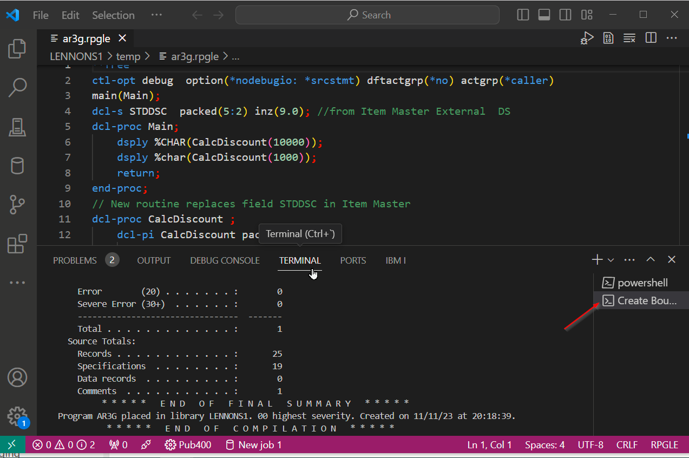

import { CardGrid, Card } from '@astrojs/starlight/components';

## Editing

To open up source code, you can [create a filter in the Object Browser](../../browsers/object-browser/) to browse source files.

<CardGrid>

<Card>

Click on a source member or stream file in the browser to open it. You can have multiple sources open.

Now you can edit the source using all the features of VS Code.

</Card><Card>

 

</Card></CardGrid>

---

<CardGrid>

<Card>

To maximize your editing tab try:

- Hide/show the side bar with **Ctrl+B**. (Or using the View menu.)
- Toggle Full screen with **F11**

See **Help** in the menu for tips, tricks, editing keyboard shortcuts and tutorials.

</Card><Card>

</Card></CardGrid>

---

### Source dates

Source date support must be enabled and is disabled by default. This can be changed in the Connection Settings. See more on the [Source Dates page](../sourcedates/).

## Compiling

Compile the **active tab** with Ctrl+E.

- If there are unsaved changes, you will be told it first must be saved, and also given the option to always save before a compile.
- If you click **Save Automatically**, sequent compile requests will always save first if there are changes. (In *Settings: Connection*, below, you can turn off the auto save option.)
- If there is more than one compile option for your source type, select the appropriate one.

<CardGrid>

<Card>

If the compile completes without error you will see an informational message like this:

</Card><Card>

</Card></CardGrid>

---

### Compile Errors

<CardGrid>

<Card>

If the compile fails, you will see an error message like this:

</Card><Card>

</Card></CardGrid>

---

<CardGrid>

<Card>

In the source errors will be highlighted with squiggly lines, and if you hover over the squiggly line you see details of the error:

</Card><Card>

</Card></CardGrid>

---

<CardGrid>

<Card>

You can jump to the next error with **F8**.  **Shift+F8** for the previous error.

</Card><Card>

</Card></CardGrid>

---

<CardGrid>

<Card>

If you have the **Problems** tab open in the Panel, it shows the list of errors. Clicking on a line in the **Problems** tab will take you to the line in the source.

Ctrl+J opens the panel, Ctrt+Shift+M opens the **Problems** tab. 

</Card><Card>

</Card></CardGrid>

---

To have **Problems** tab always open automatically, change this setting:

`Code-for-ibmi: Post Action View` Determine which view should be shown when running Actions -->

<CardGrid>

<Card>

Decide which Errors, Warnings or Info messages to show using the Filter icon. If you have been compiling several sources then you may also want to check **Show Active File Only**.

</Card><Card>

</Card></CardGrid>

---

You can remove all the squiggly line using **F1** to open the command palette and searching for 'IBM i Clear Diagnostics'

### Compile Listing

The compile listing is always routed to a terminal, should you need to review it.

#### Terminal Notes

- Terminals are generally found in the panel, as shown above. You can instead open them in a editor with this setting:

  `Terminal › Integrated: Default Location` controls where newly created terminals will appear.

- If you are compiling large programs you may wish to adjust this setting:

  `Terminal › Integrated: Scrollback` controls the maximum number of lines the terminal keeps in its buffer. 

- You may wish to adjust the line height in the terminal, with this setting:

  `Terminal › Integrated: Line Height` controls the line height of the terminal. 

