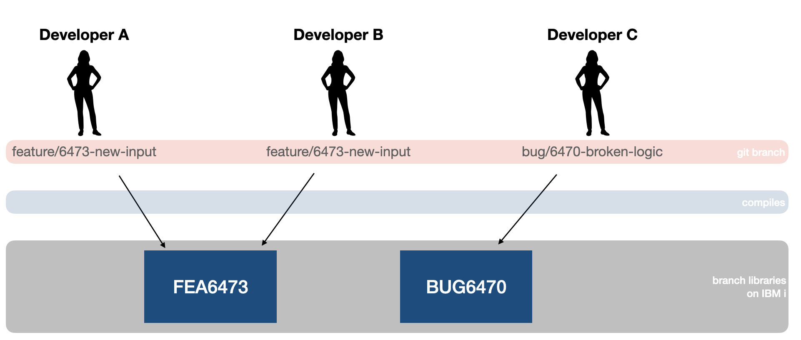
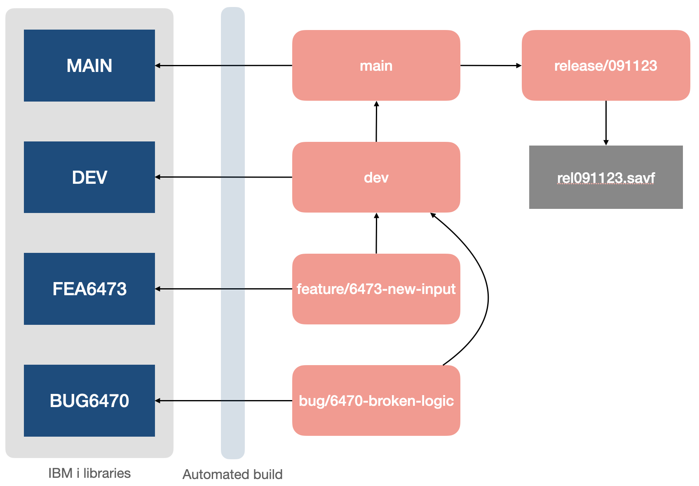

import { Aside } from '@astrojs/starlight/components';

If you have not heard of _gitflow_, then it is recommend to read this article on Gitflow from Atlassian: [Gitflow Workflow](https://www.atlassian.com/git/tutorials/comparing-workflows/gitflow-workflow).

> Gitflow is an alternative Git branching model that involves the use of feature branches and multiple primary branches. Compared to trunk-based development, Gitflow has numerous, longer-lived branches and larger commits. Under this model, developers create a feature branch and delay merging it to the main trunk branch until the feature is complete.

---

### The developer lifecycle

When using git and IBM i, developers will develop on their local device and build their changes on IBM i, as described in the [Getting started](./getting-started.mdx) section. The gitflow model is a great way to manage this process.

When using gitflow, developers will create a feature branch for each new feature or bug fix they are working on. This allows them to work independently without affecting the main codebase. Once the feature is complete, they can merge it back into the main branch.

Importantly, when developers are working in their branch, the objects they build/compile in that branch should be built into the mapped _build library_ for that branch. This ensures that the objects are isolated to that branch and do not affect other branches or the main codebase. The branch library name should be deterministic and based on the branch name.

Some branches will always exist without ever going away, for example the `main` branch or `dev` branch. For these branches, it is recommended to use a fixed build library name, such as `APPMAIN`, to avoid confusion. For feature branches, the build library can be dynamically generated based on the branch name.

<Aside type="tip">
   Code for IBM i has a feature that can be turned on in the extension settings to automatically change the user's current library to the mapped build library for the branch. This is recommended to ensure that objects are built in the correct location without manual intervention.
</Aside>

### Branch lifecycle

As branches get merged, the objects in the mapped build library for that branch will become stale and no longer needed. It is recommended to delete the branch and its associated build library once the feature is merged into parent main branch. This helps keep the codebase clean and prevents confusion about which branches are still active.

Additionally, the branch that gets merged into, for example if `feature/abc` is merged into `develop`, will need the mapped branch library updated with the latest object changes from the branch. This is typically done with some automated pipeline, but can also be done manually by a developer. This will happen a lot if you work with more branches.

