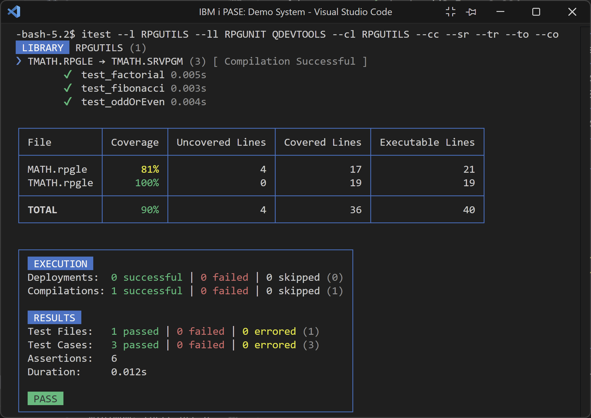
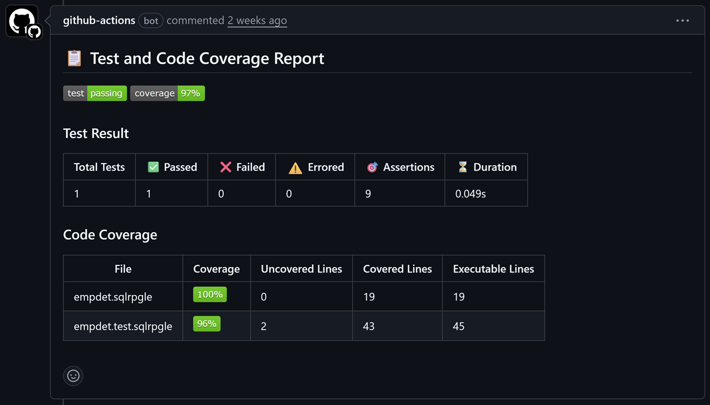

import { Aside, CardGrid, Card, Steps } from '@astrojs/starlight/components';

<div style="display: flex; gap: 5px; align-items: center;">
  <a href="https://www.npmjs.com/package/@ibm/itest">
    
  </a>
  <a href="https://www.npmjs.com/package/@ibm/itest">
    
  </a>
</div>

The [IBM i Testing CLI](https://www.npmjs.com/package/@ibm/itest) (`itest`) is a companion to the [IBM i Testing](https://marketplace.visualstudio.com/items?itemName=IBM.vscode-ibmi-testing) VS Code extension, which allows you to run unit tests and generate code coverage results for RPG and COBOL programs on IBM i. With this CLI, you can run tests in your terminal on your local PC or in PASE on IBM i. This enables you to even script the execution of tests in a CI/CD pipeline.



## Installation

This CLI can be used on your local PC or directly on IBM i. In either case, it can be installed globally via NPM:

```sh
npm i -g itest
```

## Usage

Once installed, you can run the `itest` command in your terminal along with various [options](#options) which configure what tests are run, the environment they are run in, how to run them, and what logs to generate. At a minimum, there are a few options that must be specified based on where you are running the command from and where your tests are located:

1. **Local PC + Local Tests**: Specify the `--ld, --local-directory [path]` option to point to a local directory containing your test files and the `--id, --ifs-directory [path]` option to point to the IFS directory on your IBM i where the project will be deployed.
2. **Local PC + Tests in Library**: Specify the `--l, --library <library>` option to point to a library on your IBM i containing your test members.
3. **IBM i + Tests in IFS**: Specify the `--id, --ifs-directory [path]` option to point to an IFS directory on your IBM i containing your test files.
4. **IBM i + Tests in Library**: Specify the `--l, --library <library>` option to point to a library on your IBM i containing your test members.

Check out the [examples](#examples) section below for more details.

<Aside type="note">
    If you are running the command on your local PC, you will be prompted to enter your IBM i connection details. Alternatively, you can set the following environment variables: `IBMI_HOST`, `IBMI_USER`, and `IBMI_PASSWORD` (or `IBMI_PRIVATE_KEY` if using private key authentication).
</Aside>

## Options

Listed below are all the available options for the `itest` command. For convenience, use the `itest --help` command to see all these options and their descriptions directly in your terminal.

| Flag                                           | Description                                                                  |
|------------------------------------------------|------------------------------------------------------------------------------|
| `--v, --version`                               |  Display the version number                                                  |
| `--ld, --local-directory [path]`               |  Local directory containing tests (preset: ".")                              |
| `--id, --ifs-directory [path]`                 |  IFS directory containing containing tests or deploy directory (preset: ".") |
| `--l, --library <library>`                     |  Library containing tests.                                                   |
| `--sf, --source-files <sourceFiles...>`        |  Source files to search for tests. (default: ["QTESTSRC"])                   |
| `--ll, --library-list <libraries...>`          |  Libraries to add to the library list.                                       |
| `--cl, --current-library <library>`            |  The current library to use for the test run.                                |
| `--cc, --code-coverage [ccLvl]`                | Run with code coverage (choices: "*LINE", "*PROC", preset: "*LINE")          |
| `--ct, --coverage-thresholds <threshholds...>` | Set the code coverage thresholds (yellow and green). (default: ["60","90"])  |
| `--sc, --skip-compilation`                     |  Skip compilation                                                            |
| `--sr, --summary-report [path]`                |  Save summary report (preset: "./.itest/summary-report.md")                  |
| `--tr, --test-result [path]`                   |  Save test result logs (preset: "./.itest/test-result.log")                  |
| `--to, --test-output [path]`                   |  Save test output logs (preset: "./.itest/test-output.log")                  |
| `--co, --command-output [path]`                |  Save command output logs (preset: "./.itest/command-output.log")            |
| `--h, --help`                                  |  Display help for command                                                    |

<Aside type="caution">
  If you are using Git Bash on Windows, POSIX-style paths are automatically converted to Windows paths. This conversion can break the path passed to the `--ifs-directory` option. To prevent this, you have two options:
    1. Add an additional `/` to the start of any relative or absolute POSIX path:
        ```sh
        itest --ld . --id //home/USER/builds/ibmi-company_system --ll RPGUNIT QDEVTOOLS --cl MYLIB --cc
        ```
    2. Set the environment variable `MSYS_NO_PATHCONV` to `1`:
        ```sh
        # Option A: Set the variable for your shell session
        export MSYS_NO_PATHCONV=1
        itest --ld . --id /home/USER/builds/ibmi-company_system --ll RPGUNIT QDEVTOOLS --cl MYLIB --cc

        # Option B: Set the variable only for this command
        MSYS_NO_PATHCONV=1 itest --ld . --id /home/USER/builds/ibmi-company_system --ll RPGUNIT QDEVTOOLS --cl MYLIB --cc
        ```
</Aside>

## Examples

1. Run tests in local directory:
    ```sh
    itest --ld . --id /home/USER/builds/ibmi-company_system --ll RPGUNIT QDEVTOOLS --cl MYLIB --cc
    ```

    *This first example command will deploy the contents of the current directory on your PC to the specified IFS directory, setup both the library list and current library, and finally run all tests with code coverage.**

2. Run tests in IFS directory:
    ```sh
    itest --id /home/USER/builds/ibmi-company_system --ll RPGUNIT QDEVTOOLS --cl MYLIB --cc
    ```

    *This second example is the exact same as the first one except it is run on your on IBM i because no local directory option is specified.*

3. Run tests in library:
    ```sh
    itest --l RPGUTILS --ll RPGUNIT QDEVTOOLS --cl RPGUTILS --cc
    ````

    *This third example is similar to the second except it will run tests in the specified library. This command can be run both on your local PC or IBM i.*

4. Run tests in library (more customized):
    ```sh
    itest --l RPGUTILS --ll RPGUNIT QDEVTOOLS --cl RPGUTILS --cc *PROC --ct 70 95 --sr --tr --to --co
    ````

    *This fourth example is similar to the third one except it generates procedure coverage, customizes the yellow and green coverage thresholds, and saves all logs to the default log directory (`.itest`).*

## Logs

There are various logs that can be generated by the CLI to help you understand the results of your tests and diagnose any failures or issues. By default, all logs are saved to the `.itest` in the current working directory, but you can customize the path for each log via the corresponding option. The following logs can be generated:

* **Summary Report**: Markdown file that with a summary of the test results and code coverage results in a human readable format. This report is particularly useful when running tests in a CI/CD pipeline.
* **Test Result**: Log file with a copy of the standard output of this command.
* **Test Output**: Log file with information about which tests are discovered, what test configuration is used, all standard output/errors for any commands, and more. It will have the equivalent of what is shown in the [IBM i Testing output channel](../troubleshooting/#extension-logs) when running tests in VS Code. This log file is the most useful for diagnosing issues.
* **Command Output**: Log file with standard output/errors and error codes for all commands run on the IBM i. It will have the equivalent of what is shown in the `Code for IBM i` output channel when running tests in VS Code.

## Automated Tests

Given that this CLI tool can be used to run tests from the command line, it can be easily integrated into any CI/CD pipeline. As a reference, use the below GitHub Action workflow snippet which uses the `itest` command to run tests and generate code coverage for the `my-sample-application` project:

```yaml
- name: Run Unit Tests
  id: test
  run: | 
    itest \
      --ld . \
      --id /home/$IBMI_USER/builds/my-sample-application \
      --ll MYAPP RPGUNIT QDEVTOOLS \
      --cl MYAPP \
      --cc --sr --tr --to --co
  env:
    IBMI_HOST: ${{ secrets.IBMI_HOST }}
    IBMI_USER: ${{ secrets.IBMI_USER }}
    IBMI_PASSWORD: ${{ secrets.IBMI_PASSWORD }}
    IBMI_SSH_PORT: ${{ secrets.IBMI_SSH_PORT }}
```

This step can be used in a workflow that is triggered on pull requests to ensure that all tests pass and code coverage is acceptable before allowing the pull request to be merged. The markdown summary report can even be rendered in the PR comments making it easier for reviewers to see the results.



Check out the full [pr.yaml](https://github.com/IBM/ibmi-company_system/blob/main/.github/workflows/pr.yaml) file example in the [ibmi-company_system](https://github.com/IBM/ibmi-company_system) repository. This workflow showcases an end-to-end CI/CD pipeline that consists of build, impact analysis, unit tests, and code coverage!