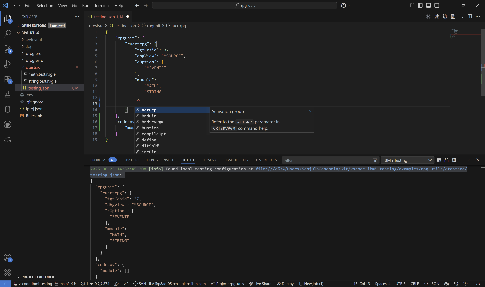
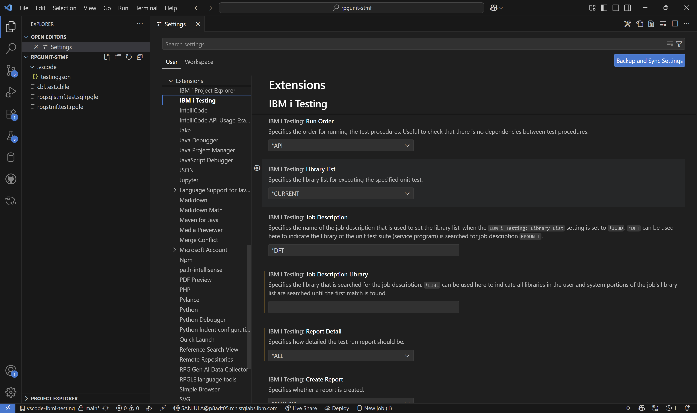

import { Aside, CardGrid, Card, Tabs, TabItem, FileTree, Steps } from '@astrojs/starlight/components';

## Test Configuration

The process of defining how to compile your tests is greatly simplified using a configuration file called `testing.json`. This file allows you to specify the parameters for the RPGUnit compile commands (`RUCRTRPG` and `RUCRTCBL`) and the code coverage command (`CODECOV`) in JSON format. The scope in which these parameters are applied is determined by the location of the `testing.json` file and depends on whether you are working with local files or source members.



### Local Files

The following hierarchy is used to determine the configuration for local files:
* `<directory>/testing.json`: This is a directory level configuration file that will apply to all tests in that directory.
* `.vscode/testing.json`: This is a global configuration file that will apply to all tests in that project. Parameters not set at the directory level will be inherited from this global configuration.

Shown below is an example of a project structure with the `testing.json` file at the global and directory level:

<FileTree>
- .vscode
  - testing.json                      **Global configuration**
- qsqlsrc
  - employee.sql
- qrpglesrc
  - utilsA.rpgle
  - utilsB.rpgle
  - employee.rpgle
- qtestsrc
  - utils
    - testing.json                    **Directory level configuration**
    - utilsA.test.rpgle
    - utilsB.test.rpgle
  - employee.test.rpgle
</FileTree>

### Source Members

The following hierarchy is used to determine the configuration for source members:
* `<sourceFile>/testing.json`: This is a source file level configuration file that will apply to all tests in that source file.
* `VSCODE.FILE/testing.json`: This is a global configuration file that will apply to all tests in that library. Parameters not set at the source file level will be inherited from this global configuration.

Shown below is an example of a project structure with the `testing.json` file at the global and source file level:
<FileTree>
- MYUSER.LIB
  - VSCODE.FILE
    - TESTING.JSON                    **Global configuration**
  - QSQLSRC.FILE
    - EMPLOYEE.SQL
  - QRPGLESRC.FILE
    - EMPLOYEE.RPGLE
    - UTILSA.RPGLE
    - UTILSB.RPGLE
  - QTESTSRC.FILE
    - EMPLOYEE_T.RPGLE
  - UTILTST.FILE
    - TESTING.JSON                    **Source file level configuration**
    - UTILSA_T.RPGLE
    - UTILSB_T.RPGLE
</FileTree>

### Default Configuration

Use the following steps to create a default configuration for your project:

<Steps>
  1. Create a `testing.json` file or source member in the desired location.
  2. Press `Ctrl+Space` and select the `IBM i Testing Configuration` option to generate the default configuration:
      ```json
      {
          "rpgunit": {
              "rucrtrpg": {
                  "tgtCcsid": 37,
                  "dbgView": "*SOURCE",
                  "cOption": [
                      "*EVENTF"
                  ]
              },
              "rucrtcbl": {
                  "tgtCcsid": 37,
                  "dbgView": "*SOURCE",
                  "cOption": [
                      "*EVENTF"
                  ]
              }
          },
          "codecov": {
              "module": []
          }
      }
      ```
  3. Use `Ctrl+Space` within any of the commands to see the available parameters and their descriptions.
</Steps>

## Execution Configuration

When it comes time to executing the tests, the extension essentially runs the `RUCALLTST` command provided by RPGUnit. The parameters for this command are configured in the VS Code settings.



## Compile, Execution, and Coverage Parameters

<Tabs>
  <TabItem label="RUCRTRPG" >
    |Parameter    |Name                    |Description                                                                                                                                                                                                                 |Default |
    |-------------|------------------------|----------------------------------------------------------------------------------------------------------------------------------------------------------------------------------------------------------------------------|--------|
    |`text`       |Text description        |Allows you to enter text that briefly describes the RPGUnit test case and its function.                                                                                                                                     |        |
    |`cOption`    |Compile options         |Refer to the `OPTION` parameter in `CRTRPGMOD` command help.                                                                                                                                                                |*EVENTF |
    |`dbgView`    |Debugging views         |Refer to the `DBGVIEW` parameter in `CRTRPGMOD` command help.                                                                                                                                                               |*SOURCE |
    |`bndSrvPgm`  |Bind service program    |Refer to the `BNDSRVPGM` parameter in `CRTSRVPGM` command help.                                                                                                                                                             |        |
    |`bndDir`     |Binding directory       |Refer to the `BNDDIR` parameter in `CRTSRVPGM` command help.                                                                                                                                                                |        |
    |`bOption`    |Binding options         |Refer to the `OPTION` parameter in `CRTSRVPGM` command help.                                                                                                                                                                |        |
    |`define`     |Define condition names  |Specifies condition names that are defined before the compilation begins. Using the parameter `DEFINE(condition-name)` is equivalent to coding the `/DEFINE` condition-name directive on the first line of the source file. |        |
    |`dltSplf`    |Delete spooled files    |Specifies if all spooled files (compile listing) created by the object creations commands are deleted on success.                                                                                                           |        |
    |`actGrp`     |Activation group        |Refer to the `ACTGRP` parameter in `CRTSRVPGM` command help.                                                                                                                                                                |        |
    |`module`     |Module                  |Refer to the `MODULE` parameter in `CRTSRVPGM` command help.                                                                                                                                                                |        |
    |`rpgPpOpt`   |Pre-compiler RPGPPOPT   |Refer to the `RPGPPOPT` parameter in `CRTSRVPGM` command.                                                                                                                                                                   |*LVL2   |
    |`pOption`    |Pre-compiler OPTIONS    |Refer to the `OPTION` parameter in `CRTSQLRPGI` command help.                                                                                                                                                               |        |
    |`compileOpt` |Pre-Compiler COMPILEOPT |Refer to the `COMPILEOPT` parameter in `CRTSQLRPGI` command help.                                                                                                                                                           |        |
    |`tgtRls`     |Target release          |Refer to the `TGTRLS` parameter in `CRTSRVPGM` command help.                                                                                                                                                                |        |
    |`incDir`     |Include directory       |Specifies one or more directories to add to the search path used by the compiler to find copy files. The compiler will search the directories specified here if the copy files in the source program can not be resolved.   |        |
    |`tgtCcsid`   |Target CCSID            |Specifies the CCSID that the compiler uses to read the source files.                                                                                                                                                        |37      |
    |`wrapperCmd` |Wrapper Command         |Specifies a custom command to wrap the `RUCRTRPG` command.                                                                                                                                                                  |        |
  </TabItem>
  <TabItem label="RUCRTCBL" >
    |Parameter    |Name                    |Description                                                                                                                                                                                                                 |Default |
    |-------------|------------------------|----------------------------------------------------------------------------------------------------------------------------------------------------------------------------------------------------------------------------|--------|
    |`text`       |Text description        |Allows you to enter text that briefly describes the RPGUnit test case and its function.                                                                                                                                     |        |
    |`cOption`    |Compile options         |Refer to the `OPTION` parameter in `CRTCBLMOD` command help.                                                                                                                                                                |*EVENTF |
    |`dbgView`    |Debugging views         |Refer to the `DBGVIEW` parameter in `CRTCBLMOD` command help.                                                                                                                                                               |*SOURCE |
    |`bndSrvPgm`  |Bind service program    |Refer to the `BNDSRVPGM` parameter in `CRTSRVPGM` command help.                                                                                                                                                             |        |
    |`bndDir`     |Binding directory       |Refer to the `BNDDIR` parameter in `CRTSRVPGM` command help.                                                                                                                                                                |        |
    |`bOption`    |Binding options         |Refer to the `OPTION` parameter in `CRTSRVPGM` command help.                                                                                                                                                                |        |
    |`define`     |Define condition names  |Specifies condition names that are defined before the compilation begins. Using the parameter `DEFINE(condition-name)` is equivalent to coding the `/DEFINE` condition-name directive on the first line of the source file. |        |
    |`dltSplf`    |Delete spooled files    |Specifies if all spooled files (compile listing) created by the object creations commands are deleted on success.                                                                                                           |        |
    |`actGrp`     |Activation group        |Refer to the `ACTGRP` parameter in `CRTSRVPGM` command help.                                                                                                                                                                |        |
    |`module`     |Module                  |Refer to the `MODULE` parameter in `CRTSRVPGM` command help.                                                                                                                                                                |        |
    |`pOption`    |Pre-compiler OPTIONS    |Refer to the `OPTION` parameter in `CRTSQLCBLI` command help.                                                                                                                                                               |        |
    |`compileOpt` |Pre-Compiler COMPILEOPT |Refer to the `COMPILEOPT` parameter in `CRTSQLCBLI` command help.                                                                                                                                                           |        |
    |`tgtRls`     |Target release          |Refer to the `TGTRLS` parameter in `CRTSRVPGM` command help.                                                                                                                                                                |        |
    |`incDir`     |Include Directory       |Specifies one or more directories to add to the search path used by the compiler to find copy files. The compiler will search the directories specified here if the copy files in the source program can not be resolved.   |        |
    |`tgtCcsid`   |Target CCSID            |Specifies the CCSID that the compiler uses to read the source files.                                                                                                                                                        |37      |
    |`wrapperCmd` |Wrapper Command         |Specifies a custom command to wrap the `RUCRTCBL` command.                                                                                                                                                                  |        |
  </TabItem>
  <TabItem label="CODECOV" >
    |Parameter |Name    |Description                                                                                 |Default |
    |----------|--------|--------------------------------------------------------------------------------------------|--------|
    |`module`  |Module  |Specifies programs or service programs and optionally modules to include for code coverage. |        |
    |`testId`  |Test ID |                                                                                            |        |
    |`exclude` |Exclude |Objects to exclude                                                                          |        |
  </TabItem>
  <TabItem label="RUCALLTST" >
    |Setting                 |Description                                                                                                                                                                                                                                                                           |Default  |
    |------------------------|--------------------------------------------------------------------------------------------------------------------------------------------------------------------------------------------------------------------------------------------------------------------------------------|---------|
    |Run Order               |Specifies the order for running the test procedures. Useful to check that there is no dependencies between test procedures.                                                                                                                                                           |*API     |
    |Library List            |Specifies the library list for executing the specified unit test.                                                                                                                                                                                                                     |*CURRENT |
    |Job Description         |Specifies the name of the job description that is used to set the library list, when the `IBM i Testing: Library List` setting is set to `*JOBD`. `*DFT` can be used here to indicate the library of the unit test suite (service program) is searched for job description `RPGUNIT`. |*DFT     |
    |Job Description Library |Specifies the library that is searched for the job description. `*LIBL` can be used here to indicate all libraries in the user and system portions of the job's library list are searched until the first match is found.                                                             |         |
    |Report Detail           |Specifies how detailed the test run report should be.                                                                                                                                                                                                                                 |*BASIC   |
    |Create Report           |Specifies whether a report is created.                                                                                                                                                                                                                                                |*ALLWAYS |
    |Reclaim Resources       |Specifies when to reclaim resources. Resources, such as open files, can be reclaimed after each test case or at the end of the test suite. This option is useful if the test suite calls OPM programs, which do not set the `*INLR` indicator.                                        |*NO      |
  </TabItem>
</Tabs>

    <Aside type="note">
        The `wrapperCmd` parameter in the `RUCRTRPG` and `RUCRTCBL` sections are not actual parameters of the RPGUnit commands, but rather are provided by the extension to allow wrappering them. This is primarily used when integrating RPGUnit with other vendor tools.

        **Example `testing.json` configuration**:
        ```json
        {
            "rpgunit": {
                "rucrtrpg": {
                    "tgtCcsid": 37,
                    "dbgView": "*SOURCE",
                    "cOption": [
                        "*EVENTF"
                    ],
                    "wrapperCmd": {
                        "cmd": "MYLIB/MYCMD TSTCMD",
                        "params": {
                            "desc": "My description"
                        }
                    }
                }
            }
        }
        ```
        **Resolved command**:
        ```
        MYLIB/MYCMD TSTCMD(RPGUNIT/RUCRTRPG TSTPGM(MYUSER/TEMPDET)
        SRCSTMF('/home/MYUSER/builds/ibmi-company_system/qtestsrc/empdet.test.sqlrpgle')
        TGTCCSID(37) DBGVIEW(*SOURCE) COPTION(*EVENTF) RPGPPOPT(*LVL2)
        INCDIR('''/home/MYUSER/builds/ibmi-company_system''')) DESC('My description')
        ```
    </Aside>