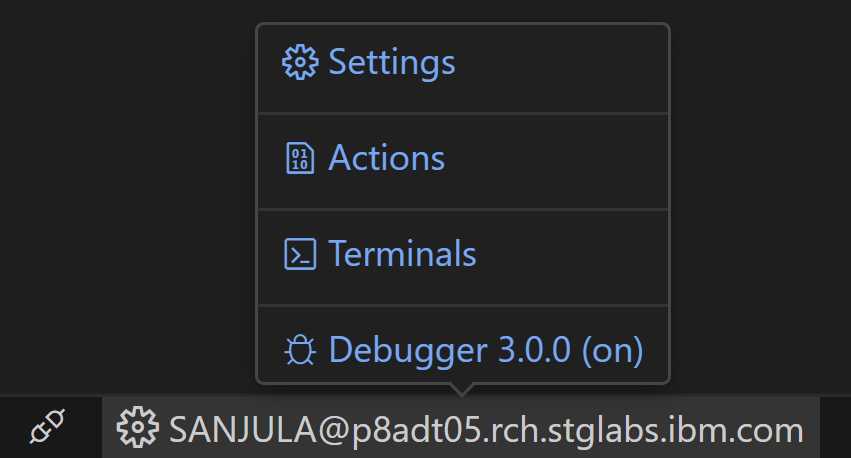
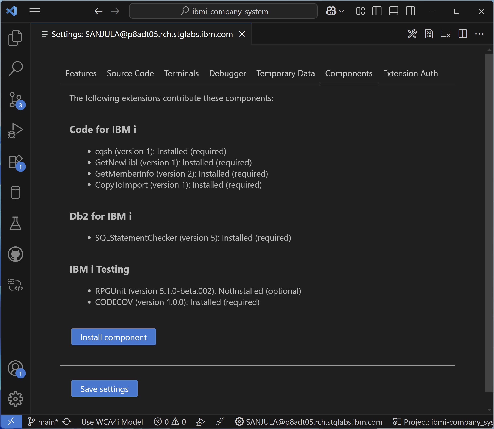
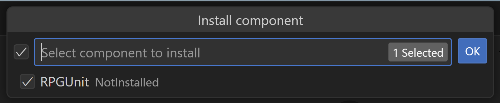
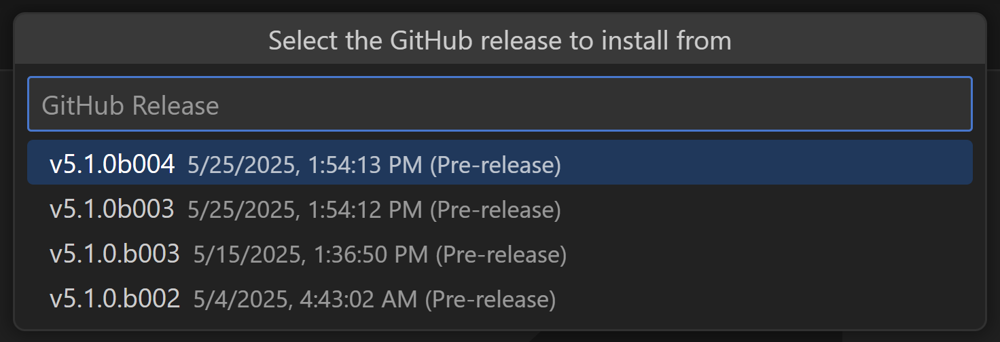
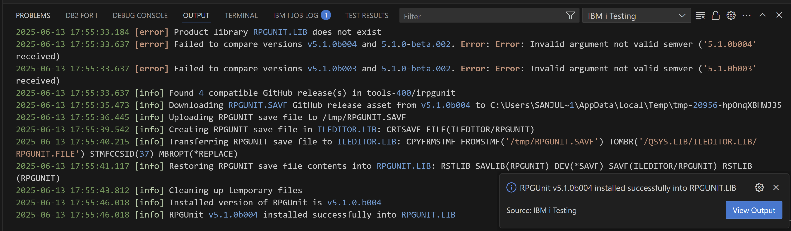
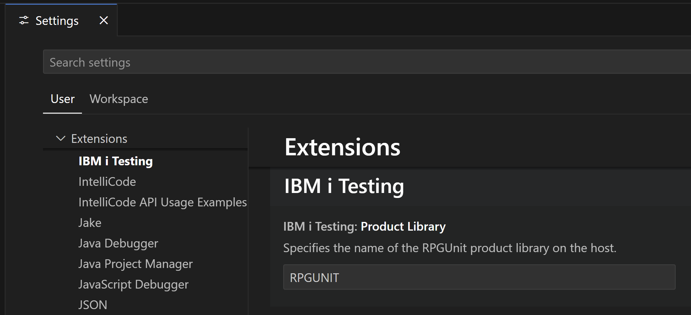

import { Aside, CardGrid, Card, Steps } from '@astrojs/starlight/components';

  
  

The [IBM i Testing](https://marketplace.visualstudio.com/items?itemName=IBM.vscode-ibmi-testing) extension allows developers to run unit tests and generate code coverage results for RPG and COBOL programs on IBM i. Under the covers, this extension leverages the [RPGUnit](https://irpgunit.sourceforge.io/help) testing framework.

* 👨‍💻 **Run Tests**: Visualize and run tests suites out of local files or source members.
* ✍️ **Generate Stubs**: Generate test stubs for individual test cases or an entire test suite.
* ⚙️ **Configure Tests**: Configure parameters to compile (`RUCRTRPG`/`RUCRTCBL`) and run (`RUCALLTST`) tests.
* 📋 **View Test Results**: View detailed test results along with inline failure/error messages.
* 🎯 **Generate Code Coverage**: View line and procedure level code coverage results as an overlay in the editor.

## Installation

### 1. Extensions

The following extensions can be installed from the Visual Studio Code Marketplace or Open VSX Registry:
  * [IBM i Testing](https://marketplace.visualstudio.com/items?itemName=IBM.vscode-ibmi-testing) ***(Required)***
  * [Code for IBM i](https://marketplace.visualstudio.com/items?itemName=HalcyonTechLtd.code-for-ibmi) ***(Required - `2.16.0` minimum)***
  * [RPGLE](https://marketplace.visualstudio.com/items?itemName=HalcyonTechLtd.vscode-rpgle) ***(Required - `0.31.0` minimum)***
  * [COBOL](https://marketplace.visualstudio.com/items?itemName=bitlang.cobol) *(Optional - Install if writing COBOL unit tests)*

### 2. RPGUnit

The `RPGUNIT` library must be installed on your IBM i in order to leverage the framework and assertions that it provides. It can be installed easily via the extension using the steps below which is the recommended approach or manually using the instructions [here](https://irpgunit.sourceforge.io/help/).

The required RPGUnit version depends on which version of the **IBM i Testing** extension you have installed:

| Extension Version | Required RPGUnit Version   |
|-------------------|----------------------------|
| ≤ 1.2.3           | 5.1.0                      |
| 1.3.2             | ≥ 6.0.0                    |

#### Preconditions
RPGUnit requires OS400 7.5 for the latest features. It can also be installed on 7.4 and 7.3 if the following PTFs have been installed:

**7.4**
* ILE RPG runtime: SI71537
* ILE RPG compiler: SI71536
* SQL Precompile support UTF-8 stream files: SI70942

**7.3**
* ILE RPG runtime: SI71535
* ILE RPG compiler: SI71534
* SQL Precompile support UTF-8 stream files: SI70936

If the PTFs have not been installed, the library must be recompiled to disable the latest features, such as `assertEqual()`. PTFs SI70942 and SI70936 are required for compiling test suites from UTF-8 (CCSID: 1208) source stream files.

#### Library Installation via Extension

Once the PTFs are installed, you can install the library via the extension using the folllowing steps:

<Steps>
  1. Connect to your IBM i system.
  2. Open the connection settings by hovering on the connection in the status bar and selecting **Settings**.
    
  3. Navigate to the **Components** tab and select **Install component**.
    
  4. Select *RPGUnit* from the list of available components to install and click **Ok**.
    
  5. Select the GitHub release to install from. In most cases this will be the latest, but you can also select a specific version. More information on each release can be found on the [irpgunit GitHub Releases](https://github.com/tools-400/irpgunit/releases) page.
    
  6. The extension will begin installing the `RPGUNIT` library on your IBM i system. You can monitor the installation progress in the **IBM i Testing** output channel. This will log all commands executed during the installation as well as any errors or warnings. You will see a notification once the installation is successful or fails.
    
</Steps>

<Aside type="note">
  By default, `RPGUNIT` is the name of the RPGUnit product library which will be installed on the host. This can be configured if necessary by going to the extension's settings and searching for the **Product Library** setting.
  
</Aside>

### 3. CODECOV

To generate code coverage results, the `CODECOV` command must be installed on your IBM i via PTF:
    * **7.3**: PTF SI80728
    * **7.4**: PTF SI80737 & SI81204
    * **7.5**: PTF SI81216 & SI81217