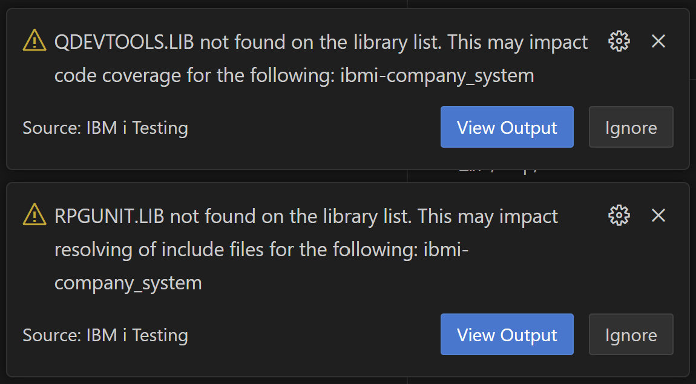
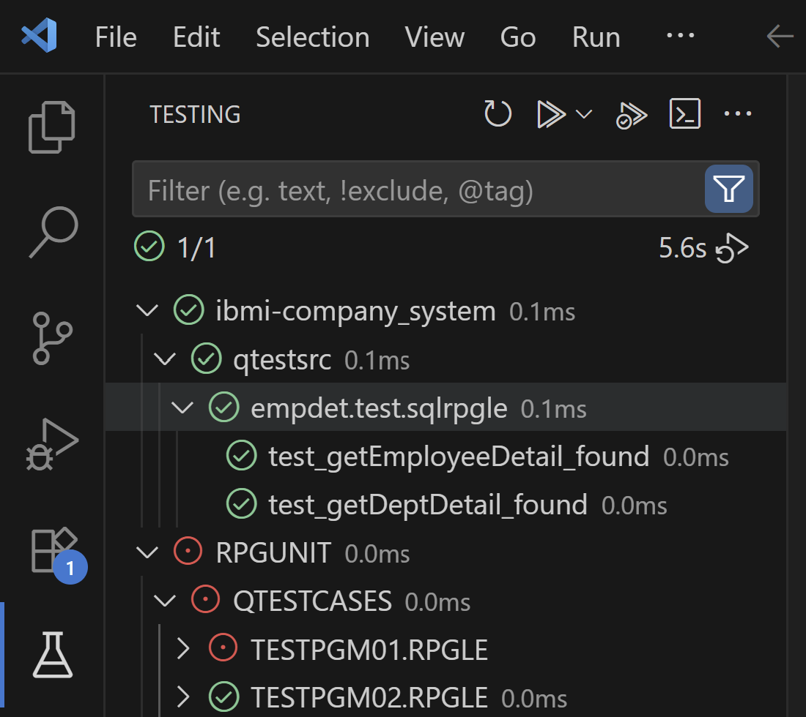
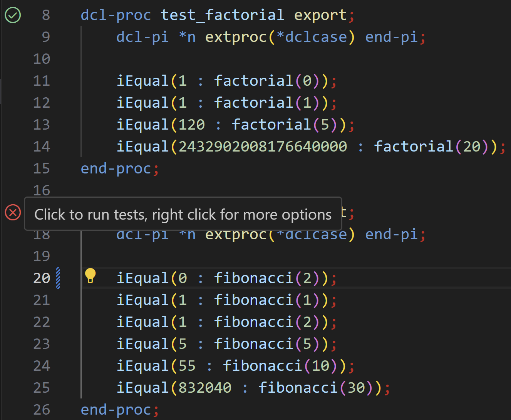
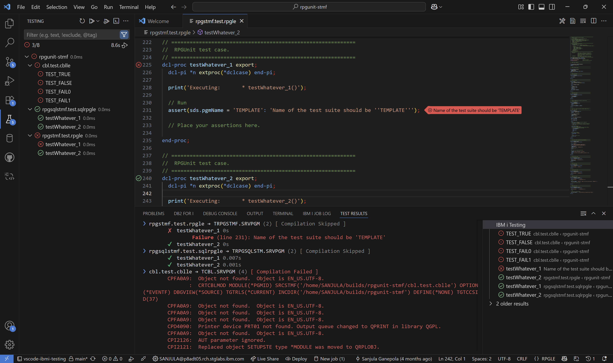
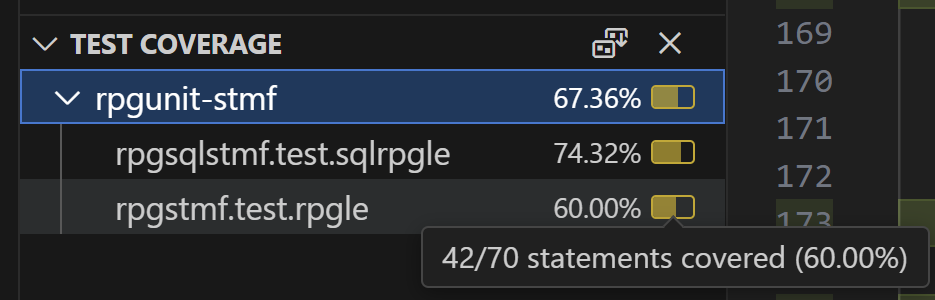
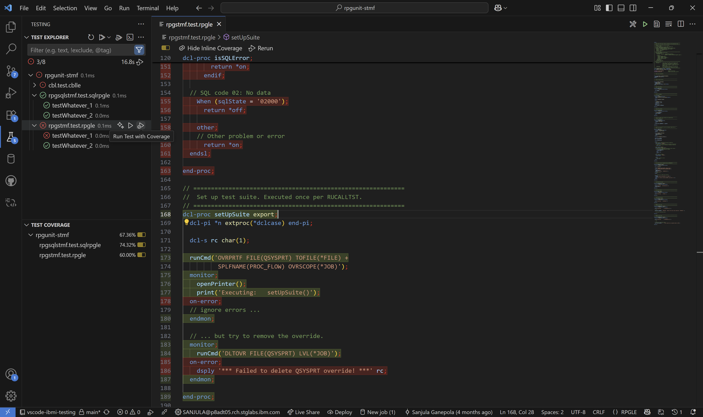
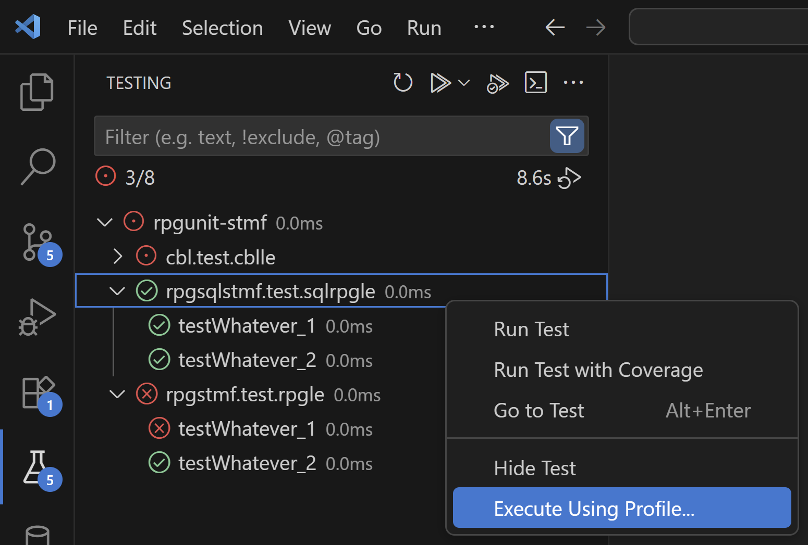
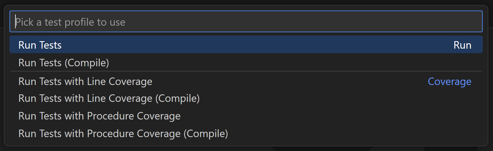
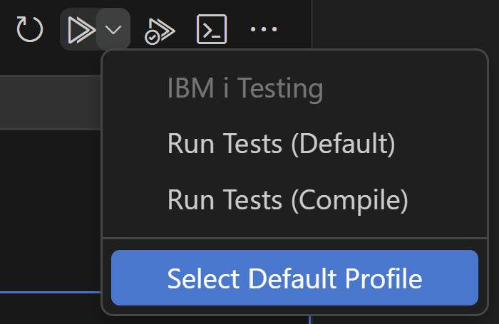
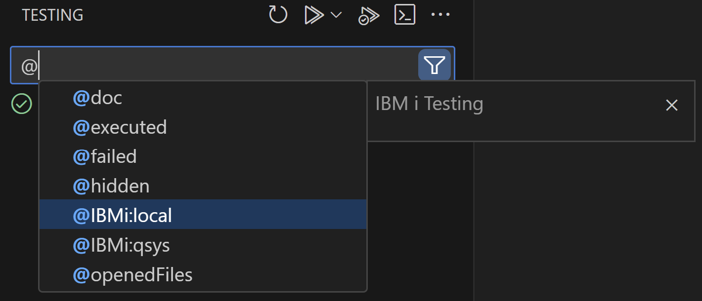

import { Aside, CardGrid, Card, Steps } from '@astrojs/starlight/components';

## Setup

### Library List

Before running any tests, it is recommended that `RPGUNIT.LIB` and `QDEVTOOLS.LIB` are added to your library list to avoid issues with resolving include files. In the case you are working with local test files and are using `iproj.json`, you can add this to your `preUsrlibl` in `iproj.json`. In the case of source members, you can add these libraries via the **User Library List** view in Code for IBM i. You may see the following warnings in the case these libraries are not on your library list:



## Test Explorer

For tests to be discovered by the extension, you must first [connect to an IBM i](../../../quickstart/). Once connected, the extension will automatically discover any RPG/COBOL tests as local files from your workspace or as source members from your library list. These tests will all be listed in the built-in **Test Explorer** view in VS Code (look for the beaker icon).



From here you can hover on any test case, test suite, folder, library, or source file and use the inline **Run Test** button. Using this action will start the following process:

<Steps>
  1. **Deployment *(Local Files Only)***: The contents of your workspace folder will be deployed to a directory in the IFS. The default deployment directory suggested will be of the following format: `/home/<user>/builds/<workspace-folder>/`. This is the same deployment process that takes place when you compile any local files via Code for IBM i.
  2. **Read Compile Configuration**: To customize the parameters used to compile your tests, a global and directory specific test configuration file will be read. Learn more about this in the [Compile Configuration](../configuring/#compile-configuration) section.
  3. **Compilation**: Given the compile configuration and tests selected for execution, the tests will be compiled via the `RUCRTRPG` or `RUCRTCBL` command. This step will be skipped for tests which have had no change since the last compilation.
  4. **Execution**: The compiled test program will be executed via the `RUCALLTST` command. The parameters for this command are configured in the VS Code settings or the test configuration file. Learn more about this in the [Execution Configuration](../configuring/#execution-configuration) section.
</Steps>

<Aside type="note">
  Another option for running specific test cases and viewing test results is using the gutter actions which can be found next to the test case procedures in the editor itself.
  
</Aside>

## Test Results

After running any test, the results will be displayed in detail in the **Test Results** view. This will include the number of passed, failed, and errored test cases along with any relevant messages. The results can also be viewed at a high level in the `Testing` view itself where the icon will be updated to reflect the status of the test. Failures associated with a specific line will also be displayed in the editor.

<Aside type="tip">
  When it comes to diagnosing test errors or failures, it often helps to see the entire CL command that was executed along with the output. You can view this information by navigating to the [IBM i Testing](../troubleshooting/#extension-logs) output channel. Learn more about finding these logs on the [Troubleshooting](../troubleshooting/#logs) page.
</Aside>



## Code Coverage

You can also run the tests with code coverage to see which lines of code were executed during the test run. This is useful for identifying untested code paths and ensuring that your tests cover all critical areas of your application.

To do this, hover on the desired tests in the **Test Explorer** view like before, but this time use the inline **Run Test with Coverage** button. In addition to executing the tests, this will populate the **Test Coverage** view with the code coverage results. You can hover on individual files here to see the coverage percentage. By default, this will show statement coverage, but procedure coverage can also be enabled using the [Test Profiles](#test-profiles) described below.



The relevant files under test will also be highlighted in the editor where the executed lines will be marked in green and the unexecuted lines will be marked in red.



## Test Profiles

The extension provides two kinds of test profiles (**Run** and **Coverage**) which represent different ways of executing tests. The standard profiles only compile the test if they have not already been compiled since loading them in. Variants of these profiles are also available that always re-compile the test (refer to the profiles with the `(Compile)` suffix).

To run a set of tests with a specific profile:

1. Navigate to the **Test Explorer** view (or find the specific test case in the editor).
2. Right-click on the test (or the gutter action) and select the **Execute Using Profile...** option.
  
3. Select the desired profile to be used.
  

<Aside type="tip">
  You can change the default test profile if you prefer using the **Select Default Profile** option.
  
</Aside>

## Test Filters and Tags

The search bar in the **Test Explorer** view is used to filter what tests are displayed and executed. You can either start typing specific names or you can also use the `@` symbol to subset tests by tags. Alongside the many built-in tags provided by VS Code, the extension also provides the following additional tags:
* `@IBMi:local`: Show only tests from local files.
* `@IBMi:qsys`: Show only tests from source members.



## Test Logs

In addition to what is logged in the [IBM i Testing](../troubleshooting/#extension-logs) output channel, there are two types of logs that are generated during the test execution process:
1. **RPGUnit XML**: This raw XML data contains test results and is dumped in `/tmp/vscode-ibmi-testing/RPGUNIT/`.
2. **Code Coverage CCZIP**: This CCZIP file contains code coverage results and is dumped in `/tmp/vscode-ibmi-testing/CODECOV/`.

<Aside type="tip">
  If you ever need to find these log files after running some tests, look for a message in the [IBM i Testing](../troubleshooting/#extension-logs) output channel that looks like this:
  ```
  Test storage for empdet.test.sqlrpgle: {"RPGUNIT":"/tmp/vscode-ibmi-testing/RPGUNIT/TEMPDET_1750712148431.xml","CODECOV":"/tmp/vscode-ibmi-testing/CODECOV/TEMPDET_1750712148431.cczip"}
  ```
</Aside>