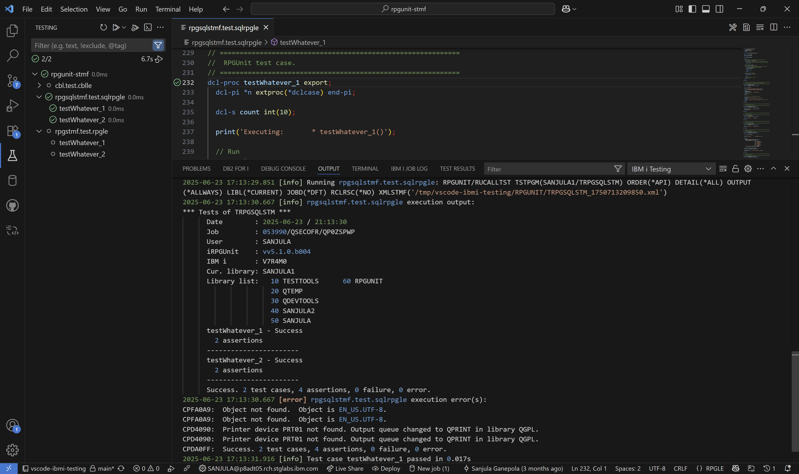

import { Aside, CardGrid, Card, LinkCard } from '@astrojs/starlight/components';

## Extension Logs

To troubleshoot any issues, navigate to the **IBM i Testing** output channel and check the logs. To do this, use the **Command Palette** (`Ctrl+Shift+P`) and search for `View: Toggle Output`. This will open the `Output` panel, where you can select the **IBM i Testing** channel.

This output channel will log which tests are discovered, what test configuration is used, all standard output/errors for any commands, and more. You can filter these logs by typing in the **Filter** search box or by using the **More Filters...** button to change the displayed log level.

## Report an Issue

There are various channels available for reporting issues and discussing features:

<CardGrid>
   <LinkCard title="🛠️ IBM i Testing GitHub Issues" href="https://github.com/IBM/vscode-ibmi-testing/issues" description="Report extension specific issues and feature requests."/>
   <LinkCard title="🗣️ IBM i Testing GitHub Discussions" href="https://github.com/IBM/vscode-ibmi-testing/discussions" description="Ask for help or discuss ideas with the community."/>
   <LinkCard title="🧪 RPGUnit Github Issues" href="https://github.com/tools-400/irpgunit/issues" description="Report RPGUnit specific issues and feature requests."/>
</CardGrid>

<Aside type="tip">
  When reporting an issue, please include logs from the `IBM i Testing` output channel as shown above. This will help us diagnose the issue more effectively.
</Aside>

## Resources

Check out these resources for more useful information:

<CardGrid>
   <LinkCard title="👨‍💻 Testing in VS Code" href="https://code.visualstudio.com/docs/editor/testing" description="Explore all the testing features built into VS Code."/>
   <LinkCard title="📖 RPGUnit Documentation" href="https://irpgunit.sourceforge.io/help/" description="Read the RPGUnit documentation and API reference."/>
</CardGrid>