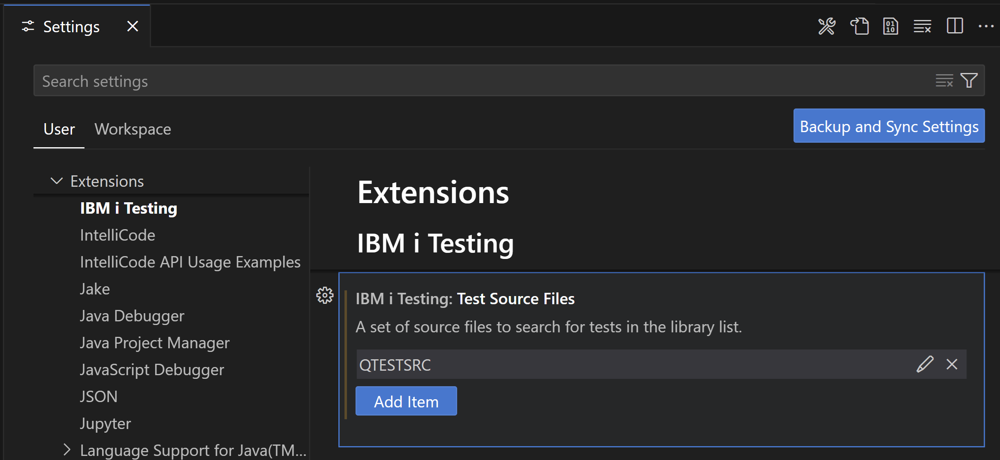
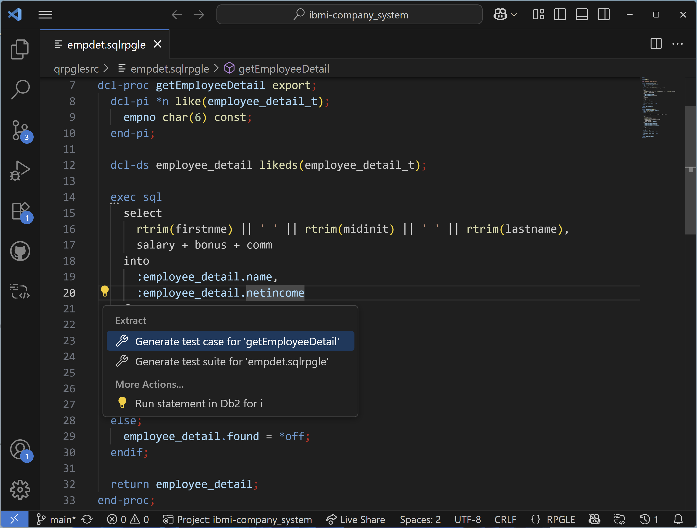
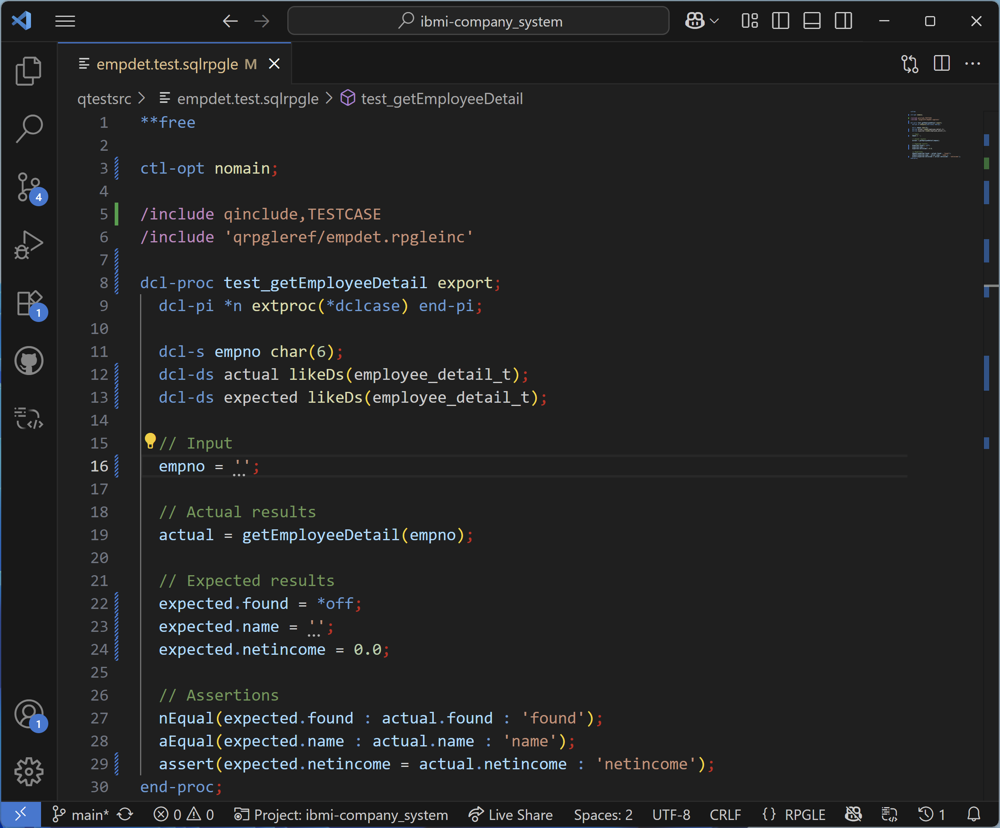
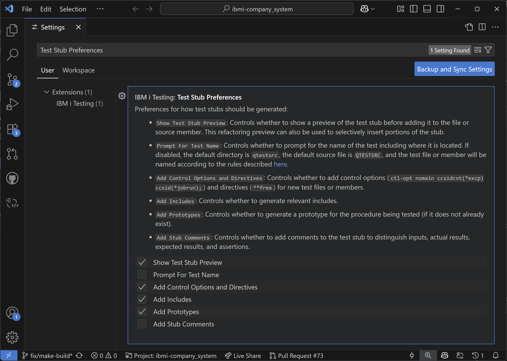
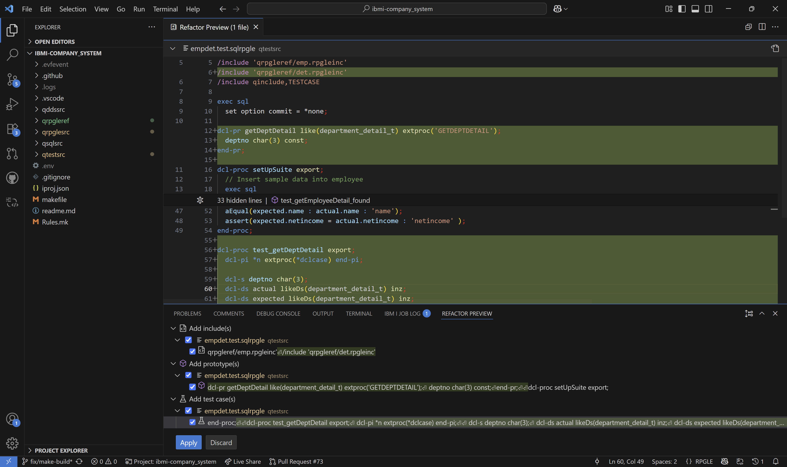

import { Aside, CardGrid, Card, Tabs, TabItem } from '@astrojs/starlight/components';

## Naming Requirements

### Test Cases

In RPGUnit, a test case is an exported procedures that starts with the name `test`. This also means that you should not export procedures starting with `test` if they are not intended to be a test case.

Listed below are some example test case names that follow this naming convention:

* `test_getEmployeeDetail`
* `test_getDeptDetail`
* `testIsPalindrome`
* `testFactorial`

### Test Suites

A test suite consists of one or more test cases in a file or source member. This test suite will be compiled into a service program in order to run the test cases. Although RPGUnit itself does not enforce an specific naming convention for test suites, the **IBM i Testing** extension does based on whether you are working on local files on your PC or source members on the IBM i.

* **Local Files**: The file name must end in `.test.rpgle`, `.test.sqlrpgle`, `.test.cblle`, or `.test.sqlcblle` in order to be detected by the extension. File names are also not restricted to 10 characters as the extension will use the same rules that Source Orbit uses to handle [long file names](https://ibm.github.io/sourceorbit/#/./pages/general/rules?id=long-file-names) when compiling the test. Noteably, since all files must include `.test`, the resulting object name will start with `T`. These files can also be put in any directory.
* **Source Members**: Source members can be named freely, but it is recommended to use some sort of prefix or suffix (ie. `T`, `_T`, `T_`, etc.) to avoid naming conflicts as the tests will be compiled into service programs. These source members can be put in any source file, but it is recommended to store them in a source file named `QTESTSRC`. By default this is where the extension will look for test suites in your library list. You can configure the extension to search other source files by going to the extension's settings and searching for the **Test Source Files** setting.
  

Listed below are some example test suite names that follow this naming convention:

* **Local Files**
  * `employee.test.rpgle`
  * `department.test.rpgle`
  * `string.test.rpgle`
  * `math.test.rpgle`
* **Source Members**
  * `QTESTSRC` source file with members:
    * `EMPLOYEET.RPGLE`
    * `DEPARTMENT.RPGLE`
    * `T_STRING.RPGLE`
    * `MATH_T.RPGLE`

## Generating Test Stubs

To simplify the process of writing tests, you can have the extension generate stubs for individual test cases or an entire test suite. To do this, place your cursor inside any export procedure and click the code action button (💡). This will give you an option to generate a test case for the specific procedure you are in or to generate a test suite containing test cases for every procedure.



After selecting an option, a test suite will be created if it does not already exist with a scaffold that will include not only the test case stubs, but also the necessary includes and prototypes (if necessary). The generated test case stubs themselves will each be structured into the following sections: declarations, inputs, actual results, expected results, and assertions. As the developer, you will need to fill in the inputs and expected results.



### Test Stub Preferences

There are various preferences that can be used to configure how the test stubs are generated. To access these preferences, go to the extension's settings and search for **Test Stub Preferences**.



### Test Stub Preview

One notable preference is the **Show Test Stub Preview** which controls whether to show a preview of the test stub before adding it to the file or source member. Once this preference is enabled, the **Refactor Preview** view will be populated with a set of edits to insert the control options & directives, includes, prototypes, and the test cases. You will need to first select the checkboxes next to the items you want to insert and then click on any item to bring up a preview of the code in the editor. Once you are satisfied with the preview, you can click the **Apply** button to insert the code into your file or source member.



## API Reference

In order to use the APIs provided by RPGUnit, you need to add the `TESTCASE` copybook to your test suite:

```RPGLE
/include qinclude,TESTCASE
```

### Setup and Teardown

<Tabs>
  <TabItem label="setUpSuite" >
    <Card title="Set Up Test Suite">
      Used to set up a test suite before the first test case is started. 
      This procedure can be used to set up test data or allocate resources before the first test case is started.

      **Syntax**
        ```RPGLE
        setUpSuite();
        ```

      **Example**
        ```RPGLE
        dcl-proc setUpSuite export;
          // Setup test suite code here
        end-proc;
        ```
    </Card>
  </TabItem>
  <TabItem label="setUp" >
    <Card title="Set Up Test Case">
      Used to set up a test case before it is executed.
      This procedure is called for each test case.

      **Syntax**
        ```RPGLE
        setUp();
        ```

      **Example**
        ```RPGLE
        dcl-proc setUp export;
          // Setup test case code here
        end-proc;
        ```
    </Card>
  </TabItem>
  <TabItem label="tearDownSuite" >
    <Card title="Tear Down Test Suite">
      Used to tear down a test suite after the last test case has been executed.
      This procedure can be used to remove test data or deallocate resources after the last test case has been executed.

      **Syntax**
        ```RPGLE
        tearDownSuite();
        ```

      **Example**
        ```RPGLE
        dcl-proc tearDownSuite export;
          // Tear down test suite code here
        end-proc;
        ```
    </Card>
  </TabItem>
  <TabItem label="tearDown" >
    <Card title="Tear Down Test Case">
      Used to tear down a test case after it has been executed.
      This procedure is called for each test case.

      **Syntax**
        ```RPGLE
        tearDown();
        ```

      **Example**
        ```RPGLE
        dcl-proc tearDown export;
          // Tear down test case code here
        end-proc;
        ```
    </Card>
  </TabItem>
</Tabs>

### Assertions

<Tabs>
  <TabItem label="RPGUnit ≥ 5.1" >
    <Tabs>
      <TabItem label="assertEqual" >
        <Card title="Equality Assertion">
          Compares the given `expected` and `actual` values (can be a string, numeric, float, date, time, timestamp).
          The assertion fails, if both values are different. If the `message` parameter is specified, it is appeneded to the log.

          **Syntax**
            ```RPGLE
            assertEqual( 'expected' : 'actual' [: 'message' );
            ```

          **Example**
            ```RPGLE
            // ✅ Pass
            assertEqual( 'Hello' : 'Hello' );
            assertEqual( 123 : 123 );

            // ❌ Fail
            assertEqual( 123.45 : 123.46 );
            assertEqual( D'2024-09-16' : D'2023-01-11' );
            assertEqual( T'11.22.33' : T'22.33.44' );
            assertEqual( Z'2024-09-16-11.22.33.123456' : Z'2024-01-11-11.22.33.123456' );
            ```
        </Card>
      </TabItem>
      <TabItem label="assertThat" >
        <Card title="Custom Assertion">
          Asserts that the given `actual` value satisfies the condition specified by the given `matcher`.
          Calls the `matcher` for comparing `actual`. The assertion fails if the `mathcer` return `false`.
          If the `message` parameter is specified, it is appeneded to the log.

          **Syntax**
            ```RPGLE
            assertThat( expected : actual : matcher [: message );
            ```

          **Example**
            ```RPGLE
            assertThat( actual : %paddr('matcher') : pUserData );
            ```
        </Card>
      </TabItem>
      <TabItem label="nEqual" >
        <Card title="Boolean Equality Assertion">
          Compares the given `expected` and `actual` Boolean values. The assertion fails, if both values are different.
          If the `fieldName` parameter is specified, the message is prefixed with `fieldName:`.

          **Syntax**
            ```RPGLE
            nEqual( expected : actual [: 'fieldName' );
            ```

          **Example**
            ```RPGLE
            // ✅ Pass
            nEqual( *off : 1=2 );

            // ❌ Fail
            nEqual( *on : 'ABC'='DEF' );
            ```
        </Card>
      </TabItem>
      <TabItem label="assert" >
        <Card title="Truthy Assertion">
          Checks if the specified Boolean expression is `true`. The assertion fails if the expression evaluates to false.
          When the assertion fails, the value of `message` is added to the test report.

          **Syntax**
            ```RPGLE
            assert( booleanExpression [: 'message' );
            ```

          **Example**
            ```RPGLE
            // ✅ Pass
            assert( 1=1 : 'Impossible to fail' );

            // ❌ Fail
            assert( 1=0 : 'Obviously wrong' );
            ```
        </Card>
      </TabItem>
      <TabItem label="fail" >
        <Card title="Fail">
          Produces an error and appends the specified `message` to the test report. The test case is terminated.

          **Syntax**
            ```RPGLE
            fail( 'message' );
            ```

          **Example**
            ```RPGLE
            monitor;
              produceAnException(doFailure);
            
              // ❌ Fail: Only runs if exception was not caught
              fail('produceAnException(..) should have raised an error.');
            on-error;
              // ✅ Pass: Only runs if exception was caught
            endmon;
            ```
        </Card>
      </TabItem>
      <TabItem label="assertJobLogContains" >
        <Card title="Job Log Contains Assertion">
          Checks whether the job log contains the specified message ID between *NOW* and `timeLimit`. The value of `timeLimit` should be created with the `getFullTimeStamp()` utility.

          **Syntax**
            ```RPGLE
            assertJobLogContains( msgId : timeLimit );
            ```

          **Example**
            ```RPGLE
            testStartTime = getFullTimeStamp();
            sndMCH1211Msg();
            
            // ✅ Pass
            assertJobLogContains( 'MCH1211' : testStartTime );
            ```
        </Card>
      </TabItem>
      <TabItem label="assertMessageQueueContains" >
        <Card title="Message Queue Contains Assertion">
          Checks whether a given message queue contains the specified message between *NOW* and `timeLimit`.
          The message is identified by any combination of ID, message text or message help where unused selection parameters must be omitted.
          * Message ID can be set to `*EMPTY` to test whether a message queue is empty (all other parameters must be omitted).
          * Message text and message help can be specified as *generic* strings values.
          * The value of `timeLimit` should be created with the `getFullTimeStamp()` utility.

          **Syntax**
            ```RPGLE
            assertMessageQueueContains( userOrQueue : library [: msgId [: msgText [: msgHelp : timeLimit );
            ```

          **Example**
            ```RPGLE
            testStartTime = getFullTimeStamp();
            sndToMSGQ();
            
            // ✅ Pass
            assertMessageQueueContains('QMSGQT' : 'QTEMP' : *omit : 'MSGQT - iRPGUnit' : *omit : testStartTime);
            
            testStartTime = getFullTimeStamp();
            
            // ✅ Pass
            assertMessageQueueContains('QMSGQT' : 'QTEMP' : '*EMPTY' : *omit : *omit : testStartTime);
            ```
        </Card>
      </TabItem>
    </Tabs>
  </TabItem>
  <TabItem label="RPGUnit ≤ 5.1" >
    <Tabs>
      <TabItem label="aEqual" >
        <Card title="String Equality Assertion">
          Compares the given `expected` and `actual` String values. The assertion fails, if both values are different.
          If the `fieldName` parameter is specified, the message is prefixed with `fieldName:`.

          **Syntax**
            ```RPGLE
            aEqual( 'expected' : 'actual' [: 'fieldName' );
            ```

          **Example**
            ```RPGLE
            // ✅ Pass
            aEqual( 'Hello' : 'Hello' );
            
            // ❌ Fail
            aEqual( 'HelloWorld' : 'Hello' );
            ```
        </Card>
      </TabItem>
      <TabItem label="iEqual" >
        <Card title="Integer Equality Assertion">
          Compares the given `expected` and `actual` Integer values. The assertion fails, if both values are different.
          If the `fieldName` parameter is specified, the message is prefixed with `fieldName:`.

          **Syntax**
            ```RPGLE
            iEqual( expected : actual [: 'fieldName' );
            ```

          **Example**
            ```RPGLE
            // ✅ Pass
            iEqual( 123 : 123 );
            
            // ❌ Fail
            iEqual( 123 : 456 );
            ```
        </Card>
      </TabItem>
      <TabItem label="nEqual" >
        <Card title="Boolean Equality Assertion">
          Compares the given `expected` and `actual` Boolean values. The assertion fails, if both values are different.
          If the `fieldName` parameter is specified, the message is prefixed with `fieldName:`.

          **Syntax**
            ```RPGLE
            nEqual( expected : actual [: 'fieldName' );
            ```

          **Example**
            ```RPGLE
            // ✅ Pass
            nEqual( *off : 1=2 );

            // ❌ Fail
            nEqual( *on : 'ABC'='DEF' );
            ```
        </Card>
      </TabItem>
      <TabItem label="assert" >
        <Card title="Truthy Assertion">
          Checks if the specified Boolean expression is `true`. The assertion fails if the expression evaluates to false.
          When the assertion fails, the value of `message` is added to the test report.

          **Syntax**
            ```RPGLE
            assert( booleanExpression [: 'message' );
            ```

          **Example**
            ```RPGLE
            // ✅ Pass
            assert( 1=1 : 'Impossible to fail' );

            // ❌ Fail
            assert( 1=0 : 'Obviously wrong' );
            ```
        </Card>
      </TabItem>
      <TabItem label="fail" >
        <Card title="Fail">
          Produces an error and appends the specified `message` to the test report. The test case is terminated.

          **Syntax**
            ```RPGLE
            fail( 'message' );
            ```

          **Example**
            ```RPGLE
            monitor;
              produceAnException(doFailure);
            
              // ❌ Fail: Only runs if exception was not caught
              fail('produceAnException(..) should have raised an error.');
            on-error;
              // ✅ Pass: Only runs if exception was caught
            endmon;
            ```
        </Card>
      </TabItem>
      <TabItem label="assertJobLogContains" >
        <Card title="Job Log Contains Assertion">
          Checks whether the job log contains the specified message ID between *NOW* and `timeLimit`. The value of `timeLimit` should be created with the `getFullTimeStamp()` utility.

          **Syntax**
            ```RPGLE
            assertJobLogContains( msgId : timeLimit );
            ```

          **Example**
            ```RPGLE
            testStartTime = getFullTimeStamp();
            sndMCH1211Msg();
            
            // ✅ Pass
            assertJobLogContains( 'MCH1211' : testStartTime );
            ```
        </Card>
      </TabItem>
      <TabItem label="assertMessageQueueContains" >
        <Card title="Message Queue Contains Assertion">
          Checks whether a given message queue contains the specified message between *NOW* and `timeLimit`.
          The message is identified by any combination of ID, message text or message help where unused selection parameters must be omitted.
          * Message ID can be set to `*EMPTY` to test whether a message queue is empty (all other parameters must be omitted).
          * Message text and message help can be specified as *generic* strings values.
          * The value of `timeLimit` should be created with the `getFullTimeStamp()` utility.

          **Syntax**
            ```RPGLE
            assertMessageQueueContains( userOrQueue : library [: msgId [: msgText [: msgHelp : timeLimit );
            ```

          **Example**
            ```RPGLE
            testStartTime = getFullTimeStamp();
            sndToMSGQ();
            
            // ✅ Pass
            assertMessageQueueContains('QMSGQT' : 'QTEMP' : *omit : 'MSGQT - iRPGUnit' : *omit : testStartTime);
            
            testStartTime = getFullTimeStamp();
            
            // ✅ Pass
            assertMessageQueueContains('QMSGQT' : 'QTEMP' : '*EMPTY' : *omit : *omit : testStartTime);
            ```
        </Card>
      </TabItem>
    </Tabs>
  </TabItem>
</Tabs>

### Utilities

#### Commonly Used APIs

<Tabs>
  <TabItem label="getFullTimeStamp" >
    <Card title="Get Full Time Stamp">
      Returns the full current timestamp, without rounding the microseconds like `%timestamp()` does.

      **Syntax**
        ```RPGLE
        getFullTimeStamp();
        ```

      **Return value**
        ```
        timestamp
        ```

      **Example**
        ```RPGLE
        tmStmp = getFullTimeStamp();
        ```
    </Card>
  </TabItem>
  <TabItem label="waitSeconds" >
    <Card title="Wait Seconds">
      Suspends the current job for a specified number of seconds. Optionally displays a status message.
      When the job resumes the original status message is restored.

      **Syntax**
        ```RPGLE
        waitSeconds( seconds [: message )
        ```

      **Return value**
        ```
        void
        ```

      **Example**
        ```RPGLE
        waitSeconds(3 : 'Waiting 3 seconds ...');
        ```
    </Card>
  </TabItem>
  <TabItem label="getMonitoredMessage" >
    <Card title="Get Monitored Message">
      Retrieves the latest `*ESCAPE` message from the job log. Usually called within the `on-error` section of a `monitor` block. 

      **Syntax**
        ```RPGLE
        getMonitoredMessage( [: doRmvMsg );
        ```

      **Return value**

        Returns a data structure with the following information:
          * `id` - Message ID
          * `text` - First level text
          * `pgm` - Sender: program name
          * `mod` - Sender: module name
          * `proc` - Sender: procedure name
          * `specNb` - Sender: statement number

      **Example**
        ```RPGLE
        monitor;
          a = 10;
          b = 0;
          c = a / b;
        
          // ❌ Fail: Only runs if exception was not caught
          fail('Division by zero did not raise an error.');
        on-error;
          msgInfo = getMonitoredMessage(*ON);
        endmon;
        
        // ✅ Pass
        aEqual( 'MCH1211' : msgInfo.Id );
        ```
    </Card>
  </TabItem>
  <TabItem label="setLowMessageKey" >
    <Card title="Set Low Message Key">
      Sets the message key of the oldest message in the job log, that is considered to be returned by `getMonitoredMessage()`.
      This procedure is automatically called by the RPGUnit, before executing a unit test. Use this procedure with care.

      **Syntax**
        ```RPGLE
        setLowMessageKey( msgKey );
        ```

      **Return value**
        ```
        void
        ```

      **Example**
        ```RPGLE
        setLowMessageKey(msgKey);
        ```
    </Card>
  </TabItem>
</Tabs>

#### Status Message APIs

<Tabs>
  <TabItem label="displayStatusMessage" >
    <Card title="Display Status Message">
      Displays a given status message in the status line at the bottom of the screen.

      **Syntax**
        ```RPGLE
        displayStatusMessage( message );
        ```

      **Return value**
        ```
        void
        ```

      **Example**
        ```RPGLE
        displayStatusMessage('Hello World!');
        ```
    </Card>
  </TabItem>
  <TabItem label="restoreStatusMessage" >
    <Card title="Restore Status Message">
      Replaces the current status message with the previous message.

      **Syntax**
        ```RPGLE
        restoreStatusMessage();
        ```

      **Return value**
        ```
        void
        ```

      **Example**
        ```RPGLE
        // Display status message.
        displayStatusMessage('Hello World!');
        
        // Overwrite status message.
        displayStatusMessage('The quick brown fox ...');
        
        // Restore previous 'Hello World!' message.
        restoreStatusMessage();
        ```
    </Card>
  </TabItem>
  <TabItem label="clearStatusMessage" >
    <Card title="Clear Status Message">
      Clears (removes) the status message that is currently being displayed at the bottom of the screen.

      **Syntax**
        ```RPGLE
        clearStatusMessage();
        ```

      **Return value**
        ```
        void
        ```

      **Example**
        ```RPGLE
        clearStatusMessage();
        ```
    </Card>
  </TabItem>
</Tabs>

#### CL Command APIs

<Tabs>
  <TabItem label="CLRPFM" >
    <Card title="Clear Physical File">
      Uses `CLRPFM` to remove the data from `member` of file `file`. The file must be stored in `*CURLIB`.

      **Syntax**
        ```RPGLE
        clrpfm( fileName [: memberName );
        ```

      **Return value**
        ```
        void
        ```

      **Example**
        ```RPGLE
        clrpfm( 'MYFILE' : 'MYMEMBER' );
        ```
    </Card>
  </TabItem>
  <TabItem label="RCLACTGRP" >
    <Card title="Reclaim Activation Group">
      Uses `RCLACTGRP` to reclaim the activation group specified at parameter `activationGroup`.

      **Syntax**
        ```RPGLE
        rclActGrp( activationGroupName );
        ```

      **Return value**
        ```
        void
        ```

      **Example**
        ```RPGLE
        rclActGrp( '*ELIGIBLE' );
        ```
    </Card>
  </TabItem>
  <TabItem label="runCmd" >
    <Card title="Run CL Command">
      Uses the `QCMDEXC` API to execute the CL command specified at parameter `command`.

      **Syntax**
        ```RPGLE
        runCmd( command );
        ```

      **Return value**
        ```
        void
        ```

      **Example**
        ```RPGLE
        runCmd( 'ALCOBJ OBJ((*CURLIB/FILE *FILE *EXCL))' );
        ```
    </Card>
  </TabItem>
</Tabs>

#### Source Type APIs

<Tabs>
  <TabItem label="getMemberType" >
    <Card title="Get Member Type">
      Returns the source type of a given source member.

      **Syntax**
        ```RPGLE
        getMemberType( sourceFile : library : member );
        ```

      **Return value**
        ```
        char(10)
        ```

      **Example**
        ```RPGLE
        srcType = getMemberType('QINCLUDE': 'RPGUNIT': 'ASSERT');
        ```
    </Card>
  </TabItem>
  <TabItem label="getStmfType" >
    <Card title="Get Stream File Type">
      Returns the source type of a given stream file.

      **Syntax**
        ```RPGLE
        getStmfType( srcStmf );
        ```

      **Return value**
        ```
        char(10)
        ```

      **Example**
        ```RPGLE
        srcType = getStmfType('/home/dev/mypgm.rpgle');
        ```
    </Card>
  </TabItem>
</Tabs>

## Example Test Suites

To get started with some sample tests, check out these examples:
* [ibmi-company_system](https://github.com/IBM/ibmi-company_system/tree/main/qtestsrc)
* RPGUnit [templates](https://github.com/tools-400/irpgunit/tree/main/host/iRPGUnit/QTEMPLATE) and [self tests](https://github.com/tools-400/irpgunit/tree/main/host/iRPGUnit/QTESTCASES)

<Aside type="tip">
  🙏 If you have example tests that you would like to share with the community, please open a pull request [here](https://github.com/codefori/docs) to add them to this list!
</Aside>