import { Aside, Tabs, TabItem, CardGrid, Card } from '@astrojs/starlight/components';

An action is used to perform a task on a member, streamfile or other type of object. A comprehensive default set of actions is loaded directly from the extension. You can also easily change or add to actions -- see below [how to manage Actions](#manage-actions).

Actions are defined commands used to perform tasks on members, streamfiles and objects. For example, to compile a source member. Actions can be executed from different places:
- When you right click on a member, streamfile or an object from the `Object Browser`.
- When you edit some source code:
  - from the editor's toolbar
  - from the Environment view's Actions node

## Manage Actions

Actions are managed from the Environment view's Actions node.

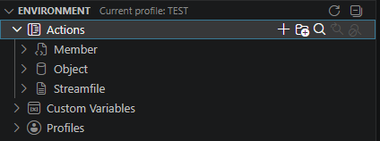

### Create an Action

You can create a new Action using one of the two `Create action` inline action located at the Actions node level, or at the Action type level.
Using `Create action` at the Actions node level will first prompt for the target type of the action.

<CardGrid>
    <Card>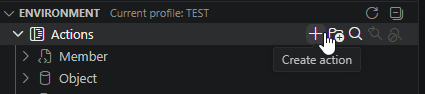</Card>
    <Card>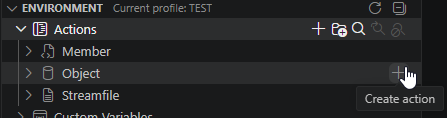</Card>
</CardGrid>

You'll be prompted to give the name of the new Action and then the Action editor will open to let you fill in the Action details.

### Edit an Action
Clicking on an Action in the Environment view will open the Action editor to let you change the selected Action's details.

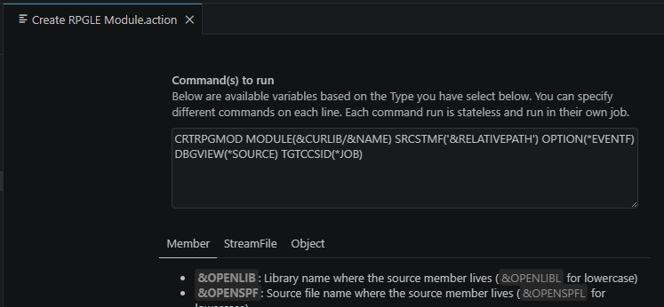

#### Command(s) to run
The command(s) that will be executed when the action is run. You can specify different commands on each line.

Notice it has portions of text that start with an `&` (ampersand) - such text is a "variable" that will be substituted when the action is run. Commands can have different variables based on the Action `Type` (member, streamfile, object or local file). Note that in addition to the supplied variables, you can create your own variables. See [Custom Variables](../variables/.).

##### Display for modification
If a command string has a leading `?`, then the command will be displayed and editable before it gets executed.
Example: `?DSPFD FILE(&LIBRARY/&NAME) OUTPUT(*PRINT)`

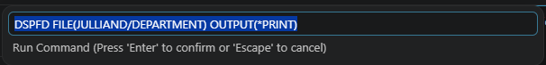

##### Prompted
Rather than using the `?`, you can have the Action prompt for values.
The `Command(s) to run` string can have embedded prompt string(s) to invoke prompting.

A "prompt string" has the format ``${NAME|LABEL|[DEFAULTVALUE]}`` where:

- NAME is an arbitrary name for the prompt field, but must be unique for this action.
- LABEL is the text to describe the prompt field.
- [DEFAULTVALUE] is an **optional** value to pre-populate the prompt field.

##### Examples

<Tabs>
<TabItem label="Example 1">
Suppose we have a "**Call program, prompt for parms**" action with the "Command to run" defined like this:

```CL
CALL &LIBRARY/&NAME PARM('${AAA|First name|Your name}' '${xyz|Last Name}')
```

If we run the action it prompts like this:

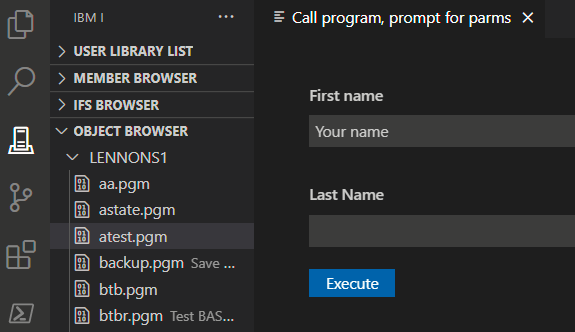

If we complete the screen like this:

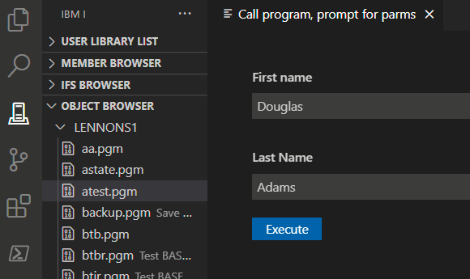

and click **Execute** a command like this is executed;

```CL
CALL LENNONS1/ATEST PARM('Douglas' 'Adams')
```

</TabItem>
<TabItem label="Example 2">
You can also use variables in the prompt string. If an action is defined like this:

```CL
CALL &LIBRARY/&NAME PARM('${AAA|Library|&CURLIB}' '${xyz|Report Name}')
```

`&CURLIB` will be substituted and the prompt will look like this when executed:

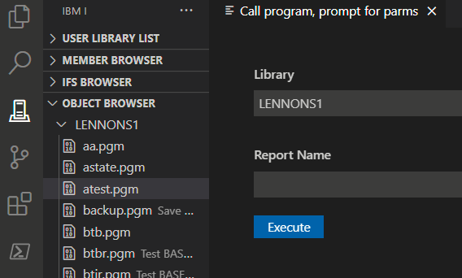

</TabItem>
<TabItem label="Example 3">
Here's a more complex example of a "**Run CRTBNDRPG (inputs)**" action.
The 'Command to run" string is defined like this:

```CL
CRTBNDRPG PGM(${buildlib|Build library|&BUILDLIB}/${objectname|Object Name|&NAME}) SRCSTMF('${sourcePath|Source path|&FULLPATH}') OPTION(*EVENTF) DBGVIEW(*SOURCE) TGTRLS(*CURRENT)
```

When executed, it prompts like this: 

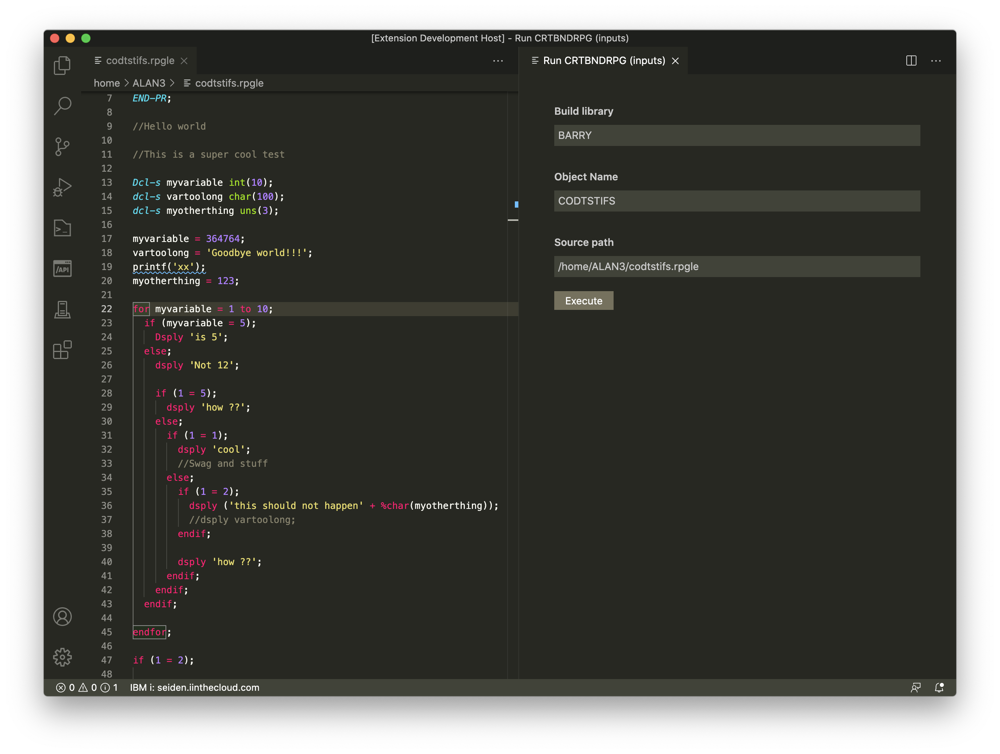

</TabItem></Tabs>

#### Extensions
A comma separated list of extensions allowed to run the action. This can be a member extension, a streamfile extension, an object type or an object attribute

#### Type
Determines which type of object can run this action. It can be `Member`, `Streamfile` or `Object`. For an Action defined in a local project, the type is always `Local File (Workspace)` and cannot be changed.

#### Environment
Determines where the command should be run. CL commands needs to run in the `ILE` environment. For shell commands, you have the option to run them through `PASE` or `QShell`.

#### Refresh
Determines the Browser level to refresh after the action is done. It can be:
- `No`: no refresh
- `Parent`: the Action target's parent container is refreshed 
- `Filter`: the Action target's root level filter is refreshed
- `Browser`: the entire browser ir refreshed

#### Deploy before running *(local project Action only)*
When enabled, the local workspace is deployed before the Action is run.

#### Post execution downloads *(local project Action only)*
A comma separated list of remote files or folders to download after the Action is complete. Supports [Custom Variables](../variables/.).

<Aside type="note"> 
    Using `.evfevent` here in combination with a build tool that will load the `EVFEVENT` file content in it will populate the Problems view.
</Aside>

#### Run on protected/read only
When enabled, allows the execution of this Action on protected or read-only targets.

#### Copy to output file
Copy the Action's output to an IFS file. [Custom Variables](../variables/.) can be used to define the file's path; use `&i` to use a file index incremented each time the action is run.
Example: `~/outputs/&CURLIB_&OPENMBR&i.txt`

### Rename/Copy/Delete
<CardGrid>
  <Card>    
    Right click on an Action to get access to the following actions:
    - Rename
    - Copy
    - Delete
  </Card>
  <Card>
    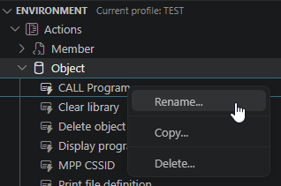
  </Card>  
</CardGrid>

---

### Local workspace Actions
Since Code for IBM i 3.x, Actions defined in a local workspace (i.e. in the `.vscode/actions.json` local file) can also be edited like member/streamfile/object Actions.

These actions are located under a node named after the local workspace.

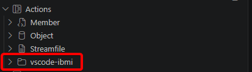

To generate standard Actions in the local workspace, use the `Launch Workspace Actions Setup` inline action at the Actions node level.

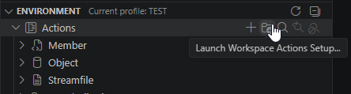

You'll be asked to choose which category(ies) of Action to generate.

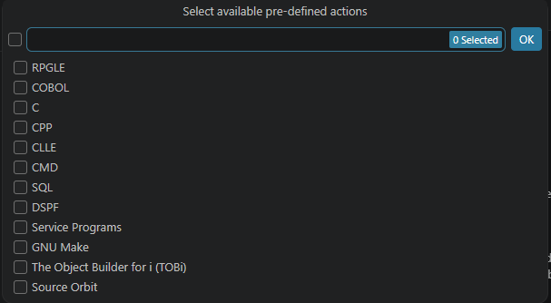

If local Actions are already defined, you'll be asked to choose between appending new Actions or overwriting the existing ones (for the select category(ies)).

---

## Running Actions

To run an Action, open a source member (or an IFS streamfile) and press the shortcut key:
- Windows: <kbd>Control + E</kbd>
- Mac: <kbd>Command + E</kbd>

Or click on the `Run Action...` action in the editor's toolbar.

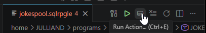

This shows a dropdown of the available Actions for the open file. Use the arrow keys to select which Action to run and hit <kbd>enter</kbd> to select it.

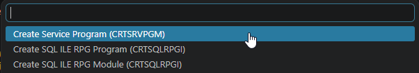

Example: to run the `CRTBNDRPG` Action, you must open a source member with the `RPGLE` extension. Then, when you use the Run Action action (above), you will see the list of available Actions.

---

You can also run an Action from the Environment view's Actions node. Any Action that an be run on the file being edited will be highlighted in blue and the `Run on active editor` inline action will be activated on each highlighted Action.

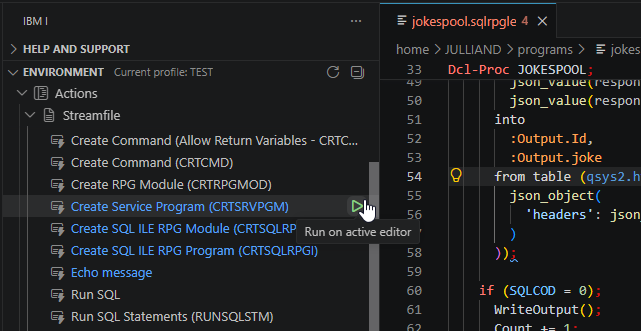

### Action execution
The Action execution workflow is the following:

1. if type is `Local File` and 'Deploy before running' is enabled -> deploy the workspace
2. execute `Command(s) to run` - depending on the command syntax:
   - execute the command immediately if no leading `?` or no prompting
   - [display for modification](#display-for-modification) and then execute if command has a leading `?`
   - [prompt](#prompted) and then execute if prompting is enabled
3. if `Copy output to file` is enabled: dump the Action output in a streamfile
4. if `Post execution downloads` is not blank: copy the listed files/folders

### EVFEVENT / Problems view
If the Action's `Command(s) to run` contains `*EVENTF` (anywhere in the command string), then the remote `EVFEVENT` file content will be loaded and parsed after the Action is done to populate the Problems view.

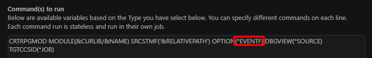

To locate the `EVFEVENT` file to load, Code for IBM i will first look for its path in the Joblog. Any message starting with `EVFEVENT:` will be parsed to get the file's path. The expected message text formats are:

```CL
EVFEVENT: LIBRARY,OBJECT
or
EVFEVENT: LIBRARY/OBJECT
or
EVFEVENT: OBJECT
```

If no `EVFEVENT:` message is found in the Action Job log, then Code for i will extract the `EVFEVENT` file location based on one of these command parameters:
- `PNLGRP(LIBRARY/OBJECT)`
- `OBJ(LIBRARY/OBJECT)`
- `PGM(LIBRARY/OBJECT)`
- `MODULE(LIBRARY/OBJECT)`
- `FILE(LIBRARY/OBJECT)`
- `MENU(LIBRARY/OBJECT)`
 
Code for i will load the `OBJECT` member from the `LIBRARY/EVFEVENT` file (or `EVFEVENT` file from the library list if `LIBRARY` is not defined).