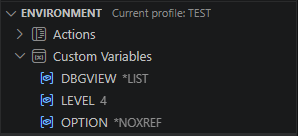
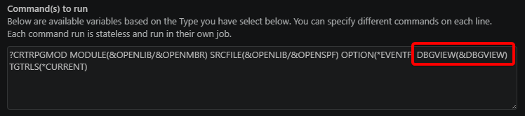
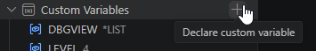
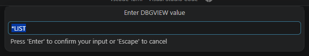
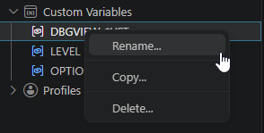

import { CardGrid, Card, Aside } from '@astrojs/starlight/components';

You can create custom variable to use in your [Actions Command(s) to run](../actions/#commands-to-run) strings.    

<CardGrid>
  <Card>    
    
  </Card>
  <Card>    
    
  </Card>
</CardGrid>

<Aside type="note">
    Variables are defined at the profile level, which means that different profiles can define the same variables with different values.
</Aside>

---

## Manage custom variables

### Create a custom variable
You can create a custom variable using the `Custom Variables` node's `Declare custom variable` inline action.



You'll be asked for the new variable's name and then for its value.

### Change custom variable value
Click on a custom variable to open a prompt asking for the new value.




### Rename/Copy/Delete
<CardGrid>
  <Card>    
    Right click on a profile to get access to the following actions:
    - Rename
    - Copy
    - Delete
  </Card>
  <Card>
    
  </Card>  
</CardGrid>

## Example Usage

In all the `CRTBNDxxx` actions, add `TGTRLS(&TARGET_RLS)`, like this:

```CL
?CRTBNDCL PGM(&OPENLIB/&OPENMBR) SRCFILE(&OPENLIB/&OPENSPF) OPTION(*EVENTF) DBGVIEW(*SOURCE) TGTRLS(&TARGET_RLS)
```

Now a single change to the TARGET_RLS custom variable can impact all the CRTBNDxxx actions.