import { CardGrid, Card, Tabs, TabItem } from '@astrojs/starlight/components';
import { Aside, Icon } from '@astrojs/starlight/components';

 __Command Language__ is the scripting language for the IBM i operating system.   This extension assists in CLP or CLLE program development, providing:

   - Content assist for CL commands 
   - Outline view
   - Go to or peek definition and references

   It also provides support for running a CL statement with `Ctrl+r`.

## Installation

The CL Language tools extension can be [installed from the Marketplace](https://marketplace.visualstudio.com/items?itemName=IBM.vscode-clle)<Icon name="external" color="cyan" class="icon-inline" /> and is also part of the [IBM i Development Pack](https://marketplace.visualstudio.com/items?itemName=HalcyonTechLtd.ibm-i-development-pack)<Icon name="external" color="cyan" class="icon-inline" />.
<CardGrid>
<Card>
Or it can be installed from the Extension view inside Visual Code. 
</Card><Card>
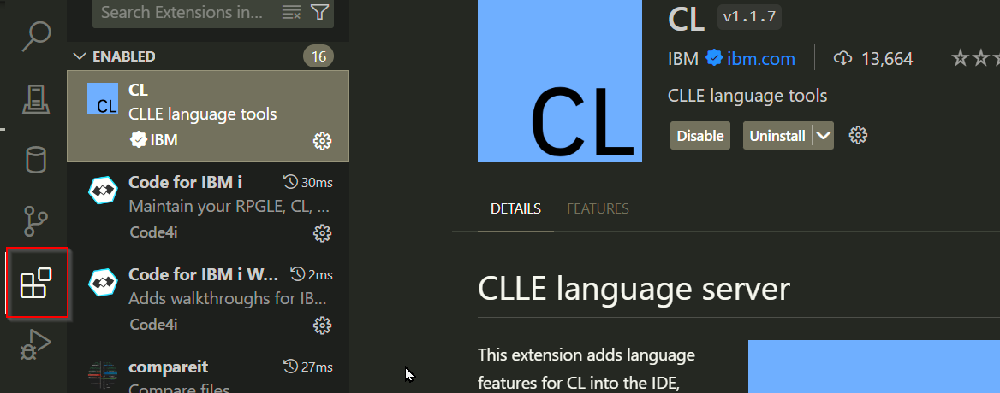
</Card>
</CardGrid>
## Content Assist

Content Assist is triggered by `Ctrl+space`. This is best explained by examples.

### Content Assist Example 1

Suppose you want to create a data area with the CRTDTAARA command. Enter CRTDTAARA __follwed by a space__, like this: 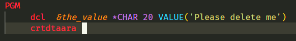

Press `Ctrl+space` to invoke Content Assist to produce a pick list like this: 
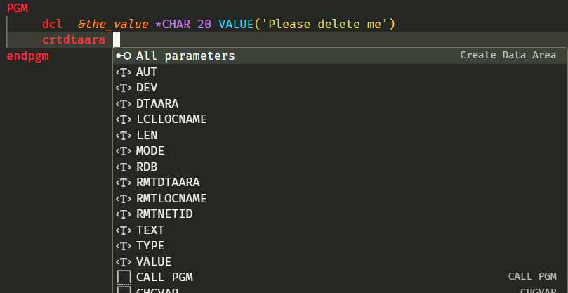

Press `enter` or `tab` to accept the highlighted "`All parameters`" from the pick list and a skeleton command is created: 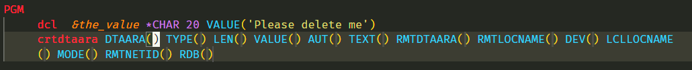

The cursors is in the first parameter value `DTAARA`. Enter the data area name, then press the `tab` key to move the cursor to the next parameter, `TYPE`: 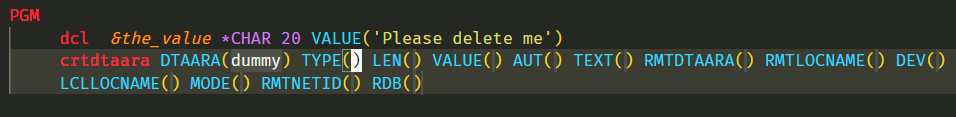  

Press `Ctrl+space` to produce a pick list of valid types: 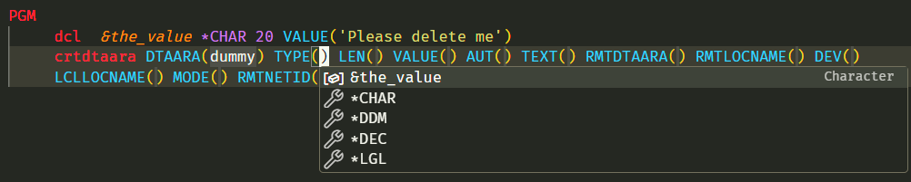

Highlight `*CHAR`, then `tab` to move to the `LENGTH` parameter. Enter 20, then tab to `VALUE`. The value can be a text string or it can be a variable. Use`Ctrl+space` to get a pick list of variables (just one in this example): 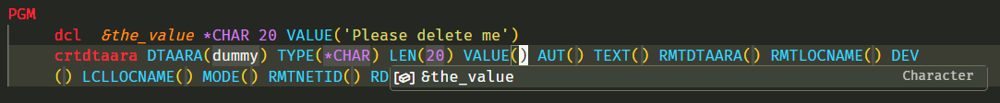

Chose the variable. Delete the other unneeded parameter and you have a completed command: 

### Content Assist Example 2

If you are familar with a command, you do not have to create a skeleton  with all parameters. Suppose you have typed this far: 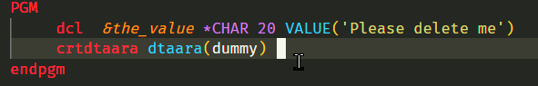

When you type `t` a pick list of parameters that start with `t` is provided: 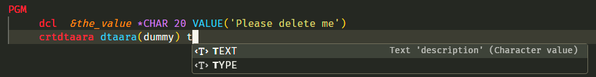

If a pick list is too long, you can enter additional characters to reduce it. In this case, if you entered `ty` only `TYPE` would appear in the pick list.

Select `TYPE` and the cursor is in the type value field where you can do `Ctrl+space` to get a pick list of valid types: 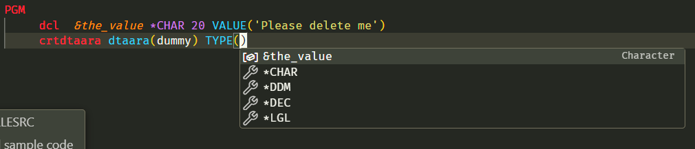

### Content Assist Snippets

Prompting of most CL commands requires a connection to a server. However, there are a number of commands that are provided as snippets, which don't require a connection. `DCL`, for example, is provided as a snippet. 

Commands that are provided as snippets are preceeded by a "box":  

To declare a variable, enter just "d" and get a list of commands that begin with "d":

Since the "`DCL`" command is highlighted, hit enter and get a pick list of available parameters:

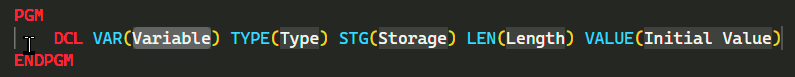

The "`VAR`" parameter value is selected, so enter the variable name, then tab to the "`TYPE`" parameter value:

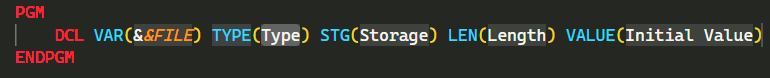

If all the valid valued for "`TYPE`" are know, just enter a valid value, for example "*CHAR". Or delete the highlighted value and key `Ctrl+Space` to get a pick list of the valid values:

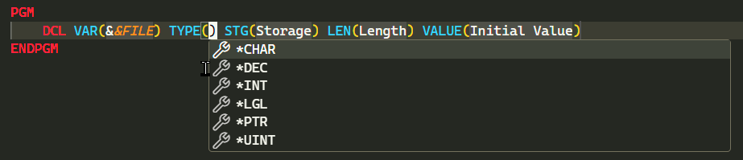

## CL Code Runner

A CL command may be executed by highlighting the command and pressing `Ctrl+r`. 

### Code Runner Example
The two lines of the `CRTMSGF` command are highlighted:
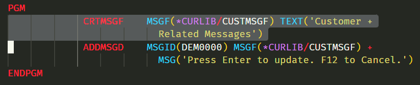

Press `Ctrl+r` and success is reported: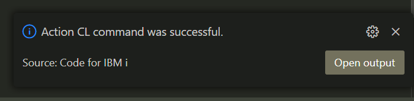

Click `Open output` if you want more detail or if the command fails: 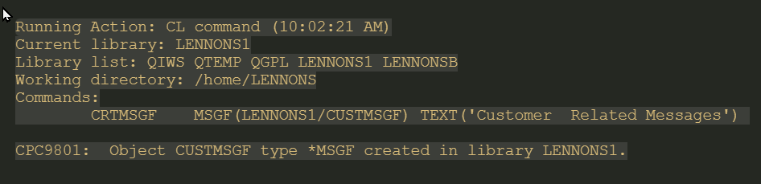

Not all CL commands may be executed.  

