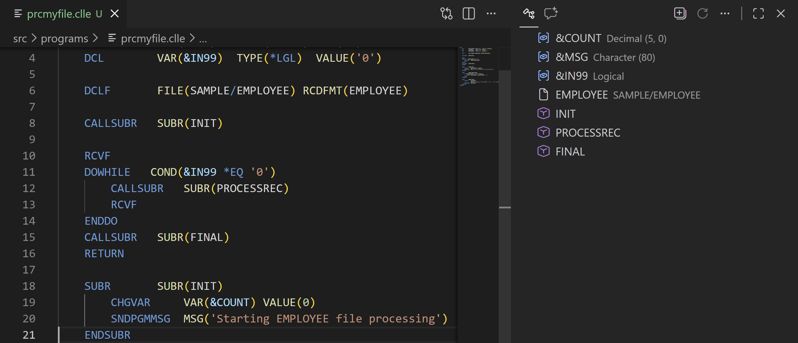
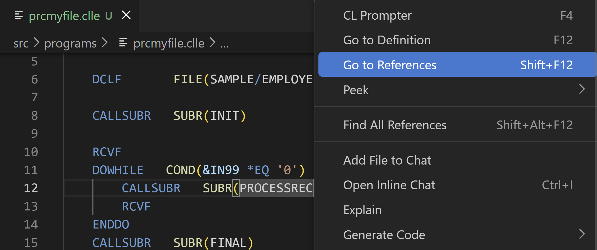
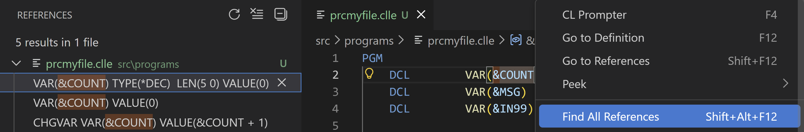
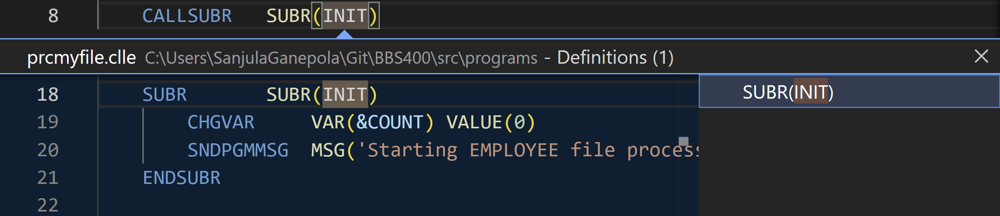
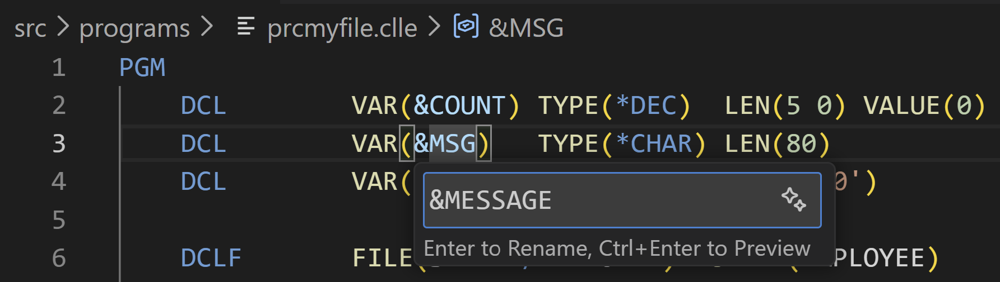
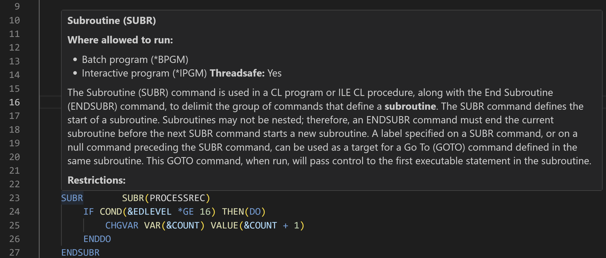
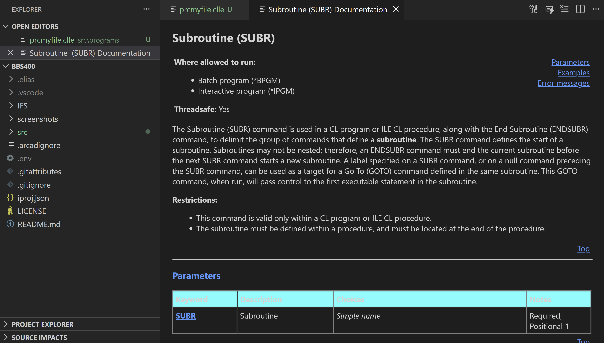
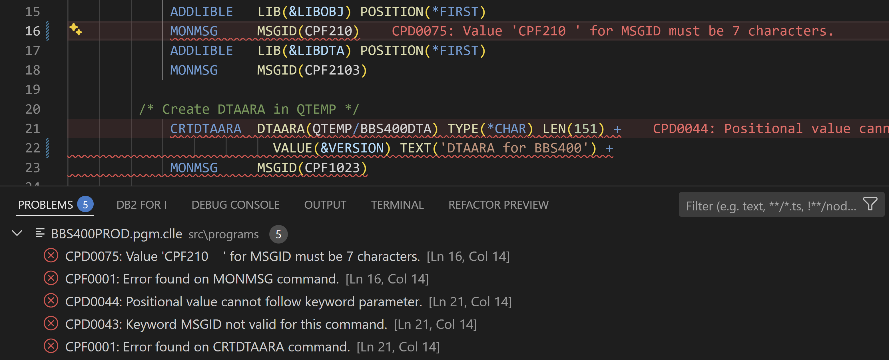

import { CardGrid, Card, Tabs, TabItem } from '@astrojs/starlight/components';
import { Aside, Icon } from '@astrojs/starlight/components';

**Command Language** is the scripting language for the IBM i operating system.   This extension assists in CLP or CLLE program development, providing:

* Content assist for CL commands and parameters
* Outline view
* Go to or peek definition and references
* Rename variables
* Hover support for CL commands and parameters
* Syntax checking

It also provides support for running a CL statement with `Ctrl+r`.

## Installation

The CL Language tools extension can be [installed from the Marketplace](https://marketplace.visualstudio.com/items?itemName=IBM.vscode-clle)<Icon name="external" color="cyan" class="icon-inline" /> and is also part of the [IBM i Development Pack](https://marketplace.visualstudio.com/items?itemName=HalcyonTechLtd.ibm-i-development-pack)<Icon name="external" color="cyan" class="icon-inline" />.

<CardGrid>

<Card>

Or it can be installed from the Extension view inside Visual Code.

</Card><Card>

</Card>

</CardGrid>

## Content Assist

Suppose you want to create a data area with the CRTDTAARA command. Enter CRTDTAARA __follwed by a space__, then press _Ctrl+Space_ to invoke Content Assist to produce a pick list like this: 

<CardGrid><Card>

Press _Enter_ or _Tab_ to accept the highlighted _All parameters_ from the pick list and a skeleton command is created.

</Card><Card>

</Card></CardGrid>

<CardGrid><Card>

Use`Ctrl+space` to get a pick list of special values or available variables (just one in this example):

</Card><Card>

</Card></CardGrid>

### Content Assist Snippets

Prompting of most CL commands requires a connection to a server. However, there are a number of commands that are provided as snippets, which don't require a connection. `DCL`, for example, is provided as a snippet.

<CardGrid><Card>

To declare a variable, enter just `d` and get a list of commands that begin with `d`:

</Card><Card>

</Card></CardGrid>

<CardGrid><Card>

Since the `DCL` command is highlighted, hit enter and get a pick list of available parameters:

</Card><Card>

</Card></CardGrid>

<CardGrid><Card>

The `VAR` parameter value is selected, so enter the variable name, then tab to the `TYPE` parameter value:

</Card><Card>

</Card></CardGrid>

<CardGrid><Card>

If all the valid valued for `TYPE` are know, just enter a valid value, for example `*CHAR`. Or delete the highlighted value and key _Ctrl+Space_ to get a pick list of the valid values:

</Card><Card>

</Card></CardGrid>

<CardGrid><Card>

If all the valid valued for `TYPE` are know, just enter a valid value, for example `*CHAR`. Or delete the highlighted value and key _Ctrl+Space_ to get a pick list of the valid values:

</Card><Card>

</Card></CardGrid>

## Outline View

In the **Outline** view, you can get an overview of all declared variables, files, and subroutines. You can click on the name of any item to jump to the definition.

## Peek Definition and References

In the editor, you can right-click on a variable or subroutine and use **Go to Definition** or **Go to References** to quickly jump to the definition or all references of the variable or subroutine.

You can also use **Find All References** which will pop open the **References** view to show all references.

Lastly, you can use any of the options under the right-click **Peak** submenu to get an inline preview of definitions or references without having to leave the current line are working on.

## Rename

You can right-click a variable and select **Rename Symbol** (or use the `F2` shortcut) to rename the variable. This will pop open a mini text box for you to enter the new variable name. Once you have entered the new name, hit `Enter` to proceed with renaming all instances of that variable or hit `Ctrl+Enter` to get a refactoring preview which you can use to selectively rename specific instances.

## Hover Support

When writing your CL programs, you can hover over a command to view a description of the commad from its documentation.

This works on individual parameters and is espically useful when determining what are the allowed values for a parameter. Content assist for paramters will also include this same documentation.

To view the full documentation for a command, scroll to the bottom of the hover window and select the **View Full Documentation** link. This will pop open a panel right in VS Code with the full documentation for the command which includes details on the command, parameter usage, examples, and error messages.

## Syntax Checker

As you write your CL programs, the syntax checker will highlight any syntax errors in your code. You can error or navigate to the **Problems** view to see the full details along with errors across all files.

<Aside type="tip">
   From the VS Code Settings, you can search for "CL Syntax Options" to change various settings including whether the syntax checker automatically when opening documents or when editing a line.
</Aside>

## CL Code Runner

A CL command may be executed by highlighting the command and pressing _Ctrl+R_. 

### Code Runner Example

The two lines of the `CRTMSGF` command are highlighted:

Press _Ctrl+R_ and success is reported:

Click _Open output_ if you want more detail or if the command fails: 

Not all CL commands may be executed.