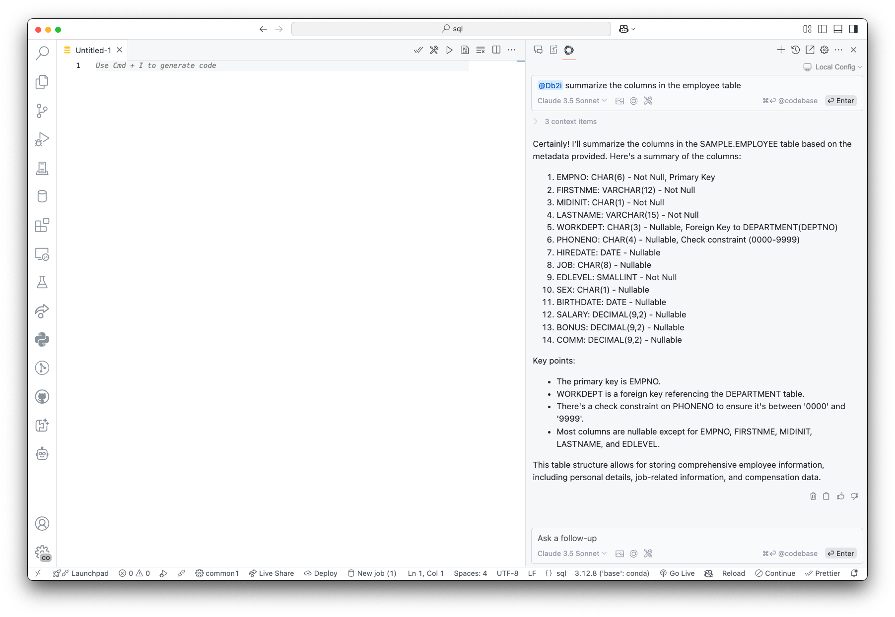
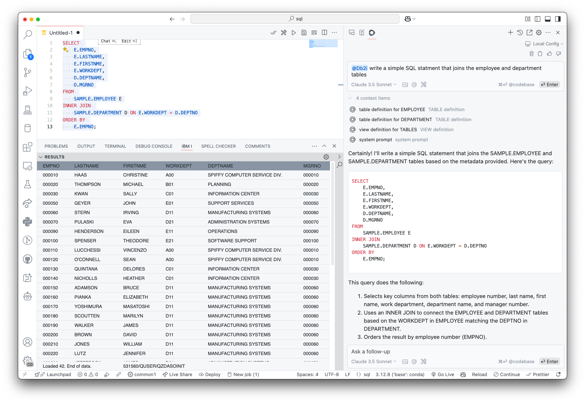
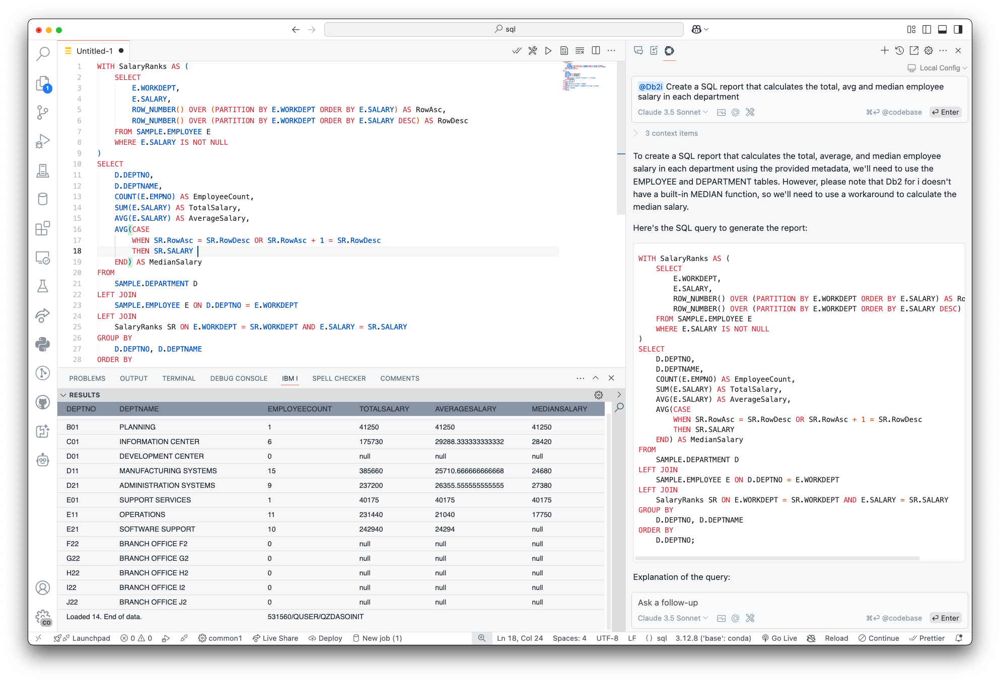
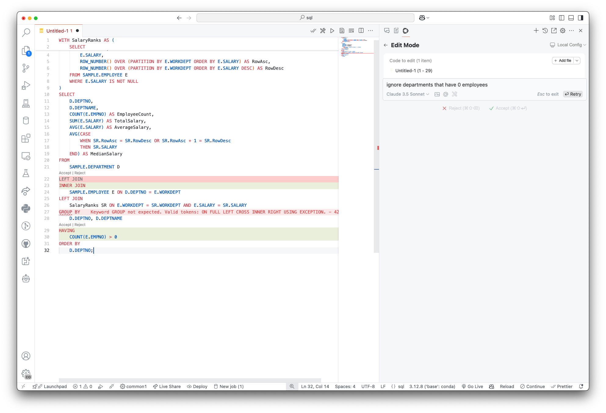
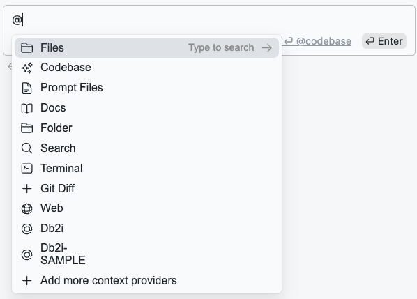
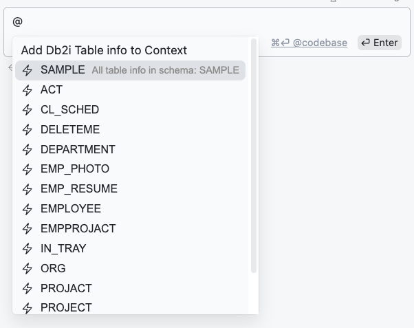
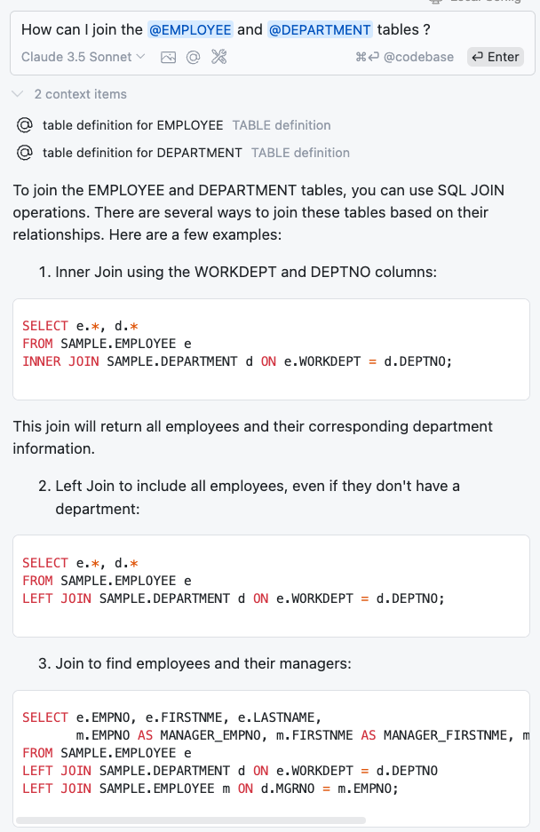
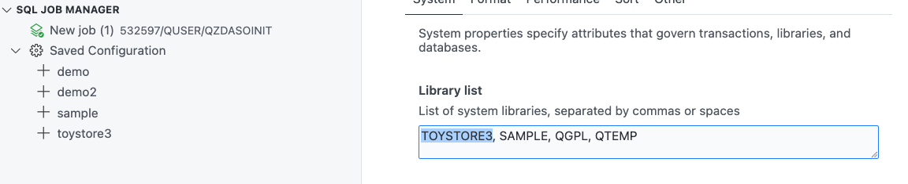
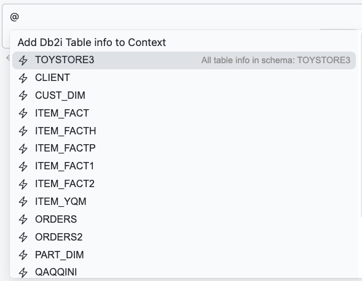
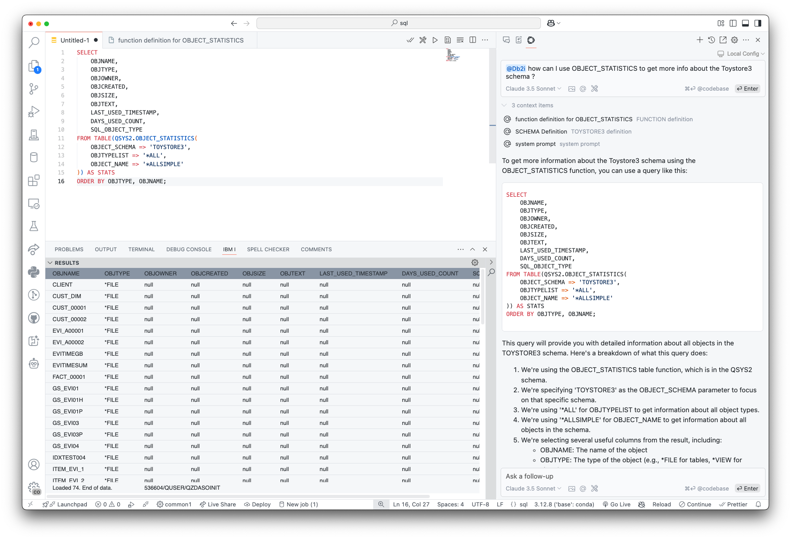

import { Aside, CardGrid, Card, LinkCard, Steps, Badge } from '@astrojs/starlight/components';
import { Image } from 'astro:assets';

This Document provides a more in depth tutorial and demo for using the Continue VSCode extension with Db2 for i.

## Getting Started: Continue


Continue is the leading open source AI code assistant for VS Code. It provides a wide range of AI features:

* Chat Interface
* Code Completion
* Autocomplete

### Install the Continue extension for VS Code

<Steps>
  1. Install the Continue extension from the [VS Code Marketplace](https://marketplace.visualstudio.com/items?itemName=Continue.continue).
  
  2. Once Installed, there will be a new icon in your VS Code menu (mine is on the top right). Click on the icon to open the chat window.
  
</Steps>

Once you have the extension installed, you can configure the AI provider you want to use. Continue supports multiple AI providers (including [Watsonx](https://docs.continue.dev/customize/model-providers/more/watsonx)!). You can choose the provider you want to use by clicking on the settings icon in the chat window.

For demonstration purposes, we will use the Ollama Provider for hosting LLMs locally on your machine.


### Setting up Ollama Provider

Here is a step-by-step guide to setting up the Ollama provider with the IBM Granite models in Continue:

#### 1. Install Ollama

Install Ollama on your machine by following the link below:
<LinkCard title="Install Ollama" href="https://ollama.com/download" />

#### 2. Fetch the IBM Granite 3.0 models

The IBM Granite 3.0  models are available in the Ollama model registry. More information about the IBM Granite models can be found [here](https://ollama.com/blog/ibm-granite).

Using the Ollama CLI, fetch the IBM Granite 3.0 8b model by running the following command:
```bash
ollama pull granite3-dense:8b
```

#### 3. Configure the Ollama provider in Continue

Open the VSCode Command Palette (Press ctrl+shift+p) and search for `Continue: open config.json`. This will open the Continue central config file `$HOME/.continue/config.json` in your editor. To enable the Granite models in Ollama, add the following configuration to the `models` section:

```json title="~/.continue/config.json"
"models": [
   {
     "title": "Granite Code 8b",
     "provider": "ollama",
     "model": "granite3-dense:8b"
   }
 ],
```

save this file and select the Granite model in the chat window.


### Other LLM Providers

You can also use other LLM providers with Continue. Here are some of the available providers:
- Watsonx
- Anthropic
- OpenAI
- Gemini (Google)

<Aside type="note">
  Although most models are good with SQL, some models are better that others. Here are some other models that work well with the Db2 for i assistant:
  - Llama3.3
  - Claude 3.5
  - Claude 3.7
  - Mistral Large

You can find more information for setting up additional models in Continue's [documentation](https://docs.continue.dev/customize/model-providers).
</Aside>


## Examples

Once you have the extension installed and the AI provider configured, you can ask questions about your database using the chat window using the `@db2i` context provider. In Continue, a context provider is very similar to a chat participant in GitHub Copilot. It provides additional context to the AI model to help it generate more accurate SQL queries.

More on context providers can be found [here](https://docs.continue.dev/customize/context-providers/).

### Working with Tables

#### Example 1: Summarize the columns in the `EMPLOYEE` table



**Notes:**
- The AI model recognizes the table reference `EMPLOYEE` and provides a summary of the columns in the table.
- Primary Key and Constraint information is also provided.


#### Example 2: Join the `EMPLOYEE` and `DEPARTMENT` tables



**Notes:**
- The AI model recognizes the table references `EMPLOYEE` and `DEPARTMENT` and provides a SQL query that joins the two tables.
- The SQL query is generated based on the context provided by the `@db2i` context provider.
- The generated SQL query can be copied and run in the SQL editor in VS Code.


#### Example 3: More complex queries


**Notes:**
- The AI model recognizes the table references `EMPLOYEE` and `DEPARTMENT` and provides a SQL query that calculates the total, average, and median salary for each department.
- run the generated SQL query in the SQL editor in VS Code.

We can refine this query further by asking to remove departments that dont have any employees:



#### Tables context provider:

When you connect to a system and start an SQL Job, we automatically create a default schema contex provider with the tables in that schema. This allows you to ask questions about the tables in the schema without having to reference the schema in your queries.

My defult Library is `SAMPLE`, so `@Db2i-SAMPLE` is the context provider for the tables in the SAMPLE library:


Once you select `@Db2i-SAMPLE`, the tables appear in a dopdown list. You can select a table to get a summary of the columns in that table:


Example Prompt:


Note, you do not need to invoke `@Db2i` in order to use the table context items. One advantage to "tagging" the direct table, is that we only look up information for that table, and dont search the entire library list for the table.

You can add additional table context providers by editing your library list in the SQL Job Manager. 
1. Open the SQL Job Manager
2. Select New SQL Job, or edit the current Job
3. Add the library as the first entry in the library list
4. Save the Job

In the following image, I added `TOYSTORE3` to the library list, and now I can use the `@Db2i-TOYSTORE3` context provider to get information about the tables in the TOYSTORE3 library:




### Working with other references in your Library List


#### Example 1: Reference a function in QSYS2


**Notes:**
- The model recognizes the function reference `OBJECT_STATISTICS` in the `QSYS2` library and provides a summary of the function.
- Information about the `TOYSTORE3` library is also provided.
- An example of how to use `OBJECT_STATISTICS` is provided.


