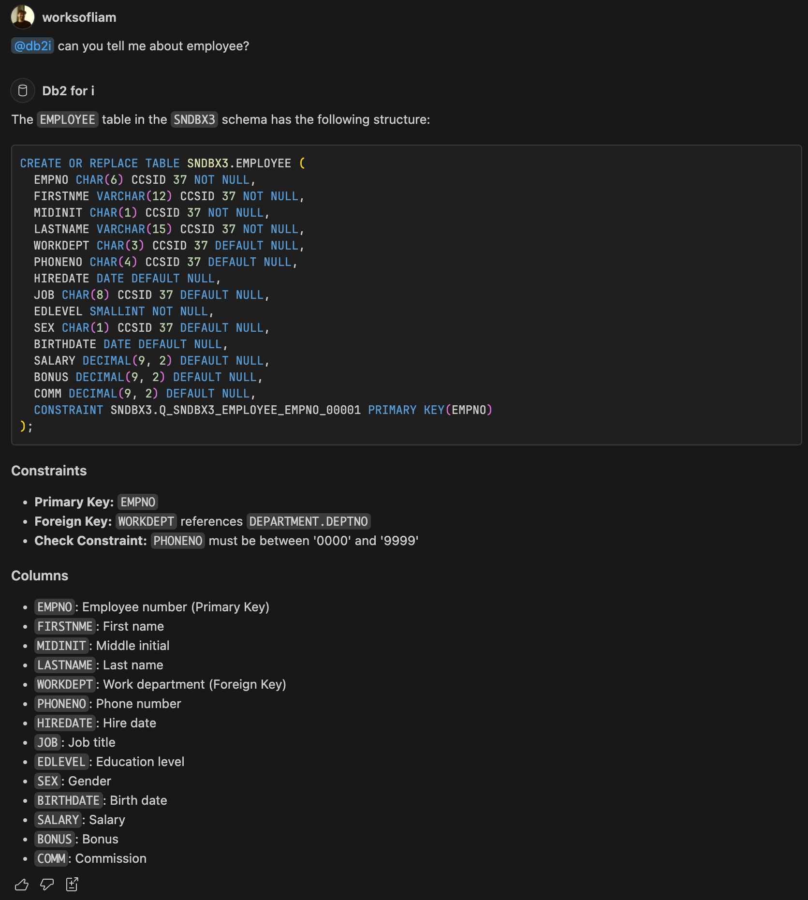
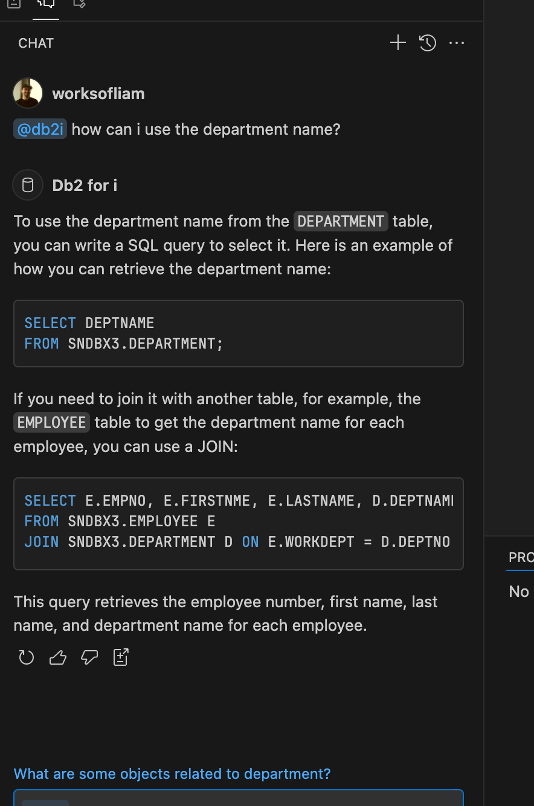
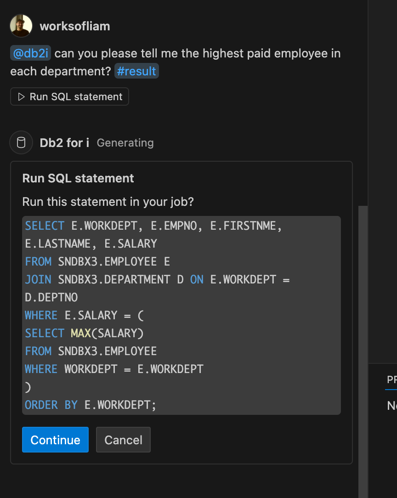
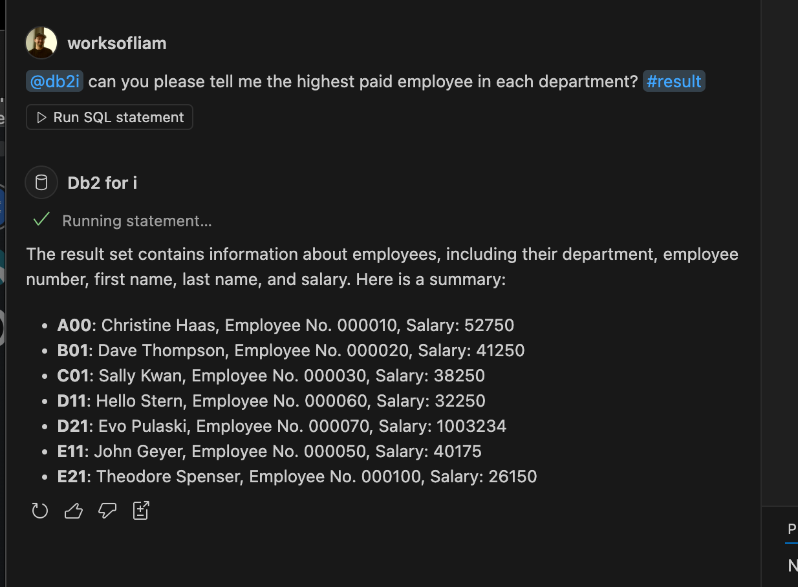

import { Aside, CardGrid, Card, LinkCard, Steps, Badge } from '@astrojs/starlight/components';
import { Image } from 'astro:assets';

### Install the GitHub Copilot extension

<Steps>

1. Install GitHub Copilot from the [VS Code Marketplace](https://marketplace.visualstudio.com/items?itemName=GitHub.copilot).

2. Install the Db2 for IBM i extension from the [VS Code Marketplace](https://marketplace.visualstudio.com/items?itemName=IBM.db2-for-i).
3. Connect to your IBM i system using the Code for IBM i extension.
4. Once connected, the `@db2i` chat participant is available in the chat window. You can ask questions about your database, and get help with writing SQL queries.

</Steps>

<Aside type="note">
  Chat participants are domain experts that can answer questions about a specific topic. The `@db2i` chat participant is a domain expert in Db2 for IBM i. It can answer questions about the structure of your database, and help you write SQL queries. 
</Aside>

### Examples

Once GitHub Copilot is installed, you can ask questions about your database using the `@db2i` chat participant. Here are some examples:

<CardGrid><Card>

**Example 1**: Summarize the columns in the `EMPLOYEE` table

This is a simple example to show how you can ask questions about the structure of your database. You can ask the chat participant to summarize the columns in a table.

</Card><Card>

</Card></CardGrid>

<CardGrid><Card>

**Example 2:** Ask to find out what objects are related to `employee`?

This example shows how you can ask the chat participant to find out what objects are related to the `employee` table. The chat participant will return a list of related objects, including the `department` table.

It will tell you if it can't get the related objects or if there are none.

</Card><Card>

</Card></CardGrid>

<CardGrid><Card>

**Example 3:** Try out a follow up question.

The screenshots that after the participant has responsed, it will sometimes offer some additional follow up questions. Simply clicking on one of these will ask the question to the chat participant.

</Card><Card>

</Card></CardGrid>

---

**Example 4**: Using our 'Run SQL statement' tool to summarize information.

This example shows how you can use the `Run SQL statement` tool to ask information about the data in your system. Before the tool will run any SQL statement, it will ask you to confirm that you want to run the SQL statement. This is a safety feature to prevent you from running SQL statements that could modify your data.

<CardGrid><Card>

</Card><Card>

It will then take the result set of the statement and summarize the information based on your request.

</Card></CardGrid>