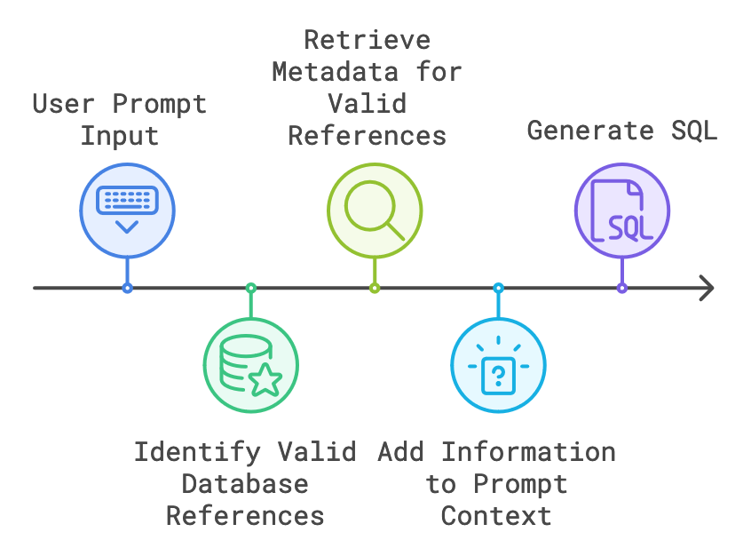

import { Aside, CardGrid, Card, LinkCard, Steps, Badge } from '@astrojs/starlight/components';
import { Image } from 'astro:assets';

<Badge text="Start Here" size="large" />The Db2 for IBM i extension, as of 1.6.3, has the ability to integrate with specific AI extensions:

<CardGrid>
  <Card title="GitHub Copilot" icon="github">
    ✅ Requires GitHub Copilot licence
  </Card>
  <Card title="Continue" icon="rocket">
    ✅ Multiple AI Providers available, including Watsonx!
  </Card>
</CardGrid>
<CardGrid>
  <LinkCard title="GitHub Copilot" href="https://marketplace.visualstudio.com/items?itemName=GitHub.copilot" icon="github"/>
  <LinkCard title="Continue" href="https://marketplace.visualstudio.com/items?itemName=Continue.continue" icon="github"/>
</CardGrid>

## Introduction


The Db2 for i SQL code assistant provides intregrations with AI code assistants such as GitHub Copilot Chat and Continue. These integrations allow you to ask questions about your Db2 for IBM i database, and get help with writing SQL queries. The best part is that you can do this directly from your VS Code editor.


## Use cases

Common Use cases of the SQL code assistant include:

* 📝 SQL query generation
* 💡 SQL query explanation
* 🛠️ SELF Error analysis
* 🚀 SQL query optimization

<Aside type="tip">
  Check out [Use cases](../use-cases/) for more tutorials and examples.
</Aside>


## How does this work? 

The `@db2i` GitHub Copilot chat participant and the `@Db2i` Continue context provider work in the same way by extracting relevant database information from the user prompt. Here is breakdown of the algorithm:


#### Step 1: Tokenize User Input

Given a prompt like:

```
tell me about the columns in sample.employee
```

- First, we split the user input into individual words, or "tokens."
- **Note:** We use spaces to tokenize the input, so each token is a single word.

#### Step 2: Identify Valid Database References

- For each token, we check if it corresponds to a valid table or object reference within the active SQL Job.
- In this example, `sample.employee` is recognized as a valid table reference.

#### Step 3: Retrieve Metadata for Valid References

- When valid references are found, we fetch associated metadata, such as column names, data types, and descriptions.
- This retrieval is done through the `SQL Job Manager` in the Db2 for i VSCode extension, which queries relevant database information based on the user’s active connection.

#### Step 4: Add Metadata to Prompt Context

- Finally, we insert the fetched column metadata into the prompt context using the Continue API


<Aside type="tip">
  * Since Database metadata is fetched from the SQL Job Manager, it is important to ensure that the SQL Job Manager is connected and configured correctly.
  * To get better results, make sure to set the current schema in the SQL job settings, or reference the schema in your queries: `SAMPLE.EMPLOYEE`
</Aside>

let's break down the process of how the `@db2i` chat participant and the `@Db2i` context provider work:


### Here’s a breakdown of the process:


1. **Activate the `@Db2i` Context Provider**
   - Start by typing the "@" symbol in the chat text box to invoke the `@Db2i` context provider.
2. **Enter Your Query**
   - Use a prompt like:
     ```
     How can I get the department name for each employee ?
     ```
3. **SQL Generation with Contextual Insights**
   - With the relevant column metadata from `employee` and `department` tables, the model generates an accurate SQL `JOIN` statement.
4. **Execute and View Results Instantly**
   - Copy the generated SQL into the active SQL editor, run the query, and instantly view the result set right inside VSCode! 🔥

By integrating database context directly into our prompts, we make SQL generation not only faster but more accurate and insightful.

## What data is shared?

If you do not want to share your data with any AI services, then do not invoke the functionality through VS Code. For example, we only fetch metadata when the user explicitly requests it through the chat windows. We do not fetch any metadata without the user explicitly using the chat windows in either Copilot Chat or Continue. Simply don't install the extensions, or don't use the `@db2i` context.

<Aside type="note">
  We do not give any service user data that exists on your system. But, we feed the following metadata into the context of the chat so it can generate more accurate answers.
</Aside>

### We do not

* Send any data in your own tables, views, programs, etc
* Send user info from the IBM i system
* Train external services using any data from your systems
* Send any requests to any service without the user explicitly using any of the AI functionality.

### We do

* Send table metadata which can be found from `QSYS2.SYSCOLUMNS2` and `QSYS2.SYSKEYCST` in the context based on user input, including table names, column names, types and comments
* Send system metadata (when the user is asking for the activity summary) which is found with `TABLE(QSYS2.SYSTEM_STATUS(RESET_STATISTICS=>'YES',DETAILED_INFO=>'ALL'))` when requested by the user.

---

<Aside title="A Note about Open Source">
  Our AI integration is fully open-source. We are transparent about how we connect our users to services and support multiple providers (such as GitHub Copilot and Continue). This gives our users the freedom to choose which AI services they want to use, if any.

  You can see all our AI integration code in the [GitHub repository for the Db2 for IBM i extension](https://github.com/codefori/vscode-db2i/tree/main/src/aiProviders).
</Aside>

## Known Limitations

The `@db2i` chat participant and the `@Db2i` context provider are designed to provide accurate and insightful SQL generation based on the user's database context. However, there are some limitations to keep in mind:

1. **Schema Resolution**
   - The `@db2i` chat participant and the `@Db2i` context provider rely on the active SQL Job's schema to resolve table references. If the schema is not set or is incorrect, the model may not be able to resolve table references accurately.
   - To get better results, make sure to set the current schema in the SQL job settings, or reference the schema in your queries: `SAMPLE.EMPLOYEE`
2. **Complex Queries**
   - The `@db2i` chat participant and the `@Db2i` context provider are optimized for generating simple SQL queries. For more complex queries, the model may not be able to provide accurate results.
   - For complex queries, it is recommended to manually write the SQL query or use the model's generated SQL as a starting point.
3. **Data Sensitivity**
   - The `@db2i` chat participant and the `@Db2i` context provider do not store or transmit any user data. All database metadata is fetched from the SQL Job Manager based on the user's active connection.
   - To ensure data privacy and security, it is recommended to review the model's generated SQL before executing it in the active SQL editor.
4. **Model Accuracy**
   - The `@db2i` chat participant and the `@Db2i` context provider are continuously being improved to provide more accurate and insightful SQL generation. If you encounter any issues or have feedback, please let us know!