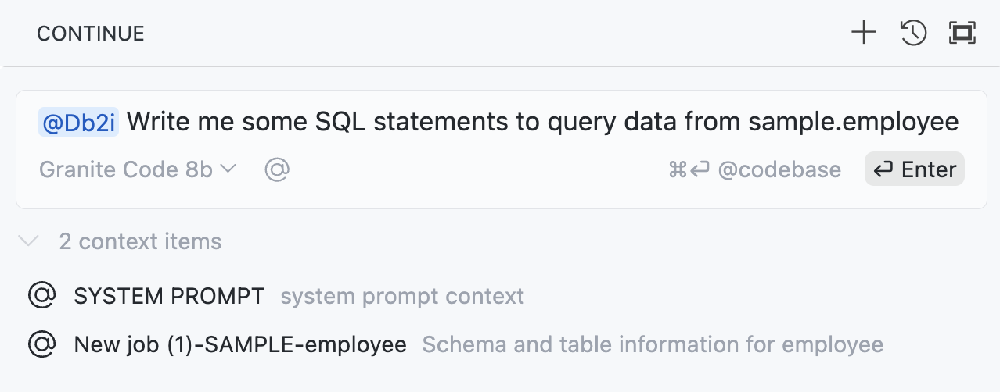
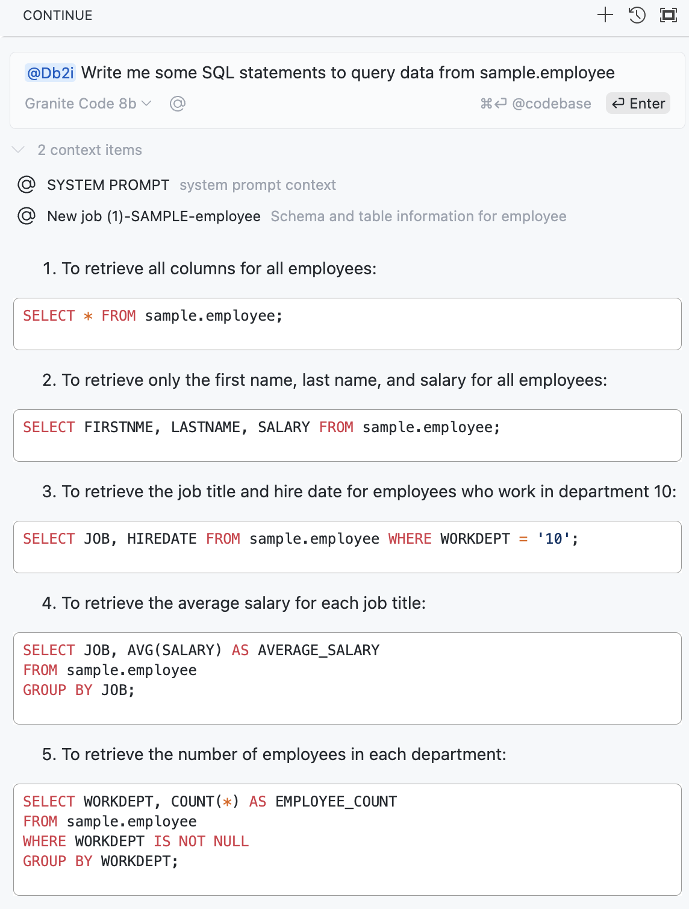

import { Aside, CardGrid, Card, LinkCard, Steps } from '@astrojs/starlight/components';

<Aside>
    ✏️ More Examples and Tutorials coming soon!
</Aside>
This is a collection of use cases for the Db2 for i Code Assistant in GitHub Copilot.

## SQL Generation

Bread and Butter example: Generate SQL statements for a given table:

Under the hood, We fetch relevant information about the referenced table: `sample.employee` and generate the SQL statement for you:

