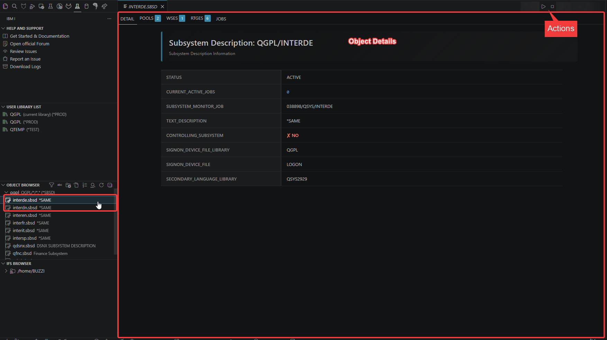

import { CardGrid, Card, Tabs, TabItem, LinkCard } from '@astrojs/starlight/components';
import { Aside } from '@astrojs/starlight/components';
import { Icon } from '@astrojs/starlight/components';

The IBM i FileSystem extension provides advanced functionality for viewing and managing objects inside the IBM i QSYS file system. It extends the base Code for IBM i extension with specialized editors and operations for various IBM i object types.

## Install

The extension can be [installed from the Marketplace](https://marketplace.visualstudio.com/items?itemName=halcyontechltd.vscode-ibmi-fs)<Icon name="external" color="cyan" class="icon-inline" /> and is also part of the [IBM i Development Pack](https://marketplace.visualstudio.com/items?itemName=HalcyonTechLtd.ibm-i-development-pack)<Icon name="external" color="cyan" class="icon-inline" />.

<Aside type="note">
  This extension requires the [Code for IBM i](https://marketplace.visualstudio.com/items?itemName=HalcyonTechLtd.code-for-ibmi) extension to be installed and connected to an IBM i system.
</Aside>

## Usage

Once connected to your IBM i system using Code for IBM i:

1. Navigate to the **Object Browser**
2. Browse to any supported object type
3. Click on the object to open it in the custom editor
4. Use the **Action Bar** (top right) to perform object-specific operations

---

## Supported Object Types

The extension supports **22 different IBM i object types** with comprehensive viewing capabilities and interactive actions. Below is a summary table of all supported object types:

| Object Type | Type Code | Actions | Description |
|-------------|-----------|---------|-------------|
| 📦 Save Files | `*SAVF` | ✅ | Store and manage saved objects and libraries |
| 📨 Data Queues | `*DTAQ` | ✅ | Inter-process communication queues |
| 📝 Data Areas | `*DTAARA` | ✅ | Shared data storage objects |
| 🖨️ Output Queues | `*OUTQ` | ✅ | Manage spooled files and printer output |
| 📋 Job Queues | `*JOBQ` | ✅ | Manage batch jobs waiting to be processed |
| 💾 User Spaces | `*USRSPC` | ✅ | Temporary or permanent data storage |
| 🔑 User Indexes | `*USRIDX` | ✅ | Fast keyed access to user-defined entries |
| 📄 Message Files | `*MSGF` | ❌ | Predefined application messages |
| 💬 Message Queues | `*MSGQ` | ✅ | Store and manage system/user messages |
| 🔗 Binding Directories | `*BNDDIR` | ✅ | Lists of service programs and modules |
| 🔧 Programs | `*PGM` | ❌ | Executable program objects |
| 🔧 Service Programs | `*SRVPGM` | ❌ | Shared executable code libraries |
| 🧩 Modules | `*MODULE` | ❌ | Compiled ILE objects |
| ⚙️ Commands | `*CMD` | ❌ | IBM i CL command definitions |
| 📄 Job Descriptions | `*JOBD` | ❌ | Runtime environment for batch jobs |
| 📓 Journal Receivers | `*JRNRCV` | ❌ | Store journal entries for recovery |
| 📓 Journals | `*JRN` | ✅ | Record changes for auditing and recovery |
| 🌐 DDM Files | `*DDMF` | ❌ | Access files on remote systems |
| 🖥️ Subsystem Descriptions | `*SBSD` | ✅ | Define independent operating environments |
| 🎯 Classes | `*CLS` | ❌ | Runtime attributes for batch jobs |
| 📁 Files | `*FILE` | ✅ | Physical/logical files, views, and indexes |
| 🔍 Query Definitions | `*QRYDFN` | ✅ | Query/400 database query definitions |

**Legend:**
- ✅ **Actions Available** - Interactive operations (create, modify, delete, send, clear, etc.)
- ❌ **View Only** - Read-only information display

<Aside type="tip">
  For detailed information about each object type, including all available features and actions, see the [**Object Details**](./objects/) page.
</Aside>

---

## View Object Details and Actions

To view the **detailed object content** and **interact with object-specific actions**, **click directly on the object** in the Object Browser. This will open the custom editor for that object type, where you can:

- View the complete object content
- Use the **Action Bar** (top right) to perform operations
- Edit and modify the object (when applicable)
- Access object-specific features and tools

*Object Details Editor - Click on an object to open the custom editor with full content and interactive actions*

<Aside type="caution">
**Filter Restrictions**: Modification actions are subject to filter settings. If a filter has protected a library as read-only, you will not be able to use modification actions on objects within that library.
</Aside>

---

## System Views

The extension also provides powerful **system views** for monitoring and managing your IBM i system:

- 📊 **Display Object Information (DSPOBJ)** - Comprehensive object details with locks and authorizations
- 👥 **Work with Active Jobs (WRKACTJOB)** - Monitor and manage all active jobs
- 💼 **Work with Job (WRKJOB)** - Detailed job information with statistics and logs
- 👤 **Work with User Jobs (WRKUSRJOB)** - View all jobs including completed ones
- 🖨️ **Work with Spooled Files (WRKSPLF)** - Manage spooled files with pagination

<Aside type="tip">
For detailed information about system views, including all available features and actions, see the [**System Views**](./views/) page.
</Aside>

---

## Localization

This extension supports multiple languages through VSCode's built-in localization framework.

### Supported Languages

- 🇬🇧 **English** (default)
- 🇮🇹 **Italian**
- 🇫🇷 **French**
- 🇩🇪 **German**
- 🇪🇸 **Spanish**
- 🇯🇵 **Japanese**
- 🇰🇷 **Korean**
- 🇧🇷 🇵🇹 **Brazilian Portuguese**
- 🇨🇳 **Simplified and Traditional Chinese**