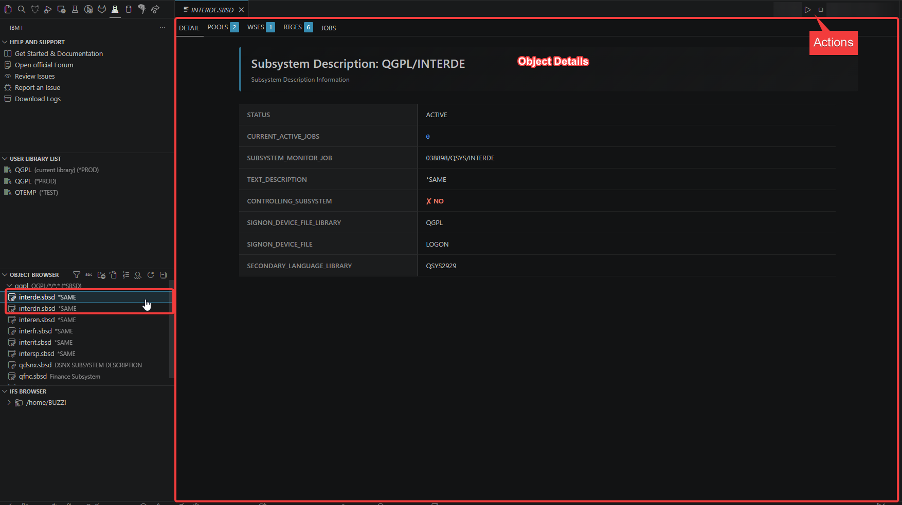

import { CardGrid, Card, Tabs, TabItem, LinkCard } from '@astrojs/starlight/components';
import { Aside } from '@astrojs/starlight/components';
import { Icon } from '@astrojs/starlight/components';

The IBM i FileSystem extension provides advanced functionality for viewing and managing objects inside the IBM i QSYS file system. It extends the base Code for IBM i extension with specialized editors and operations for various IBM i object types.

## Install

The extension can be [installed from the Marketplace](https://marketplace.visualstudio.com/items?itemName=halcyontechltd.vscode-ibmi-fs)<Icon name="external" color="cyan" class="icon-inline" /> and is also part of the [IBM i Development Pack](https://marketplace.visualstudio.com/items?itemName=HalcyonTechLtd.ibm-i-development-pack)<Icon name="external" color="cyan" class="icon-inline" />.

<Aside type="note">
  This extension requires the [Code for IBM i](https://marketplace.visualstudio.com/items?itemName=HalcyonTechLtd.code-for-ibmi) extension to be installed and connected to an IBM i system.
</Aside>

### Optional: CL Prompter

Some actions use [Bob Cozzi's CL Prompter and Formatter for IBM i](https://marketplace.visualstudio.com/items?itemName=CozziResearch.clprompter)<Icon name="external" color="cyan" class="icon-inline" /> to prompt the underlying CL command:

- **Required** to add or change a message description in a Message File (`*MSGF`) and to change a Job Description (`*JOBD`)
- **Optional** for Save Files (`*SAVF`): when installed, save and restore prompt the CL command (SAV/SAVLIB/SAVOBJ, RST/RSTLIB/RSTOBJ) with the save file already filled in, instead of asking for each parameter one by one

## Usage

Once connected to your IBM i system using Code for IBM i:

1. Navigate to the **Object Browser**
2. Browse to any supported object type
3. Click on the object to open it in the custom editor
4. Object-level actions are available in the editor **Action Bar** (top right), or through the **Object Actions** quick pick
5. Row-level actions (hold/release/end a job, reply to a message, open a spooled file, ...) are buttons inside the tables of the object view itself

---

## Supported Object Types

The extension supports **22 different IBM i object types** with comprehensive viewing capabilities and interactive actions. Below is a summary table of all supported object types:

| Object Type | Type Code | Actions | Description |
|-------------|-----------|---------|-------------|
| 📦 Save Files | `*SAVF` | ✅ | Store and manage saved objects and libraries |
| 📨 Data Queues | `*DTAQ` | ✅ | Inter-process communication queues |
| 📝 Data Areas | `*DTAARA` | ✅ | Shared data storage objects |
| 🖨️ Output Queues | `*OUTQ` | ✅ | Manage spooled files and printer output |
| 📋 Job Queues | `*JOBQ` | ✅ | Manage batch jobs waiting to be processed |
| 💾 User Spaces | `*USRSPC` | ✅ | Temporary or permanent data storage |
| 🔑 User Indexes | `*USRIDX` | ✅ | Fast keyed access to user-defined entries |
| 📄 Message Files | `*MSGF` | ✅ | Predefined application messages |
| 💬 Message Queues | `*MSGQ` | ✅ | Store and manage system/user messages |
| 🔗 Binding Directories | `*BNDDIR` | ✅ | Lists of service programs and modules |
| 🔧 Programs | `*PGM` | ❌ | Executable program objects |
| 🔧 Service Programs | `*SRVPGM` | ❌ | Shared executable code libraries |
| 🧩 Modules | `*MODULE` | ❌ | Compiled ILE objects |
| ⚙️ Commands | `*CMD` | ❌ | IBM i CL command definitions |
| 📄 Job Descriptions | `*JOBD` | ✅ | Runtime environment for batch jobs |
| 📓 Journal Receivers | `*JRNRCV` | ❌ | Store journal entries for recovery |
| 📓 Journals | `*JRN` | ✅ | Record changes for auditing and recovery |
| 🌐 DDM Files | `*DDMF` | ❌ | Access files on remote systems |
| 🖥️ Subsystem Descriptions | `*SBSD` | ✅ | Define independent operating environments |
| 🎯 Classes | `*CLS` | ❌ | Runtime attributes for batch jobs |
| 📁 Files | `*FILE` | ✅ | Physical/logical files, views, and indexes |
| 🔍 Query Definitions | `*QRYDFN` | ❌ | Query/400 definitions, shown as SQL |

**Legend:**
- ✅ **Actions Available** - Interactive operations (create, modify, delete, send, clear, etc.)
- ❌ **View Only** - Read-only information display

<Aside type="tip">
  For detailed information about each object type, including all available features and actions, see the [**Object Details**](./objects/) page.
</Aside>

---

## View Object Details and Actions

To view the **detailed object content** and **interact with object-specific actions**, **click directly on the object** in the Object Browser. This will open the custom editor for that object type, where you can:

- View the complete object content
- Use the **Action Bar** (top right) to perform operations
- Edit and modify the object (when applicable)
- Access object-specific features and tools

*Object Details Editor - Click on an object to open the custom editor with full content and interactive actions*

<Aside type="caution">
**Filter Restrictions**: Modification actions are subject to filter settings. If a filter has protected a library as read-only, you will not be able to use modification actions on objects within that library.
</Aside>

### Generic Actions

Every object opened in the custom editor gets these toolbar actions, whatever its type:

| Action | Description |
|--------|-------------|
| 🔄 **Refresh Object** | Reload the object's data from the system |
| ⚡ **Object Actions** | Quick pick listing every action available for the current object, so they stay reachable when the toolbar is collapsed |
| 🔧 **Additional Information** | Open the [Display Object Information (DSPOBJ)](./views/#-display-object-information-dspobj) view for the object |

---

## System Views

The extension also provides powerful **system views** for monitoring and managing your IBM i system:

- 📊 **Display Object Information (DSPOBJ)** - Comprehensive object details with locks and authorizations
- 👥 **Work with Active Jobs (WRKACTJOB)** - Monitor and manage all active jobs
- 💼 **Work with Job (WRKJOB)** - Detailed job information with statistics and logs
- 👤 **Work with User Jobs (WRKUSRJOB)** - View the jobs of a user profile, including completed ones
- 🖨️ **Work with Spooled Files (WRKSPLF)** - Manage the spooled files of a user profile with pagination
- 🏢 **Work with Subsystems (WRKSBS)** - List active subsystems, drill into them or end them

<Aside type="tip">
For detailed information about system views, including all available features and actions, see the [**System Views**](./views/) page.
</Aside>

---

## FS Quick Start Menu

Click on **FS Quick Start** in the status bar (bottom left) to access these commands:

| Command | Description |
|---------|-------------|
| 📥 **DSPMSG** | Display the current user's message queue |
| 💬 **DSPMSG QSYSOPR** | Display System Operator messages |
| 📋 **DSPOBJ** | Open the Display Object Information view, prompting for library, name and type |
| 🔍 **DSPOBJ Detailed** | Prompt for library, object name and object type, then open that object without navigating the Object Browser |
| 📄 **WRKSPLF** | Work with Spooled Files |
| 💼 **WRKJOB** | Work with Job |
| 🔄 **WRKACTJOB** | Work with Active Jobs |
| 👥 **WRKUSRJOB** | Work with User Jobs |
| 🏢 **WRKSBS** | Work with Subsystems |

### Customizing the menu

The menu is fully customizable through the `vscode-ibmi-fs.quickStartMenu` setting. Click the ⚙️ **Customize FS Quick Start Menu...** entry at the bottom of the menu (or run **FS Quick Start: Configure FS Quick Start Menu** from the Command Palette) to open a guided wizard that lets you:

- ➕ **Add** an entry pointing to any built-in or contributed VS Code command (with optional arguments)
- ✏️ **Edit** an existing entry's label, description, icon or command
- 🗑️ **Remove** one or more entries
- ⬆️⬇️ **Move** entries up or down to reorder the menu
- ♻️ **Reset** the menu back to the built-in defaults

Once customized, your menu completely replaces the built-in defaults; use **Reset** to go back to them.

<Aside type="tip">
The **DSPOBJ Detailed** entry can be pinned to a fixed object: when you add it through the wizard, choose to specify library, object name and object type, and the object opens straight away without prompting.
</Aside>

---

## Settings

Besides `vscode-ibmi-fs.quickStartMenu`, the extension follows two settings of the base Code for IBM i extension:

| Setting | Default | Description |
|---------|---------|-------------|
| `code-for-ibmi.views.autoRefreshInterval` | `30` | Auto-refresh interval, in seconds, of the views that refresh themselves (WRKACTJOB, WRKJOB, WRKUSRJOB, WRKSPLF, WRKSBS and the data queue, job queue, output queue, message queue and subsystem description editors). Set it to `0` to disable auto-refresh |
| `code-for-ibmi.tables.itemsPerPage` | `50` | Number of rows per page in paginated tables (minimum `30`) |

---

## Localization

This extension supports multiple languages through VSCode's built-in localization framework. The display language of VS Code is detected automatically, and more than 1600 strings are translated, including UI messages, tab titles, table column headers and IBM i database column names.

### Supported Languages

- 🇬🇧 **English** (default)
- 🇮🇹 **Italian**
- 🇫🇷 **French**
- 🇩🇪 **German**
- 🇪🇸 **Spanish**
- 🇯🇵 **Japanese**
- 🇰🇷 **Korean**
- 🇧🇷 🇵🇹 **Brazilian Portuguese**
- 🇨🇳 **Simplified and Traditional Chinese**

To contribute a new language, add a `l10n/bundle.l10n.<locale>.json` file to the [GitHub repository](https://github.com/codefori/vscode-ibmi-fs)<Icon name="external" color="cyan" class="icon-inline" />, copying the structure of `l10n/bundle.l10n.en.json` and translating the values while keeping the keys unchanged.
