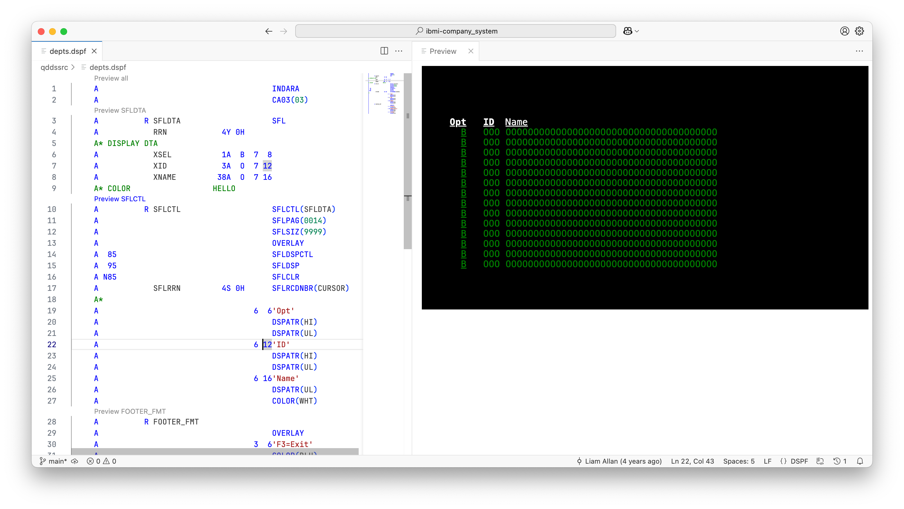
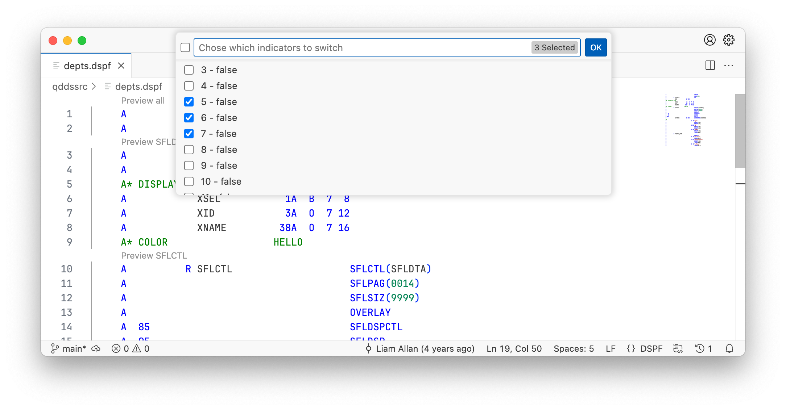

import { Aside, Icon, CardGrid, Card } from '@astrojs/starlight/components';

## Install

The extension can be [installed from the Marketplace](https://marketplace.visualstudio.com/items?itemName=HalcyonTechLtd.vscode-displayfile)<Icon name="external" color="cyan" class="icon-inline" /> and is also part of the [IBM i Development Pack](https://marketplace.visualstudio.com/items?itemName=HalcyonTechLtd.ibm-i-development-pack)<Icon name="external" color="cyan" class="icon-inline" />.

## Overview

The extension has two main pieces of functionality:

1. the ability to preview IBM i display files
2. the ability to preview IBM i printer files

Additionally, it's possible to preview..

* the entire display at one time
* specific record formats
* record formats with a subfile

## Usage

To use the renderer, open any `.dspf` (`dds.dspf`) or `.prtf` (`dds.prtf`) file in the editor. A _Preview Record_ will appear above the record format names in the source code and a _Preview all_ will appear at the top of the document. 

Click on a Code Lens to open the renderer.

<Aside type="tip">
   The renderer will update as you make changes to your DDS.
</Aside>

<CardGrid><Card>

If your DDS makes use of conditional indicators, you can toggle them by using the 'Flip Indicators' feature.

Open the Command Palette with <kbd>Ctrl</kbd> + <kbd>Shift</kbd> + <kbd>P</kbd> and find 'Flip Indicators' to toggle the indicators on and off.

</Card><Card>

</Card></CardGrid>

---