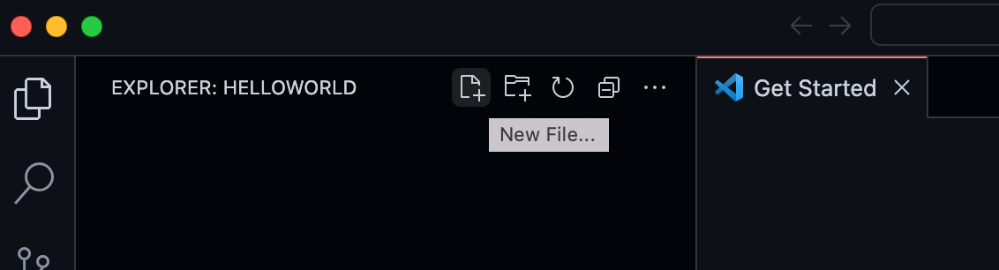
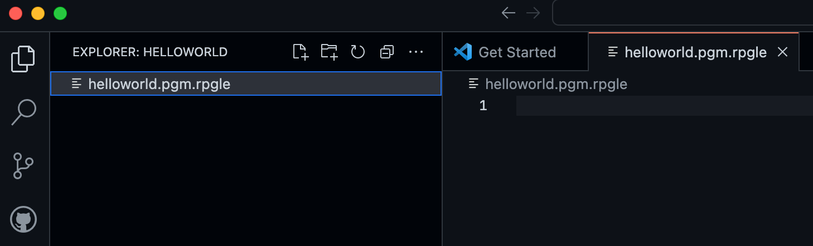
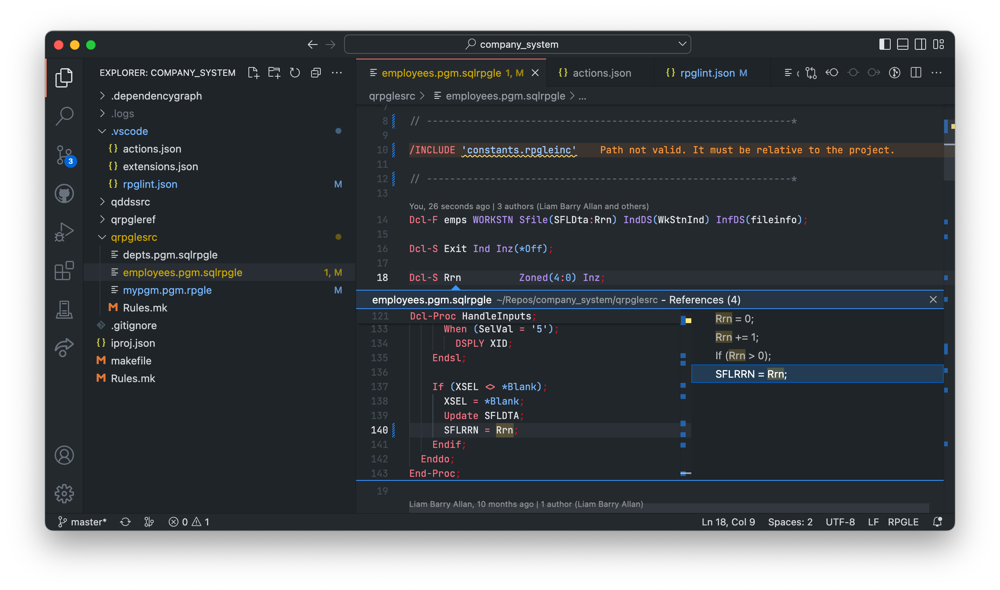
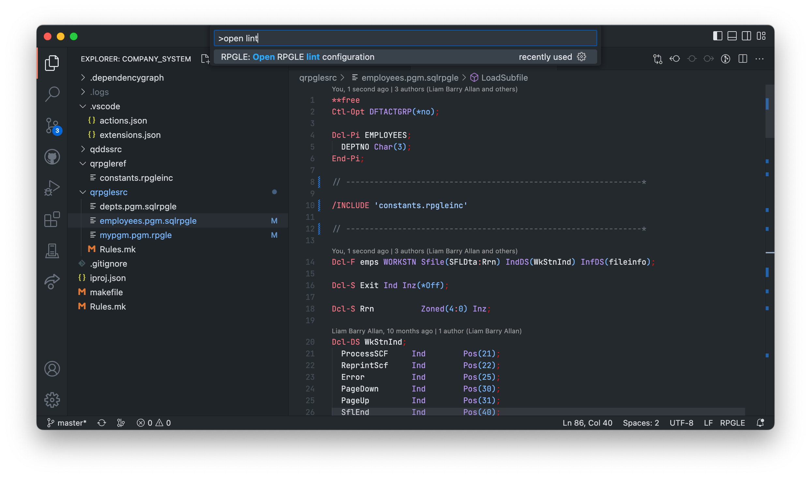

import { Aside, Icon } from '@astrojs/starlight/components';

<Aside type="tip">
  Check out [this video from the Visual Studio Code YouTube channel](https://www.youtube.com/watch?v=JRI7K8Y7cjQ)<Icon name="youtube" color="red" class="icon-inline" />
 on IBM i and RPGLE.
</Aside>

## Install

The extension can be [installed from the Marketplace](https://marketplace.visualstudio.com/items?itemName=HalcyonTechLtd.vscode-rpgle)<Icon name="external" color="cyan" class="icon-inline" /> and is also part of the [IBM i Development Pack](https://marketplace.visualstudio.com/items?itemName=HalcyonTechLtd.ibm-i-development-pack)<Icon name="external" color="cyan" class="icon-inline" />.

The official compilers for RPGLE cannot run on any platform other than IBM i and are not required for this language functionality. If you are an IBM i user, the Code for IBM i extension offers the functionality to compile source code the local workspace.

## Usage

The extension has two main pieces of functionality:

* language tools: content assist, outline view, etc. Supports every version of ILE RPG (fixed, mixed and free-format)
* linter: configurable linter to check code quality. **Only supports total free-format** (`**FREE`).

The RPGLE language extension works on three main filesystems:

* Local workspace
* IBM i source members (remote)
* IBM i streamfiles (remote)

## Hello world

To ensure the RPGLE extension is working, we can write the source code for a very simple program in our local workspace.

Create a folder called `HelloWorld` and open VS Code in that folder 
<Aside type="tip">
  `code .` opens VS Code in the current folder
</Aside>

```bash title="terminal"
mkdir HelloWorld
cd HelloWorld
code .
```

The `code .` command opens VS Code in the current working folder, which becomes your "workspace". Accept the Workspace Trust dialog by selecting **Yes, I trust the authors** since this is a folder you created.

Now create a new file called `helloworld.pgm.rpgle` with the **New File** button in the File Explorer or **File** > **New File** command.




### Add Hello World source code

Now paste in this source code:

```RPGLE
**free

ctl-opt dftactgrp(*no);

dcl-s mytext char(25);

Dcl-PR printf Int(10) extproc('printf');
  input Pointer value options(*string);
End-PR;

mytext = 'Hello World';
printf(mytext);

return;
```

### Verify with the Outline View

You can focus the Outline View by opening the Command Palette (**F1**) and searching 'focus outline'. The definitions from the program should be displayed:


### What next?

Compiling the code from Visual Studio Code requires a different extension due to the fact that the compilers only exist on IBM i. Check out the official [documentation for Code for IBM i](../../) to get started.

## Content assist

Content assist provides code completion, hover information, and formatting issues to help the user write code correctly. 


You can turn the content assist from showing up automatically by changing the 'Suggest On Trigger Characters' setting.

### Hover information

Hover over any definitions (variable, structure, procedures, etc) to see type information and documentation.


## Code Navigation

Whether writing code in the local workspace or on a remote IBM i, users can utilize built in code navigation functionality to better understand their application.

### Go to definition

With any definition, you are able to use Go to Definition or Peek Definition:


### Show references

Just like definitions, you are able to find all references to definitions with Go to References or Peek References:



### Go to implementation

Go to implementation works for procedures in two ways.

* For all sources (members/streamfiles/local) it will do a lookup of the procedure name in the binding directories you have specified in the `BNDDIR` header/control-spec and try to open the source up for it.
   * Look up uses the Code for IBM i library list if the binding directory is not qualified with a library.
* For local projects it will take you to the implementation of an export procedure wherever it is in your project.

### Format Document

You can automatically fix all indentation of your free-format sources by using Format Document inside of VS Code.

*Open the Command Palette (F1/Control+Shift+P) -> 'Format Document'*

### Extract to new procedure

When using all free-format source code, you are able to use 'Extract to procedure' which will take the selected lines of code and wrap it into a new procedure and make all variable referenced into parameters.


## Linter

The extension ships with a built-in linter to ensure developers write the cleanest code. The linter is un-opinionated and is highly configurable.

### Creating lint configuration

Use the 'Open RPGLE lint configuration' command from the command palette to automatically create and open the relative lint configuration from the RPGLE source you are working in.



### Lint options

There are some default options enabled when the lint configuration is created. The content assist inside of `rpglint.json` will show other available options:


### Quick fix and formatting

Most lint errors have a Quick Fix for them and the fixes are available when hovering over the error. You can also use 'Format Document' from the command palette to fix all errors with a Quick Fix attached.

