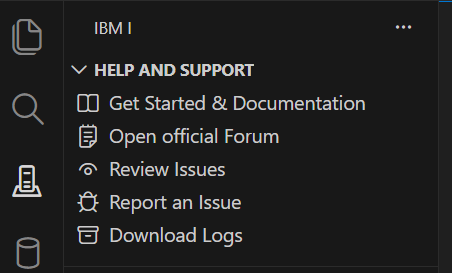
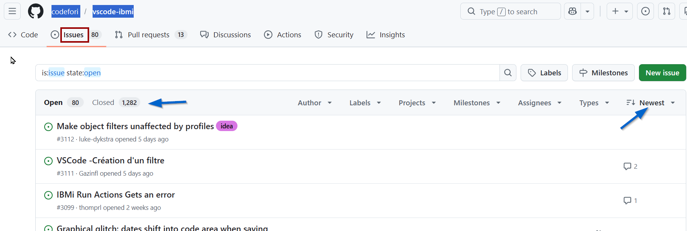
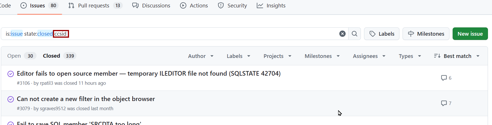
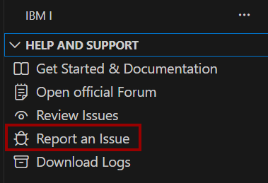
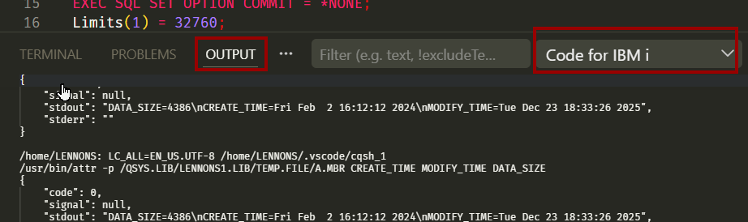
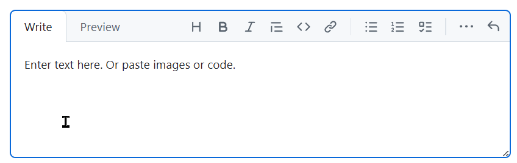
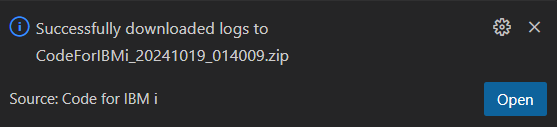

import { Aside, CardGrid, Card } from '@astrojs/starlight/components';

<CardGrid>

<Card>

The `HELP AND SUPPORT` view provides a link to the documentation, and links to get help and support should you encounter any issues in Code for IBM i.

</Card><Card>

</Card>

</CardGrid>

### Get started & Documentation

This link  opens the documentation for Code for IBM i in your browser, making it easy to go directly from Code for IBM i to the information on how to use it.

### Open official Forum

This link takes you to the Code for IBM i discussions, where you can ask any question on how to use the product.

### Review Issues

If you have a problem, there is a good chance that your problem has been seen before. A solution or workaround may have been found, or a fix may have been created to solve a similar problem. By reviewing the [Issues section](https://github.com/codefori/vscode-ibmi/issues) in the GitHub repository you may be able to solve your issue. 

You can see all open or closed issues reported since the start of the project and sort them by date.

You can also search issues by adding text in the search bar:

### Report an Issue

<Aside type="caution">
**Do not use the VS Code Issue Reporter (found in VS Code Help menu, item Report Issue)!**

This issue reporter does not include the configuration and logs necessary to debug your issue, and time will be wasted while the support team will request additional information from you.
</Aside>

If searching existing issue reports did not give you the solution to your problem, the best way to create a new issue report is by using the `Report an Issue` link. 

This link collects system information about Code for IBM i, the IBM i server and VS Code. 

It then copies this information into a Github issue and opens the issue for you to complete.

#### Steps to create an issue

To provide the most helpful information for the support staff, follow these steps as far as possible to report an issue:

1. Make sure you can reproduce the issue. It is extremely difficult to debug a problem that can't be reproduced.
2. If the issue is related to some source code, please provide the smallest possible source example that causes the problem, and paste it into the Github issue. Please do not provide this code as screen shots.
3. Restart VS Code, connect to the IBM i and immediately cause the problem.
4. Click the `Report an Issue` link.
5. In the opened Github issue clearly descibe the steps to cause the problem. Paste screen shots if this helps clarify the issue..
6. Go to the `OUTPUT` tab and select `Code for IBM i`. Select the complete displayed contents and then copy and paste into the Github issue.:
   
7. Click Create to save the issue.

<Aside type="danger">
  All issues are available to the public, so any sensitive information must be redacted before submitting the issue report!
</Aside>

<Aside type="tip">
  Github allows you to enter text and paste images in an issue. Generally it is not necessary to create separate documents to attach as files.
  
</Aside>

<Aside type="tip">
   You need to have or create a GitHub account to create an issue report. Github accounts are free.
</Aside>

### Download Logs

Often the support team will ask for the full Code for IBM i log to better understand what's happened. For this you can use `Download Logs`.
This will show a pop-up where you can choose which of the following logs you want to download:
- Code for IBM i log
- Debug Service log
- Debug Service Eclipse Instance log

Next you will be prompted for a directory in which to save a zip file containing the chosen log files.
After the zip file has been downloaded, you get this message:

When you click on `Open`, your file explorer will open with the cursor on the zip file, and you can upload the file to your issue report on Github.