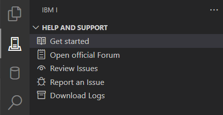

import { Aside, CardGrid, Card } from '@astrojs/starlight/components';

<CardGrid>

<Card>

The view `HELP AND SUPPORT` provides the initial links to get help and support, should you encounter any issues in Code for IBM i.

</Card><Card>

</Card>

</CardGrid>

### Get started

This link will open the documentation for Code for IBM i in your browser, making it easy to go directly from Code for IBM i to the information on how to use it.

### Open official Forum

This link will take you to the Code for IBM i discussions, where you can ask any question on how to use the product.

### Review Issues

If you encounter an issue or have a problem that you suspect may be a bug in Code for IBM i, please use this link for the [Issues section](https://github.com/codefori/vscode-ibmi/issues) in the GitHub repository, where you can see all open and closed issue reports created by the users since the start of the project.
There is a good chance that your problem has been seen before and a solution or workaround found, or a fix may have been created to solve a similar problem.

### Report an Issue

<Aside type="caution">
**Do not use the VS Code Issue Reporter (found in Help menu item Report Issue)!**

This issue reporter does not include the configuration and logs necessary to debug your issue, and time will be wasted while the support team will request additional information from you.
</Aside>

If searching existing issue reports using the link above did not give you the solution to your problem, you can create a new issue report using this link.

<Aside type="tip">
   Keep your connection to the IBM i system active when creating the issue report (to have all important system information included in the report).
</Aside>

When you click on `Report an Issue` in the `HELP AND SUPPORT` view, your browser will open the GitHub issues page with a template containing the following information:
- Code for IBM i version, VS Code version and OS
- Active extensions
- Remote system information, e.g. IBM i release, TR level, CCSID, enabled features and more
- Shell environment
- Variants (used for CCSID troubleshooting)
- Errors (the last three commands executed on the server and the result)

You must also provide a title and thorough description of the issue with information on how to recreate the issue encountered.

<Aside type="danger">
  All issues are available to the public, so any sensitive information must be redacted before submitting the issue report!
</Aside>

<Aside type="tip">
   You need to have or create a GitHub account to create an issue report.
</Aside>

### Download Logs

Often the support team will ask for the full Code for IBM i log to better understand what's happened. For this you can use `Download Logs`.
This will show a pop-up where you can choose which of the following logs you want to download:
- Code for IBM i log
- Debug Service log
- Debug Service Eclipse Instance log

Next you will be prompted for a directory in which to save a zip file containing the chosen log files.
After the zip file has been downloaded, you get this message:

When you click on `Open`, your file explorer will open with the cursor on the zip file, and you can upload the file to your issue report on Github.