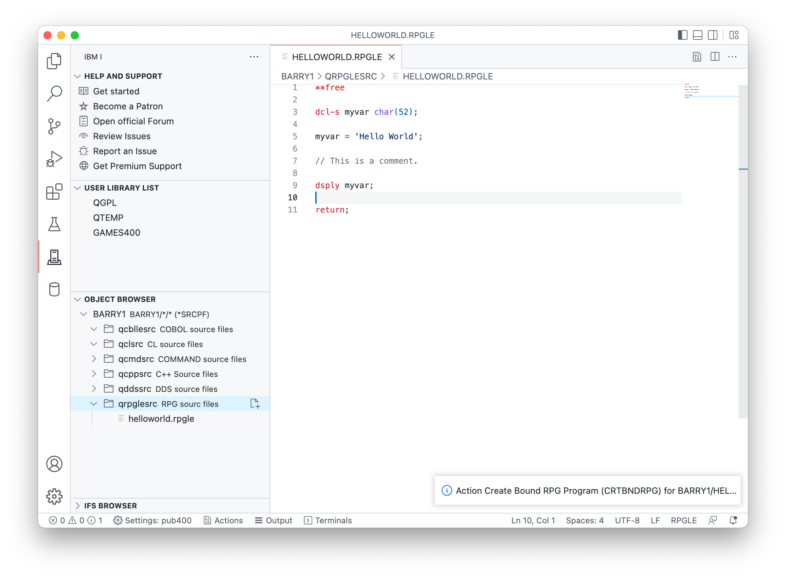
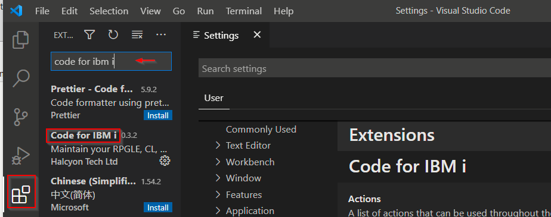

import { CardGrid, Card, Badge, LinkCard, Icon } from '@astrojs/starlight/components';

## Requirements

- IBM i 7.4 (7.3 may works but is no more supported)
- SSH Daemon must be started on IBM i.
   - (Licensed program 5733-SC1 provides SSH support.)
   - `STRTCPSVR *SSHD` starts the daemon.
   - User `QSSHD` is enabled.
- The user used to log in must be enabled and must have a password
- Java 8 minimum must be installed to run <a href="/docs/settings/mapepire/">Mapepire</a>
- The *SIGNON and *DATABASE servers must be running, with TCP ports 8471 and 8476 listening using Mapepire not secured, and TCP ports 9471 and 9476 listening using Mapepire SSL
- DELETE operations at the database level, used in the extension for managing temporary files, must be allowed
- Mapepire TCP port network address (only when used in server mode, the default is 8076)
- Some familiarity with VS Code. An introduction can be found [here](https://code.visualstudio.com/docs/getstarted/introvideos)<Icon name="external" color="cyan" class="icon-inline" />.

Optionally, ensure you know how to connect to pase from a shell. See this [official IBM i OSS docs](https://ibmi-oss-docs.readthedocs.io/latest/user_setup/README.html#step-1-install-an-ssh-client)<Icon name="external" color="cyan" class="icon-inline" />.

## Installation

<CardGrid>

<Card>

From the Visual Studio Code Marketplace: [Code for IBM i](https://marketplace.visualstudio.com/items?itemName=HalcyonTechLtd.code-for-ibmi)<Icon name="external" color="cyan" class="icon-inline" />

Or from the Extensions view inside of Visual Studio Code.

</Card><Card>

</Card></CardGrid>

### Recommended Extensions

It's recommended you also install the [IBM i Development Pack](https://marketplace.visualstudio.com/items?itemName=HalcyonTechLtd.ibm-i-development-pack)<Icon name="external" color="cyan" class="icon-inline" />, a curated set of extensions built on or adding value to Code for IBM i. This includes database tools, RPGLE tools, COBOL tools, and more.

## Extension Development

Check out our [Developer documentation](./dev/getting_started/) page!
