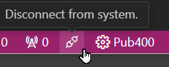
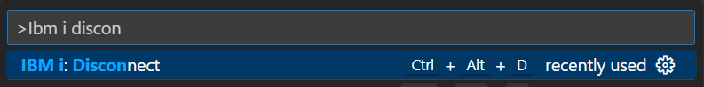

import { CardGrid, Card } from '@astrojs/starlight/components';

### Connect First Time

<CardGrid>

<Card>

Click on the IBM i icon and then on 'Connect to an IBM i'.

</Card><Card>

</Card></CardGrid>

---

<CardGrid>
<Card>
Enter the systems details in the window that appears. You need either a password or a private key.

Alternatively, press <kbd>F1</kbd>, search for `IBM i: New Connection`, and complete the form.
</Card>
<Card>

</Card>
</CardGrid>

### Connect Subsequent

<CardGrid>
<Card>
If you have already connected to an IBM i system, click on the conection in the IBM i: Servers browser.
</Card>
<Card>

</Card>
</CardGrid>

<CardGrid>
<Card>
After logging in, a status bar item will appear showing the name of the IBM i system to which you are connected.
</Card>
<Card>

</Card>
</CardGrid>

### Logout (Disconnect)
You can close a connection  and logout out from a server in several ways
<CardGrid>

<Card>
Use the keyboard: <kbd>Ctrl(Cmd)</kbd> + <kbd>Alt</kbd > + <kbd>D</kbd>
</Card>
<Card>
</Card>
<Card>
Click the `Disconnect from system` icon in the status bar... 
</Card>
<Card>

</Card>
<Card>
Press <kbd>F1</kbd> and search for `IBM i: Disconnect`
</Card>
<Card>

</Card>

</CardGrid>

