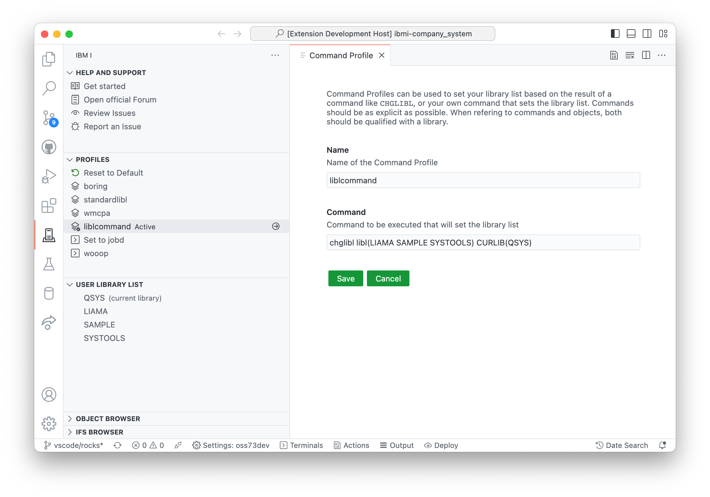

A Connection Profile allows the user to switch between settings quickly. You could use a profile to quickly change library list and other items specific to a project. A profile stores this information:

- The home / working directory
- The current library
- The library list
- The IFS shortcuts
- The object browser list
- The database browser list

If you have no existing profiles, you can create your first one from the User Library List view:

After your first profile has been created, the Profiles view will become available. The Profiles view allows you to quickly switch between profiles, as well as update and delete existing profiles. The Profiles view will also show you what the last profile you set is.

In the profiles view, the save button in the header bar will prompt the user to save into a brand new profile. You can right click on a profile and save to update a profile.

**Changing any of the settings** will not update the profile. If you change the library list and want this to reflect on the profile, you can save over the profile or into a new one.

## Command Profiles

Command Profiles are special types of profiles that only update the user library list and current library. Command Profiles are created from ILE/CL commands that set the library list and/or the current library.

When creating a Command Profile, a ILE/CL command is provided that would set the user library list and current library for a job. This is especially useful when working with change management that has commands to setup the user environment.

You can switch between Command Profiles and Connection Profiles as often as you like.

Command Profiles can only be created after the first Connection Profile has been made.