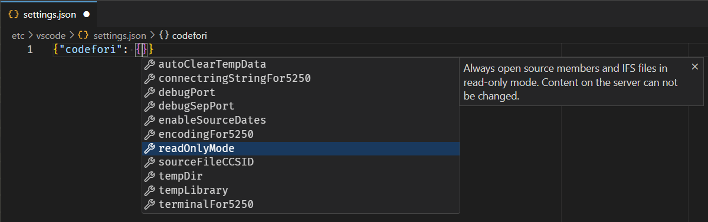

import { Aside } from '@astrojs/starlight/components';

As of Code for IBM i 2.16.3, the extension supports system-wide settings that can be configured once in the IFS, in a fixed location, and then applied to all users that connect to that system using the extension. This is useful for setting up a consistent environment across multiple users or teams.

All configuration files related to VS Code settings should be stored under `/etc/vscode/` in the IFS.

### Code for IBM i settings

The path is `/etc/vscode/settings.json`. The top level is a JSON object that can contain different properties. Below is a table for the first level of properties. If sub-properties are not described here, refer to the content assist while working on the file.

| Property   | Description |
| ---------- | ----------- |
| `codefori` | Used to determine the connection configuration for all clients. Should not be used for UI customisation. |

<Aside type="note">
When server-wide settings are set, they cannot be edited from the Connection Settings UI and the fields will be read-only. This is to ensure that the settings are consistent and not accidentally changed by individual users.
</Aside>