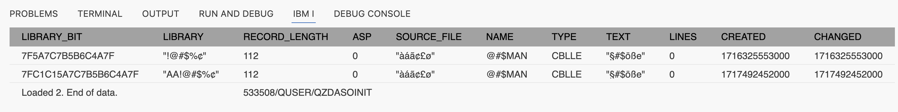
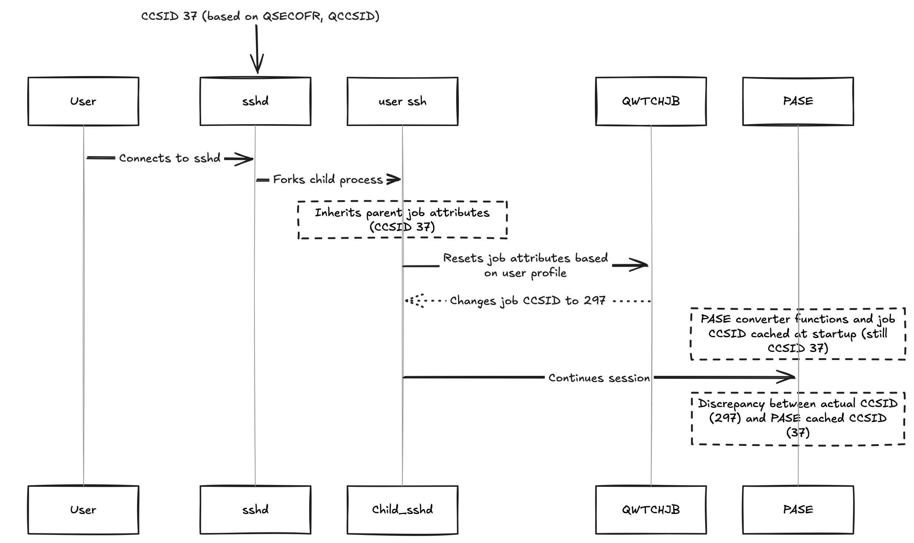

import { Icon } from '@astrojs/starlight/components';

IBM i uses the EBCDIC character set in contrast to your workstation, which uses some ASCII based character set (Windows, MAC and Linux each use their own variant). This may cause some issues with the names displayed for the objects, files and members in the Object Browser. Even worse, IBM i has several EBCDIC variants, each targeting a national language, and the special US characters '#', '@' and '$' allowed in IBM i object and member names have other code values in the other variants. But IBM i still expects the same code values of the US characters to be used, and thus the national characters with these code values must be used instead.

## User CCSID

From version 1.4.0 of this extension the code for handling these differences has been changed, primarily when SQL is enabled and used for retrieving object and member lists. Previously there were no conversion between the US and national characters, but now Code for IBM i converts the US characters into the national characters. This is controlled by the coded character set ID (CCSID) value on the IBM i user profile used for the connection, alternatively the system value `QCCSID` (if the user profile CCSID value is `*SYSVAL`). The CCSID is probably already set on your user profile or system, but if you need to change to another language, here are some examples of how to set the CCSID:

| Language | Command | Variant characters |
| -------- | ------- | :----------------: |
| US | `CHGUSRPRF _yourprofile_ CCSID(37)` | $, #, @ |
| DK | `CHGUSRPRF _yourprofile_ CCSID(277)` | Å, Æ, Ø |
| IT with euro | `CHGUSRPRF _yourprofile_ CCSID(1144)` | $, £, § |

The conversion is done in both directions: When reading object and members names for the list, but also when creating a source file or member or when applying a filter to a list. For non-US users, you should always use your national characters instead of the US characters, also in filter values.

If you change the CCSID for your profile on the server, you may have to change your filters as well, if you have used any of the special characters in the filter!

The special CCSID value 65535 means "no conversion" - and this will disable the SQL support. It is **not** recommended to use CCSID 65535 and most newer systems have a CCSID different from 65535. But you may experience this value on older systems. The solution here would be to change the user profile to a CCSID value corresponding to your national language, e.g. 280 in Italy or 297 in France.

## Setting environment variables

If you still are experiencing issues after setting the CCSID value, you may want to check that the IBM i PASE environment locale is set correctly:

<details>
<summary><b>OS 7.4 or greater</b></summary>

[7.4 and above defaults to UTF-8](https://www.ibm.com/docs/en/i/7.4?topic=system-default-pase-ccsid-locale-changed-utf-8)<Icon name="external" color="cyan" class="icon-inline" /> and there should be no issue.
</details>

<details>
<summary><b>OS 7.3 or earlier</b></summary>

The SSH daemon must start with the correct `PASE_LANG` and `QIBM_PASE_CCSID` environment variables set. You probably want to use a locale that defaults to CCSID 1208. **Locale is case sensitive**. E.g., `FR_FR` is different from `fr_FR`.

1. Change the PASE language and CCSID *system wide* by using `WRKENVVAR LEVEL(*SYS)` to set:
   - the appropriate locale/language, e.g., `PASE_LANG 'FR_FR'`.  You can find infomation on PASE for i Locales [here](https://www.ibm.com/docs/en/i/7.4?topic=ssw_ibm_i_74/apis/pase_locales.htm)<Icon name="external" color="cyan" class="icon-inline" />
   - `QIBM_PASE_CCSID` should be `1208`.
2. **Restart** the SSH daemon.

You are also able to change the environment variables at a `*JOB` level, but it is recommend to do it once for your entire system.
</details>

## More information

Some links to pages which containing information on variant characters:

- [IBM definition of Variant characters](https://www.ibm.com/docs/en/db2-for-zos/11?topic=ccsids-variant-characters)<Icon name="external" color="cyan" class="icon-inline" />
- [IBM Support](https://www.ibm.com/support/pages/what-impact-changing-qccsid-shipped-65535-another-ccsid)<Icon name="external" color="cyan" class="icon-inline" />
- [Wikipedia](https://en.wikipedia.org/wiki/EBCDIC)<Icon name="external" color="cyan" class="icon-inline" />

## Quoted/delimited object names

Code for IBM i is using SQL more and more to fetch system information. This includes information like system object names. Object names in the operating system are typically stored as raw hex values (therefore 65535), but are not tagged with what CCSID the name is. Back in the old days, the name encoding used to be determined by the client (In 5250, the client can set what encoding they read the data stream as).

Since Code for IBM i tries to depend on the server to handle all encoding translations, this becomes a bit of an issue with system names since the OS is not storing what the object name encoding is. There for:

1. we only support object names in ASCII/37 encoding.
2. we cannot support quoted/delimited object names with non-ASCII characters since the OS doesn't know what encoding it is and the client doesn't know how to handle 65535.

Learn more about object naming rules [in the IBM documentation](https://www.ibm.com/docs/en/i/7.1?topic=rules-names-name).

<details>
   <summary>Learn more</summary>

Use the following SQL/CL commands to create an object with a qualified name.

```sql
cl: CHGUSRPRF USRPRF(liam) CCSID(273);
select CHARACTER_CODE_SET_ID from table( QSYS2.QSYUSRINFO( USERNAME => upper('liam') ) );

-- create ugly object
cl: CRTLIB LIB("Aܧ#$%Ä") TEXT("§#$öße");
cl: CRTSRCPF FILE("Aܧ#$%Ä"/"àáãÄ£ø") RCDLEN(112) CCSID(273) TEXT("Üä$öß");
cl: ADDPFM FILE("Aܧ#$%Ä"/"àáãÄ£ø") MBR("§#$MAN") SRCTYPE(CBLLE) TEXT("§#$öße");

-- check it exists
cl: CHKOBJ OBJ(QSYS/\"Aܧ#\$%Ä\") OBJTYPE(*LIB) AUT(*NONE);
```

The following shows that the object can be returned when using `for bit data`, but object name is incorrect since the OS doesn't store the encoding of the object name.

```sql
With MEMBERS As (
   SELECT
      rtrim(cast(a.system_table_schema as char(10) for bit data)) as LIBRARY_BIT,
      rtrim(cast(a.system_table_schema as char(10))) as LIBRARY,
      b.avgrowsize as RECORD_LENGTH,
      a.iasp_number as ASP,
      rtrim(cast(a.system_table_name as char(10))) AS SOURCE_FILE,
      rtrim(cast(b.system_table_member as char(10))) as NAME,
      coalesce(rtrim(cast(b.source_type as varchar(10))), '') as TYPE,
      coalesce(rtrim(varchar(b.partition_text)), '') as TEXT,
      b.NUMBER_ROWS as LINES,
      extract(epoch from (b.CREATE_TIMESTAMP))*1000 as CREATED,
      extract(epoch from (b.LAST_SOURCE_UPDATE_TIMESTAMP))*1000 as CHANGED
   FROM qsys2.systables AS a
      JOIN qsys2.syspartitionstat AS b
      ON b.table_schema = a.table_schema AND
         b.table_name = a.table_name
)
Select * From MEMBERS
where LIBRARY_BIT like '%Ü%'
```



</details>

## Common Errors

As of Code for IBM i 2.14, the extension now uses a new component to execute CL commands and SQL statements. This component is called `cqsh`.

### The job CCSID is set to 65535

As mentioned above, we require the user profile CCSID to be set to a valid CCSID. If the CCSID is set to `*SYSVAL` and the system value `QCCSID` is set to 65535, then VS Code will not know how to handle variant characters.

The solution is to set the CCSID on the user profile to a valid CCSID by using `CHGUSRPRF USER(x) CCSID(y)`. If you are unsure which CCSID to use either:

* Use the `CHGUSRPRF` command show in the error message, which has has the default CCSID for the user profile in the parameter filled out.
* Look up the default CCSID for your jobs. You can do this from 5250 by running `DSPJOB OPTION(*DFNA)` and looking for 'Default coded character set identifier'

### The CCSID of the SSH connection does not match the job CCSID

This error occurs when the CCSID of the SSH connection does not match the job CCSID. The job CCSID is determined by the user profile CCSID or the system value `QCCSID`. The CCSID of the SSH connection is determined by whichever user is running the SSHD - this is usually `QSECOFR` and the CCSID of the user profile.

This message appears when the `cqsh` is not available (not installed or not runnable) and the extension falls back to the old method of executing commands. When that happens, we check the SSHD CCSID and compare it to the job CCSID. If they do not match, the error is thrown, as QSH will not use the user job CCSID, but the SSHD CCSID.

<details>
<summary>Learn more</summary>

So when you log in via SSH, sshd accepts your connection and forks a child to handle your session. The forked job will initially inherit all the job attributes of the parent sshd job, which in this case is running in 37.

However, as a custom addition, IBM have code in sshd to reset your job attributes based on the user profile by using QWTCHJB. This changes the job CCSID to user profile CCSID, as you would expect.

However, the PASE converter functions and job CSSID are cached at PASE startup time, so it still thinks the CCSID is 37.



</details>