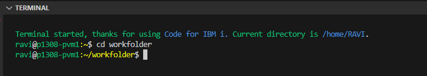
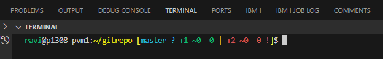

import { Icon } from '@astrojs/starlight/components';


Modification of the prompt string to display useful details in the PASE terminal can greatly improve your workflow and productivity. This guide will show you two methods to customize your terminal prompt: a simple method for basic information display, and an advanced method that includes Git status integration.

## Why Customize Your Terminal Prompt?

A customized terminal prompt helps you:
- Know exactly where you're currently located without issuing a `pwd` command
- See Git repository status at a glance
- Identify the server and user you're working as
- Reduce context switching and improve efficiency

## Prerequisites

- Access to IBM i PASE terminal
- Basic knowledge of shell commands
- For the advanced method: Git installed in PASE

---

## Simple Method: Basic PS1 Customization

By modifying the `PS1` environment variable, we can display useful information like username, server name, and current working directory.



This customization helps users know exactly where they're currently located without the need to issue a `pwd` command.

### Implementation

Create a `.profile` file in your home directory with the following command:

```bash
echo 'PS1="\[\e[32m\]\u\[\e[0m\]@\[\e[32m\]\h\[\e[33m\]:\w\[\e[0m\]\$ "' >> ~/.profile
```

Then reload your profile:

```bash
source ~/.profile
```

### What This Does

- `\u` - Displays the username (in green)
- `@` - Separator
- `\h` - Displays the hostname (in green)
- `:` - Separator
- `\w` - Displays the current working directory (in yellow)
- `\$` - Displays `$` for regular users or `#` for root

---

## Advanced Method: Git Status Integration

By modifying the `PROMPT_COMMAND`, we can display the Git status directly on the prompt string. This replicates functionality similar to [posh-git](https://github.com/dahlbyk/posh-git) for PowerShell.



In this example:
- `gitrepo` - Current folder name (which is a Git repository)
- `master` (cyan) - Current branch name
- `?` - No remote repository configured
- `+1` (green) - One file is tracked and newly added
- `+2` (red) - Two files are added but untracked

### Step 1: Download the git-prompt.sh Script

First, get the `git-prompt.sh` shell script that can evaluate the Git status. You can read more about this script [here](https://github.com/lyze/posh-git-sh).

```bash
/QOpenSys/pkgs/bin/wget --show-progress https://raw.githubusercontent.com/lyze/posh-git-sh/refs/heads/master/git-prompt.sh -O ~/.git-prompt.sh
```

### Step 2: Setup the Open Source PATH Variable

Add the open source path to your `.profile` file. This is required for the `git-prompt.sh` to work correctly.

```bash
echo "export PATH=/QOpenSys/pkgs/bin:$PATH" >> ~/.profile
```

### Step 3: Configure PROMPT_COMMAND

Setup the `PROMPT_COMMAND` to reflect the Git status. Run the following commands one by one:

```bash
echo "PROMPT_COMMAND='__posh_git_ps1 \"\${VIRTUAL_ENV:+(\`basename \$VIRTUAL_ENV\`)}\\[\\e[32m\\]\\u\\[\\e[0m\\]@\\h:\\[\\e[33m\\]\\w\\[\\e[0m\\] \" \"\\\\\\\$ \";'\$PROMPT_COMMAND" >> ~/.profile
```

```bash
echo "source ~/.git-prompt.sh" >> ~/.profile
```

```bash
source ~/.profile
```

### How It Works

The `PROMPT_COMMAND` is a special shell variable that gets executed each time before the shell's primary prompt (PS1) is displayed. We instruct it to call the `git-prompt.sh` script every time the prompt is displayed.

The function `__posh_git_ps1` takes two parameters: `__posh_git_ps1 <prefix> <suffix>`, and sets `PS1` to `<prefix><status><suffix>`.

---

## Understanding Git Status Symbols

<details>
<summary>Click here to read the full legend of the Git Prompt</summary>

By default, the status summary has the following format:

```
[{HEAD-name} x +A ~B -C !D | +E ~F -G !H W]
```

### HEAD Name and Colors

**`{HEAD-name}`** is the current branch, or the SHA of a detached HEAD. The color of `{HEAD-name}` represents the divergence from upstream:

- **`cyan`** - the branch matches its remote
- **`green`** - the branch is ahead of its remote (green light to push)
- **`red`** - the branch is behind its remote
- **`yellow`** - the branch is both ahead of and behind its remote

### Divergence Symbols

**`x`** is a symbol that represents the divergence from upstream:

- **`≡`** - the branch matches its remote
- **`↑`** - the branch is ahead of its remote
- **`↓`** - the branch is behind its remote
- **`↕`** - the branch is both ahead of and behind its remote

### Status Changes

Status changes are indicated by prefixes to `A` through `H`:
- `A` through `D` represent counts for the **index** (dark green)
- `E` through `H` represent counts for the **working directory** (dark red)

**Prefixes:**
- **`+`** - added
- **`~`** - modified
- **`-`** - removed
- **`!`** - conflicting

### Working Directory Status

**`W`** represents the overall status of the working directory:

- **`!`** - there are unstaged changes in the working tree
- **`~`** - there are uncommitted changes (staged changes waiting to be committed)
- **None** - there are no unstaged or uncommitted changes

### Example

A status of `[master ≡ +0 ~2 -1 | +1 ~1 -0 !]` corresponds to the following `git status`:

```
# On branch master
#
# Changes to be committed:
#   (use "git reset HEAD <file>..." to unstage)
#
#        modified:   this-changed.txt
#        modified:   this-too.txt
#        deleted:    gone.txt
#
# Changed but not updated:
#   (use "git add <file>..." to update what will be committed)
#   (use "git checkout -- <file>..." to discard changes in working directory)
#
#        modified:   not-staged.txt
#
# Untracked files:
#   (use "git add <file>..." to include in what will be committed)
#
#        new.txt
```

</details>

---

## Tips & Best Practices

1. **Backup your `.profile`** before making changes: `cp ~/.profile ~/.profile.backup`
2. **Test in a new session** after making changes to ensure everything works correctly
3. **Keep it readable** - Don't overcrowd your prompt with too much information
4. **Consider performance** - The Git status check runs on every prompt display, which might slow down your terminal in large repositories
5. **Customize colors** - Modify the ANSI color codes to match your preferences

---

## References

- [posh-git-sh on GitHub](https://github.com/lyze/posh-git-sh)<Icon name="external" color="cyan" class="icon-inline" />
- [posh-git for PowerShell](https://github.com/dahlbyk/posh-git)<Icon name="external" color="cyan" class="icon-inline" />
- [Bash Prompt HOWTO](https://tldp.org/HOWTO/Bash-Prompt-HOWTO/)<Icon name="external" color="cyan" class="icon-inline" />

---

