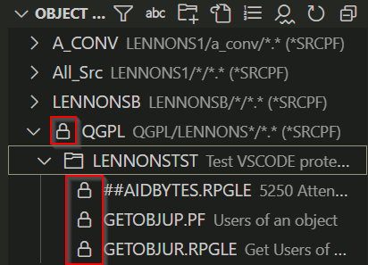
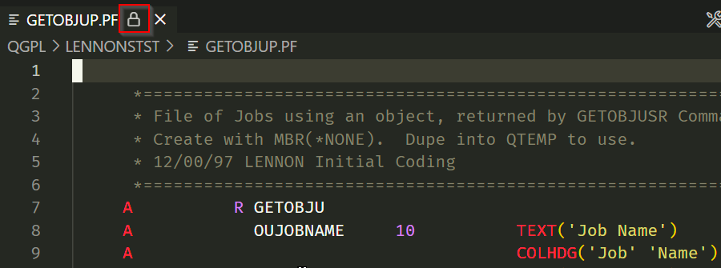
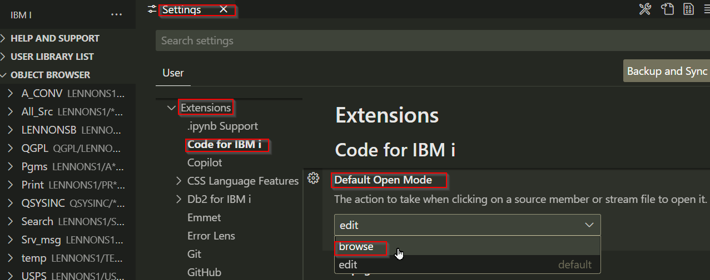
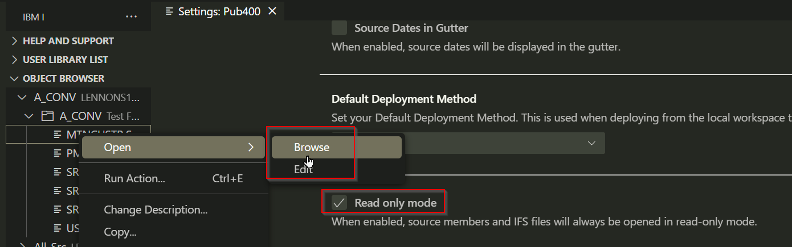
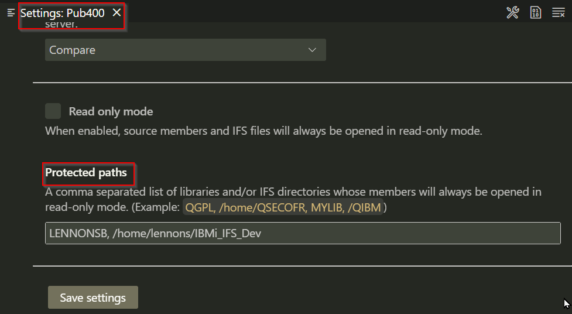
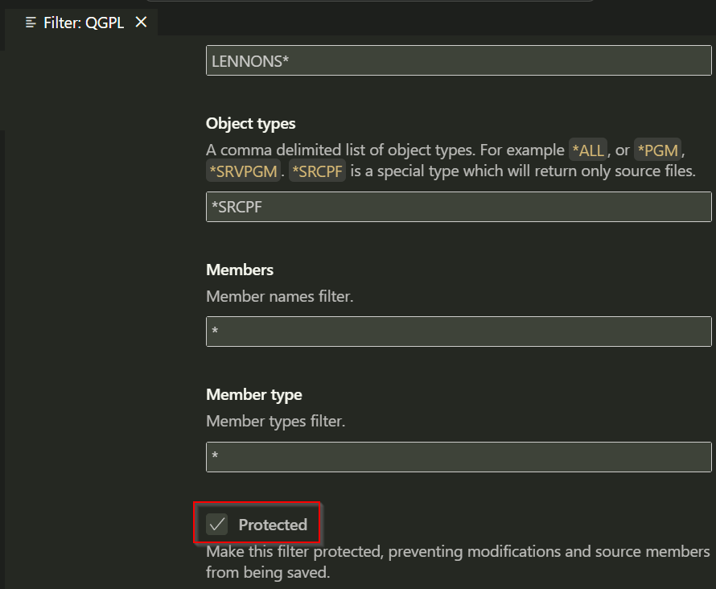

import { Icon } from '@astrojs/starlight/components';
import { CardGrid, Card } from '@astrojs/starlight/components';

Generally accepted best practice is that developers should not be able to directly change production source. 

However, if you operate with *ALLOBJ or other elevated authority, there are a few setting that may protect you against making accidental changes to production source.

Source that is protected from change by these settings is shown with a **Padlock** icon:
<CardGrid>
<Card>

</Card><Card>

</Card>
</CardGrid>

### Code for IBM i Extension Level Protection

By default, clicking on source opens it for editing. Change `Default Open Mode` to `browse` to protect all source in all connections by default.

To override `Broswe`, right click and choose `Edit` to open the source and allow changes.

### Connection Level Protection #1

Protect **all** filters and source in a connection by choosing `Browse` as the `Read only mode` setting, so that by default source will be opened as read-only. 

To override `Broswe`, right click and choose `Edit` to open the source and allow changes.

### Connection Level Protection #2

Protect source in specific libraries or IFS directories by making entries in the `Protected paths` setting:

Note that this protection cannot be overridden by right clicking on the source.

### Filter Level Protection

Put a checkmark in the `Protected` setting of a filter to protect all source defined in the filter from being changed: 

There is no way to override this protection other then un-checking this setting in the filter.
