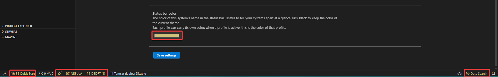

import { Aside, CardGrid, Card } from '@astrojs/starlight/components';

When you work with several systems at once - development, test, production - it is very easy to run an Action or a SQL statement on the wrong one. The **Status bar color** setting paints the Code for IBM i status bar items with a color of your choice, so the current environment is recognizable at a glance.

The color is stored **per connection**, and it can also be stored **per profile**, so that switching environment also switches the color.

---

## Where the color is applied

The color is a *foreground* color: it colors the text and the icons of the status bar items, not their background. Background states set by the extensions (for example the orange "pending transaction" warning of Db2 for i) are not affected.



| Extension | Status bar item |
| --------- | --------------- |
| Code for IBM i (core) | The connected system item (`$(settings-gear) SYSTEM (profile)`) |
| Code for IBM i (core) | The `Disconnect from system` item |
| Code for IBM i (core) | The source dates search item (shown when *Enable source dates* is on) |
| Db2 for i | The SQL Job Manager item (`$(database) job name`) |
| IBM i FileSystem | The `FS Quick Start` item |

<Aside type="note">
    The color comes from the connection settings of the **core** extension: Db2 for i and IBM i FileSystem read the same value through the `parseStatusBarColor` API exported by Code for IBM i. There is nothing to configure in those extensions - set the color once and every item follows.
</Aside>

### Accepted values

- `#rgb` or `#rrggbb` hexadecimal values (for example `#f00` or `#ff0000`).
- **Black (`#000000`) means "no color"**: the items keep the color of the current VS Code theme. This is the default, and it is also what the color picker shows when no color has been chosen yet.
- An empty or invalid value is treated like black.

---

## Changing the color of a connection

<CardGrid>
  <Card>
    1. Hover the connection name in the status bar and click **Settings** (or run **Code for IBM i: Show Additional Settings** from the command palette).
    2. Open the **Features** tab.
    3. Set **Status bar color** with the color picker, at the bottom of the tab.
    4. Save.
  </Card>
  <Card>
    The change is applied immediately: all the status bar items listed above refresh as soon as the connection settings are saved - no reconnection needed.
  </Card>
</CardGrid>

This value belongs to the connection, so it is used every time you connect to that system, whatever profile is active - unless the profile carries its own color (see below).

---

## Changing the color of a profile

Each profile can carry its own color, so activating a profile also changes the status bar color. This is handy when a single connection is used for several environments (different library lists, different iASPs).

<CardGrid>
  <Card>
    1. In the **Environment** view, expand **Profiles** and click the profile to open the profile editor.
    2. Set **Status bar color**.
    3. Save.
  </Card>
  <Card>
    Unlike most of the other profile fields, **Status bar color** stays editable even when the profile you are editing is the active one; saving it updates the connection's color right away.
  </Card>
</CardGrid>

Hovering a profile in the Environment view shows its color in the tooltip, along with the other profile settings.

### How the two levels interact

The connection color is the one actually used to paint the status bar; the profile color is the value that is loaded into the connection when the profile becomes active. The rules are:

- **Activating a profile that has a color** sets the connection color to the profile's color.
- **Activating a profile that has no color** leaves the current connection color untouched.
- **Switching profile** first saves the current connection color into the profile you are leaving (including the default, unnamed profile), exactly like the library list and the other profile settings.
- **Unloading the active profile** goes back to the default profile, and therefore to the color that was stored in it.
- **Editing the color of the active profile** also updates the connection's color, and vice versa: the two values are kept in sync while the profile is active.

<Aside type="tip">
    A practical setup: leave the connection color black (theme default) for your everyday profile and give a strong color - red is the usual choice - only to the production profile. The status bar stays neutral until you switch to the environment where mistakes are expensive.
</Aside>

<Aside type="caution">
    Because the current color is saved into the outgoing profile when you switch, changing the color from the connection settings while a profile is active will end up stored in that profile. To keep a profile's color stable, set it from the profile editor.
</Aside>

---

## Editing the setting manually

Both values live in the `code-for-ibmi.connectionSettings` array of your VS Code settings, one entry per connection:

```json title="settings.json"
"code-for-ibmi.connectionSettings": [
  {
    "name": "PRODUCTION",
    "statusBarColor": "#ff0000",
    "currentProfile": "NIGHTLY",
    "connectionProfiles": [
      {
        "name": "NIGHTLY",
        "statusBarColor": "#ff0000",
        "currentLibrary": "PRDLIB"
      },
      {
        "name": "TEST",
        "statusBarColor": "#00a000",
        "currentLibrary": "TSTLIB"
      }
    ]
  }
]
```

<Aside type="note">
    Editing the settings by hand while connected is not recommended: use the settings editor and the profile editor, which validate the value and refresh the status bar for you.
</Aside>

---

## Troubleshooting

- **The core items are colored, but the Db2 for i or IBM i FileSystem ones are not.** Those extensions get the color from the core extension's API; make sure they are updated to a version that supports it. The `FS Quick Start` item also re-evaluates its color periodically, so it may take a couple of seconds to follow.
- **Nothing changes after saving.** Check that the chosen color is not black: black is the "use the theme color" value.
- **The color changed on its own after switching profile.** That is by design - see the interaction rules above.
