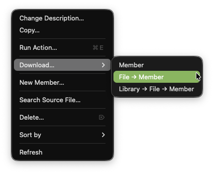

import { CardGrid, Card, Aside, Icon } from '@astrojs/starlight/components';

## Overview

**Download...** in the Object Browser is a submenu that offers three ways to download IBM i source members to a local folder. The original single-member download is still available as **Member**, and two new structured layout options organize downloads into subfolders that reflect the IBM i QSYS hierarchy.

The structured options are particularly useful when migrating IBM i source into a Git repository, as they produce a folder layout that is ready for version control.

## How to Use

<CardGrid>

<Card>

1. In the **Object Browser/Filter**, right-click one of the following:
   - A **source physical file (PF-SRC) name** — downloads all members in that file
   - Select one or more **source members** — downloads the selected members
2. Hover over **Download...** to reveal the submenu
3. Choose a download option:
   - **Member** — saves a single member via a Save-as dialog (original behavior)
   - **File → Member** — structured download to a subfolder named for the Source File
   - **Library → File → Member** — structured download to a library->file folder structure with the members stored under the file name folder.
4. For structured options, choose a **base download folder** on your local machine when prompted
5. Subfolders and files are created automatically

</Card>

<Card>



</Card>

</CardGrid>

## Download Options

### Library → File → Member

<CardGrid>

<Card>

Use this when you want the full IBM i path preserved locally.

Given IBM i source in library `DEVLIB`:

```
DEVLIB
├── QRPGLESRC
│   ├── PROGRAMA.RPGLE
│   ├── PROGRAMB.RPGLE
│   └── PROGRAMC.RPGLE
├── QCLLESRC
│   └── STARTJOB.CLLE
├── QCMDSRC
│   └── STARTJOB.CMD
└── QSQLSRC
    ├── CUSTOMERS.SQL
    └── INVENTORY.SQL
```

</Card>

<Card>

After choosing `~/myproject` as the base download folder:

```
~/myproject/
└── DEVLIB/
    ├── QRPGLESRC/
    │   ├── PROGRAMA.RPGLE
    │   ├── PROGRAMB.RPGLE
    │   └── PROGRAMC.RPGLE
    ├── QCLLESRC/
    │   └── STARTJOB.CLLE
    ├── QCMDSRC/
    │   └── STARTJOB.CMD
    └── QSQLSRC/
        ├── CUSTOMERS.SQL
        └── INVENTORY.SQL
```

</Card>

</CardGrid>

### File → Member

<CardGrid>

<Card>

Use this when want the source files to sit directly inside your project folder with their members below them — for example, downloading to a folder named `Pickles` that receives `QRPGLESRC`, `QCLLESRC`, etc. builds the folder structure using the source file names as subfolders.

After choosing `~/Pickles` as the base download folder:

```
~/Pickles/
├── QRPGLESRC/
│   ├── PROGRAMA.RPGLE
│   ├── PROGRAMB.RPGLE
│   └── PROGRAMC.RPGLE
├── QCLLESRC/
│   └── STARTJOB.CLLE
├── QCMDSRC/
│   └── STARTJOB.CMD
└── QSQLSRC/
    ├── CUSTOMERS.SQL
    └── INVENTORY.SQL
```

</Card>

<Card>

#### Collision handling

<Aside type="caution">

If members from **different libraries** share the same `FILE/MEMBER.EXT` path, silently overwriting one with the other would result in data loss. Instead, those specific members automatically fall back to the full `LIBRARY/FILE/MEMBER.EXT` structure, and a warning notification identifies the collisions. All non-colliding members still use the flat `FILE/MEMBER` layout.

</Aside>

</Card>

</CardGrid>

## Comparison of Download Options

| | Download → Member | Download → File→Member | Download → Library→File→Member |
|---|---|---|---|
| Single member | `MEMBER.EXT` |  `FILE/MEMBER.EXT` | `LIBRARY/FILE/MEMBER.EXT` |
| Multiple members | All Members in one folder | `FILE/MEMBER.EXT` tree (library omitted) | Full `LIBRARY/FILE/MEMBER.EXT` tree |
| Best for | Quick one-off save |  Single-library Git project setup | Multi-library or full-archive download |

## Notes

- The base download folder you select is remembered as the default for future downloads
- The member's source type (aka `SEU type`) is used as the file extension.
- If a member's source type  is blank, the file extension is set to `.MBR`
- All library, file, and member names are created in **uppercase**
- Subfolders (for each library and file) are created automatically if they do not exist.
- Source change dates (SEU sequence/date columns) are **not** downloaded — the recommended approach for change management for these objects is **Git**

For further reading on local development and Git workflows with IBM i, see the [Code for IBM i documentation](https://codefori.github.io/docs/developing/local/getting-started/)<Icon name="external" color="cyan" class="icon-inline" />.
