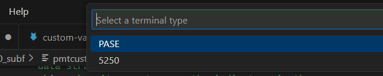

import { CardGrid, Card, Icon } from '@astrojs/starlight/components';

In Code for IBM i you can open a 5250 terminal in it's own tab, so almost all developer needs are integrated into the editor. You can launch either a 5250 terminal or a pase shell right in the editor.

_Shows explorer, RPGLE code, problems, outline view and 5250 terminal._

## Terminal Startup

<CardGrid>

<Card>

Hover over the connected system in the Status Bar

</Card><Card>

</Card></CardGrid>

---

<CardGrid>

<Card>

Click  **Terminals** in the quick pick menu, then choose a terminal:

* **PASE** will launch into the pase environment
* **5250** will launch a 5250 emulator to the connected system. 

</Card><Card>

</Card></CardGrid>

## 5250 Requirements & Settings

To launch a 5250 emulator, you must have tn5250 installed on the remote system. This can be [installed via yum](https://www.seidengroup.com/php-documentation/how-to-set-up-the-ibm-i-open-source-environment/)<Icon name="external" color="cyan" class="icon-inline" />. 

After you have installed tn5250, you should be able to launch the 5250 terminal, but if not: before connecting to your server, right-click on the server and choose “Connect and Reload Server Settings.”

Code for IBM i provides additional settings so you can setup your termimal how you like. The most common setting is likely the CCSID mapping configuration, which lets you set the encoding for the terminal.

## FAQ

- **Do the function keys work?** Yes.
- **It is possible to do a system request?** Yes. Use Command+C.
- **How do I end my session?** Use the Terminal bin in VS Code.
- **I am stuck with `Cursor in protected area of display.`!** Use Command+A to get attention, then use F12 to go back.
- **What are all the key bindings?** [Check them out here](https://linux.die.net/man/1/tn5250)<Icon name="external" color="cyan" class="icon-inline" />.
