import { Aside, CardGrid, Card } from '@astrojs/starlight/components';

## Outline

* Requirements:
* Connecting to a system
* Using the job manager
* Executing statements - running statements regularly, running in a view, statement history, canceling a statement, dealing with host variables, commitment control UI
* Writing SQL - content assist for schemas, table columns, signature info for functions/procedures
* Exporting data - cover the different types of export modes
* Schema browser - adding/removing entries, browsing schemas, viewing different object types, generating SQL, right click options
* Visual explain - explain types, explaining a statement, how to read the data, exporting the data, configuring which nodes to highlight, generating create index statements
* SELF - what is self, how to enable it, using the error view, creating an intentional error, turning SELF on outside of VS Code
* Notebooks - what is a notebook, creating your first notebooks, different cell types, saving and sharing notebooks, charting with notebooks, chart tooltips, chart * datapoints, exporting notebooks, opening a notebook from SQL files

---

## Requirements

This is a BYOD (bring your own device) workshop and some software and accounts are required.

### Tasks

#### Install Visual Studio Code

We are using VS Code to write our code. It is a free, open-source editor with great extensibility.

[Download it here for free](https://code.visualstudio.com/download).

#### Install Code for IBM i and the Db2 for i extension

We are using the Code for IBM i extension to connect to IBM i systems, and then using the Db2 for IBM i extension to work with the database.

**After you have installed Visual Studio Code**, then go ahead and install the [Code for IBM i extension](https://marketplace.visualstudio.com/items?itemName=HalcyonTechLtd.code-for-ibmi) and the [Db2 for IBM i extension](https://marketplace.visualstudio.com/items?itemName=HalcyonTechLtd.vscode-db2i), or, to make life easier in the future, install the [IBM i Development pack](https://marketplace.visualstudio.com/items?itemName=HalcyonTechLtd.ibm-i-development-pack) which contains those extensions and more.

#### Access to an IBM i

If you are doing this workshop as part of a hosted lab, then a user profile and system will be provided to you. If you're using your own system, then ensure SSH is running on your system. [Check out the requirements](../../).

---

## Goals

The main goal of this workshop is to understand how you can use Visual Studio Code to make it easier to work with the database while you work on developing applications.

---

## Connecting to a system

### Tasks

Using the Code for IBM i extension, you can create a new connection to an IBM i system.


If the database extension has never been seen before, you will see a popup asking if you'd like to start an SQL Job. For now, select 'Yes' or 'Always'. More will be covered on this later.


### Db2 for i User Interface


There are three areas that should be known when using the database extension in Visual Studio Code:

1. This database icon is where the database extension can be found inside of VS Code. Clicking it will load the available database panels.
2. When the database extension is select, the panels will show here. Most functionality can be found here.
3. The database extension has a quick pick item on the status bar, which the user can hover over to quickly access specific information.

---

## Using the job manager

### Intro

<CardGrid>
<Card>

The job manager is used to maintain different jobs, all of which can be used to execute different SQL statements. You can spin up a new job by clicking the ⛁ (database) icon. Notice that the current job (in the screenshot) has the icon highlighted green. The highlighted job indicates the job that is going to be used when running SQL statements in VS Code. We call this the 'selected job'.

Each job has a set of icons when hovering over the item. Each job has unique JDBC settings, all of which can be edited by clicking on the ✎ (pencil) icon. You can also see the job log of a job by selecting on the ℹ (info) button.

There are also additional buttons to open new SQL documents and notebooks.

</Card><Card>


</Card></CardGrid>

### Tasks

#### 1. Spin up two jobs

<CardGrid>
<Card>

For this task, we are going to spin up two jobs that have unique settings for when we run SQL statements.

You can spin up a new job by clicking the ⛁ (database) icon.

<Aside type="note">
The selected job will change when you create new jobs.
</Aside>

</Card><Card>


</Card></CardGrid>

#### 2. Configure the jobs

<CardGrid>
<Card>

Click on the ✎ (pencil) icon of the first job and see that a new tab opens where JDBC settings can be edited.

For a simple change, edit the library list entry under the System tab. **Scroll to the bottom of the page and select 'Apple changes'** to save. The job will be restarted when the changes are applied.

Do this for both jobs that you have.

</Card><Card>


</Card></CardGrid>

#### 3. Execute statements on both jobs

<CardGrid>
<Card>

Use the 'Open SQL document' on the SQL Job Manager view to create an empty SQL document. This new document can be used to test the library list change with an SQL statement:

```sql
select * from qsys2.library_list_info
```

To execute the statement, either the ▶️ (play) button can be pressed - or the shortcut Control/Command+R - can be used to execute the statement. The result set should appear below the SQL document.

Do this with both SQL jobs that were started.

</Card><Card>


</Card></CardGrid>

<Aside type="note">
When clicking on a job in the SQL Job Manager, it becomes the selected job, and will be used when the user executes an SQL statement.
</Aside>

#### 4. Save your job configuration

<CardGrid>
<Card>

Once a job has been configured to your liking, you are able to save the configuration so next time you start a job the settings will already be applied.

Right click on a job and select 'Save settings into config'. This will allow you to provide a name for the configuration.

</Card><Card>


</Card></CardGrid>

<CardGrid>
<Card>

A new group will appear in the SQL Job Manager with your saved configurations.

* click on the configuration to start a new job with that configuration
* use the ✎ (pencil) icon to edit the configuration
* use the 🗑️ (trash/bin) icon to delete the configuration

</Card><Card>


</Card></CardGrid>

### Takeaways

Here are the main items to remember from this section:

* SQL statements run in a unique job
* The user can maintain multiple jobs through the SQL Job Manager
* The user can change the selected job by clicking on it. The selected job is highlighted with a checkmark

---

## Executing statements

### Intro

As discovered in the last section, it is possible to run statements in an SQL document with the ▶️ (play) button, or with the Command/Control+R keyboard shortcut. But there is more, like running statements in a unique view, seeing the statement history, and managing commitment control.

### Tasks

#### 1. Executing statements

<CardGrid>
<Card>

Use the 'Open SQL document' on the SQL Job Manager view to create an empty SQL document. When the active editor is an SQL file (usually the `.sql` extension), then the ▶️ (play) button will appear. 

Clicking the ▶️ (play) button will show a drop down, and the first entry in the list is the action to execute the statement. This shows the view in the lower panel with a scrollable result set.

</Card><Card>


</Card></CardGrid>

#### 2. Cancelling a statement

<CardGrid>
<Card>

When executing a statement, the play button will turn into a ⓧ (cancel) button, which doesn't immediately cancel, but instead requests that job should cancel the current running statement.

Try executing this statement, then use the ⓧ (cancel) button to stop it:

```sql
select count(*) from qsys2.syscolumns2 a, qsys2.syscolumns2 b where 1=1
```

</Card><Card>


</Card></CardGrid>

#### 3. Using statement history

<CardGrid>
<Card>

Every time you execute a statement, the statement will be prepended to the statement history so it can be accessed again quickly in the future. Statements in history are grouped by time period; last day, last week, last month, etc. Hovering over an entry will show it and clicking on it will open it into a brand new document. Single items can be cleared from history, and the entire history can also be cleared.

</Card><Card>


</Card></CardGrid>

#### 4. Managing commitment control

VS Code has a simple UI to show if your job has changes pending to commit in your job. In the screenshot an update statement has been execute, and the result view shows that 1 row was updated. When your job has committment control setup, the hotbar item will highlight when there are pending changes in your job. Hovering on the hotbar item with your current job will show new Commit and Rollback buttons.

<Aside type="note">
For this, **commitment control will need to be turned on for your job**. Edit your job settings, and under the System tab, set 'Auto commit' to False, 'Transaction isolation' to 'Read uncommitted' and 'True autocommit' to false.
</Aside>


---

## Writing SQL

### Intro

Seeing results is useful, but you become an expert when you know how to find out the information you want. By understanding how the content assist works in Visual Studio Code, you can practically navigate entire schemas while you're writing SQL statements.

<Aside type="note">
Triggering the content assist refers to the keyboard shortcut to make the content assist appear in the editor. The shortcut is always Control+Space (on all Windows, Mac and Linux.) You can type at any point when the content assist list is open to filter the items down.
</Aside>

### Tasks

#### 1. SQL functions

<CardGrid>
<Card>

By default, when you trigger the content assist, VS Code will show available SQL functions as snippets.

Selecting the item from the list will insert it at the cursor location and, if available, show the required parameters.

</Card><Card>

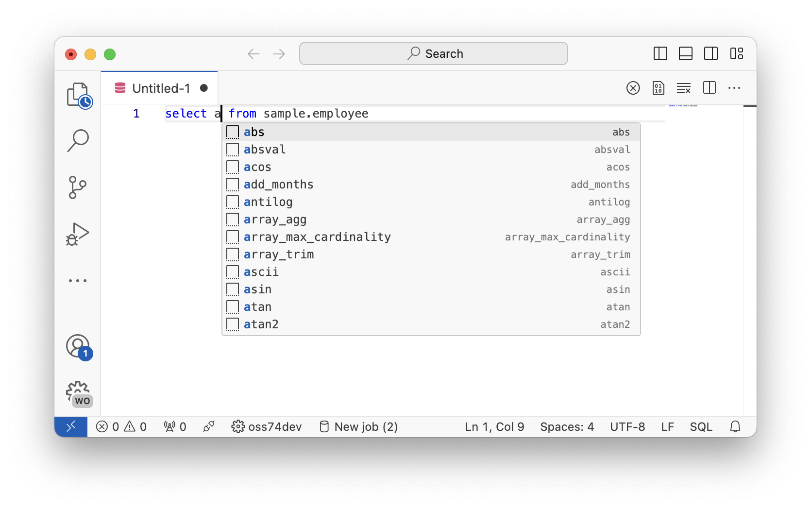

</Card></CardGrid>

#### 2. Looking for schemas

<CardGrid>
<Card>

You can trigger the content assist at any point and expect to see a list of schemas available to you. Each schema entry has the double bracket icon
: `{}`

</Card><Card>

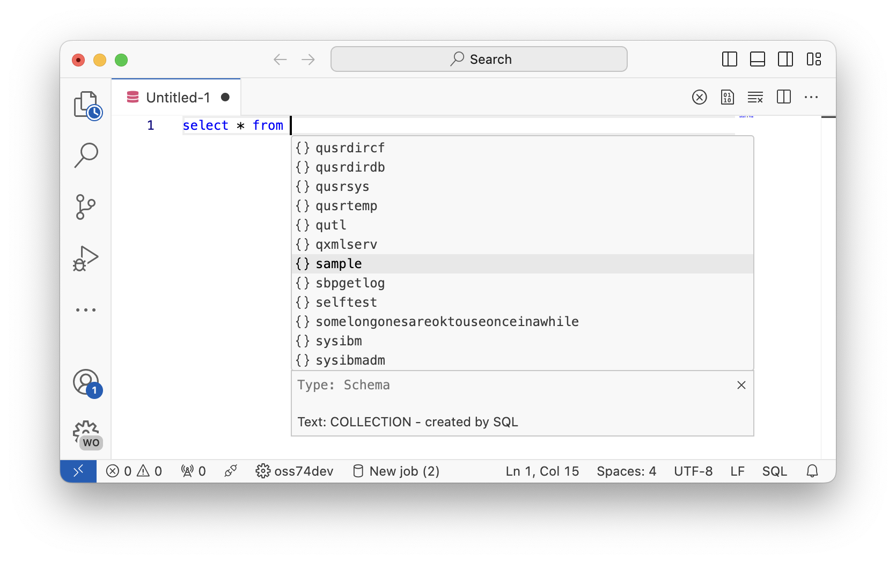

</Card></CardGrid>

#### 3. Looking at objects in schemas

If you enter a dot (`.`) after a schema, it will show available objects in the schema that you can reference, with the applicable type and text. Different object types have different icons.

<CardGrid>
<Card>

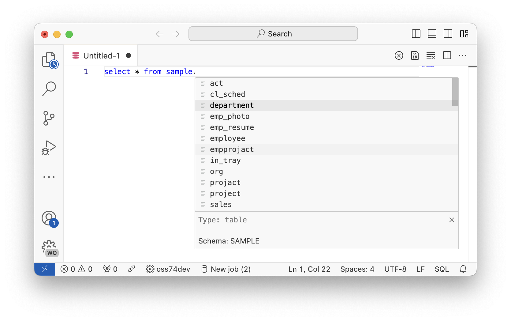

</Card><Card>

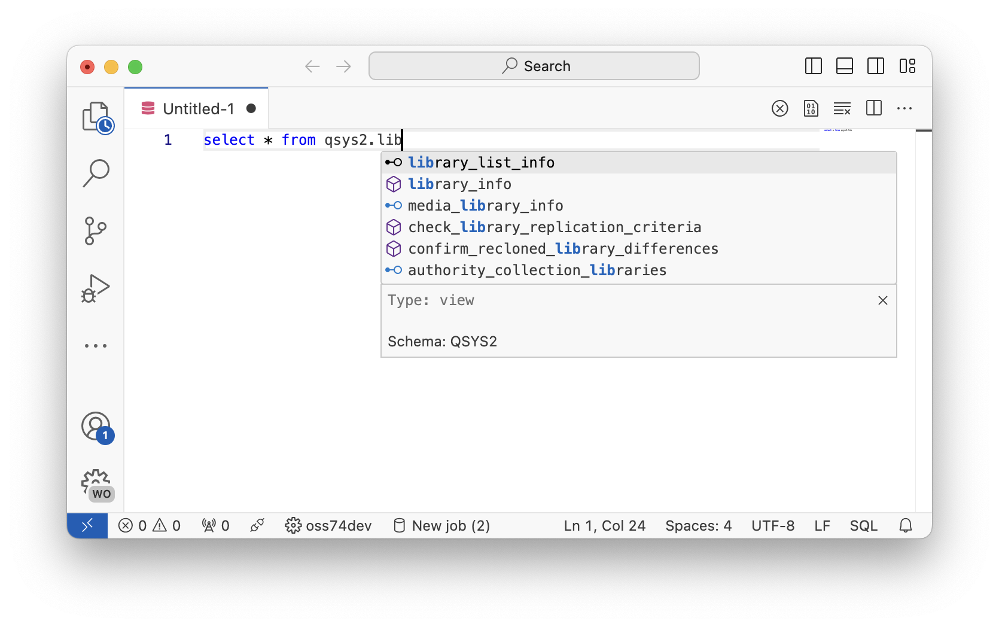

</Card></CardGrid>

#### 4. Columns from tables, views, and table functions

<CardGrid>
<Card>

When you reference tables, views, table functions, etc, then you will also have access to the columns of those objects in the content assist.

<Aside type="note">
When referencing multiple objects in SQL statements, it's always recommended to use table correlation names:

```sql
select d.deptno, d.deptname from sample.department as d;
```
</Aside>

</Card><Card>

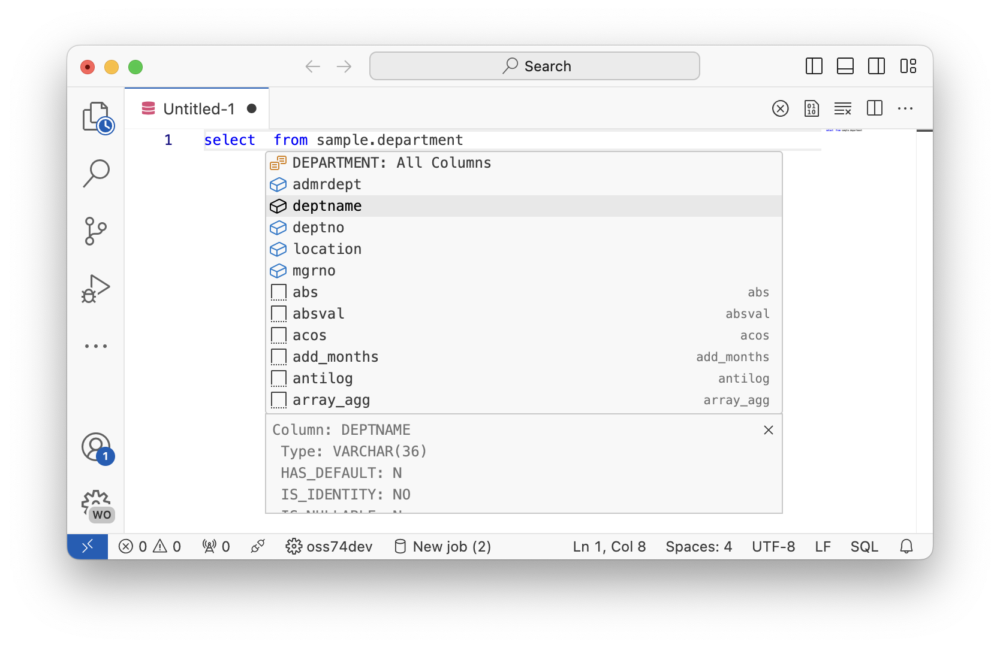

</Card></CardGrid>

#### 5. Procedure and function call signatures

<CardGrid>
<Card>

When calling a function or procedure, after entering an open round bracket (`(`), then the signature information should appear. This shows, as you are writing the parameters to the routine, what the current information is for the current parameter you are writing for.

</Card><Card>

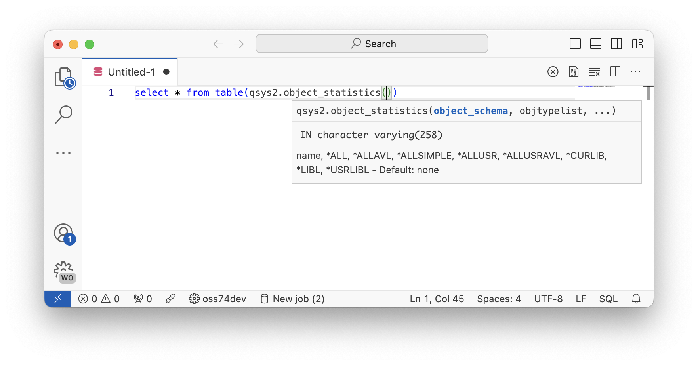

</Card></CardGrid>

#### 6. Dealing with host variables

<CardGrid>
<Card>

If you have host variables in a statement you are trying to execute, you will find that the statement does not execute right away. Instead, it will highlight the host variables so the user can replace them correctly. You can Tab and Shift+Tab between the host variables. When the variables have been removed, then the statement can be executed.

</Card><Card>

```sql
select * from qsys2.syscolumns2
where 
    data_type = :theType and
    is_nullable = ?
limit 10;
```

</Card></CardGrid>

---

## Exporting data

### Intro

The Db2 for IBM i extension provides simple ways to export result sets to multiple formats. The SQL processor supports a 'statement prefix', which tells the SQL execution how to process the statement. ACS has support for the `cl` prefix, but VS Code adds to that by supporting `csv`, `json` and `sql`.

### Task

Try executing a statement to generate a CSV document, JSON document and SQL insert statement:

```sql
-- result set as normal table
select * from sample.employee;

-- result set as JSON, will open in a new file
json: select * from sample.employee;

-- result set as CSV, will open in a new file
csv: select * from sample.employee;

-- result set as SQL insert statement
sql: select * from sample.employee;

-- run CL commands. output is directed to IBM i output channel
cl: dspffd sample/employee
```

---

## Schema Browser

### Intro

Schema Browser is a view where users can explorer schemas, and SQL objects inside of those schemas. Additionally, context options on some objects as well as viewing columns or parameters to others.

### Tasks

#### 1. Adding and removing schemas

To add schemas to the Schema Browser, select the 'Manage Schema Browser List'. When the list appears, you are able to filter down and select the schemas you want to appear in the list. Select OK when the items have been selected correctly.

<CardGrid>
<Card>

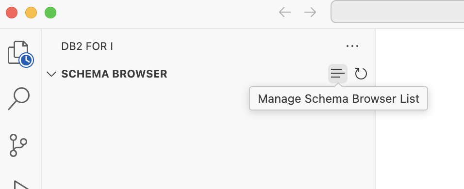

</Card><Card>

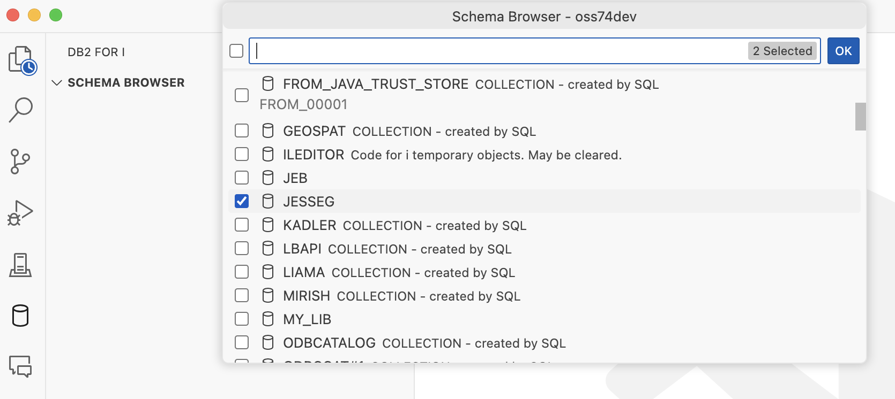

</Card></CardGrid>

#### 2. Browsing schemas

<CardGrid>
<Card>

When schemas are expanded, objects are grouped by object type. Expanding a type will show the objects in that schema of that type.

Tables and views have a button on each item to quickly view the data, which will open a new SQL document with a pre-written `select` statement and will automatically execute it.

</Card><Card>

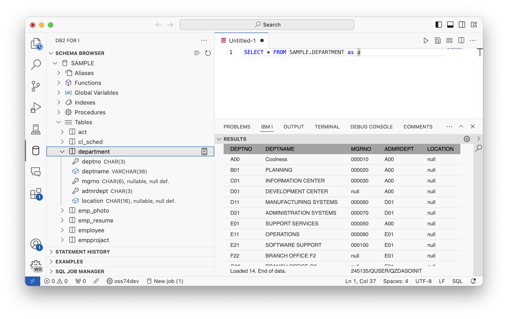

</Card></CardGrid>

#### 3. Object options

<CardGrid>
<Card>

Some objects have right-click context options on there. 

All objects will have the ability to delete and rename.

</Card><Card>

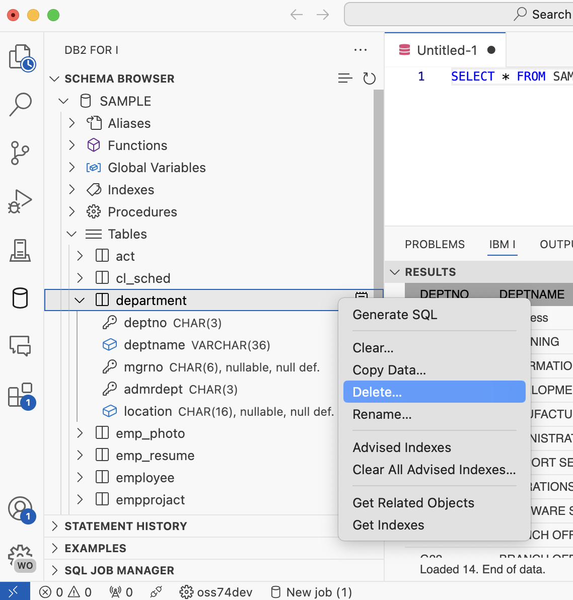

</Card></CardGrid>

#### 4. Generating SQL

<CardGrid>
<Card>

All SQL objects will have the 'Generate SQL' option, which will generate the SQL that can be used to recreate the object.

<Aside type="note">
Further provements are going to be made to 'Generate SQL' in the future to make it more configurable.
</Aside>

</Card><Card>

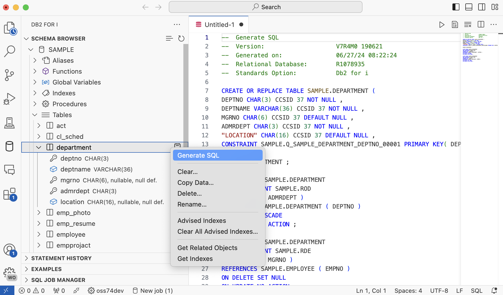

</Card></CardGrid>

#### 5. Filtering / searching a schema

All schemas have the ability to filter objects in a schema to find something specific. Click on the 🔎 (search) icon, which will show a input box where a case-insensitive name can be provided.

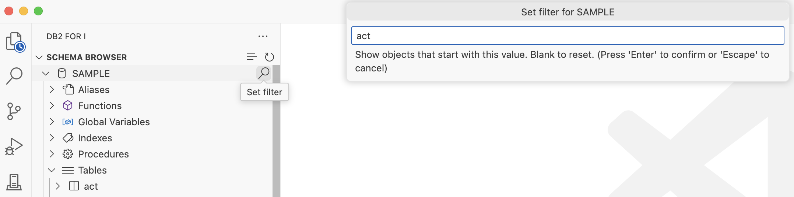

---

## Visual Explain

### Intro

Visual Explain is.....

### Tasks

#### 1. Explaing a statement

#### 2. Reading the VE data

#### 3. Configuring node highlighting

#### 4. Exporting the data

#### 5. Generating `create index` statements

---

## SELF

### Intro

SQL Error Logging Facility (SELF) offers a comprehensive view that can help users understand specific SQL errors or warnings. The SELF view can be accessed through the IBM i panel next to the Results View. Additional documentation of SELF can be found [here](https://www.ibm.com/docs/en/i/7.5?topic=tools-sql-error-logging-facility-self).

<Aside type="caution">
SELF can only work with users who has `*ALLOBJ` authority. This is because... Scott write here. This section may have to be skipped in the lab environment due to lack of authority.
</Aside>

### Tasks

#### 1. Enable SELF for jobs

SELF can be turned on at a job level or a system level. In this workshop we are only going to cover turning on SELF at the job level.

There are four modes to capture errors with:

| Mode | Info |
| - | - |
| `*NONE` | Capture no errors |
| `*WARNING` | Capture any errors where the `SQLCODE` is above `0` |
| `*ERROR` | Capture any errors where the `SQLCODE` is below `0` |
| `*ALL` | Capture both warnings and errors |

##### Turn on SELF for an SQL job

<CardGrid>
<Card>

You can right click on any SQL job that has been created inside of the SQL Job Manager, and set the logging level. This will show a quick pick where you can select the mode.

The job will then start to capture errors and warnings.

</Card><Card>

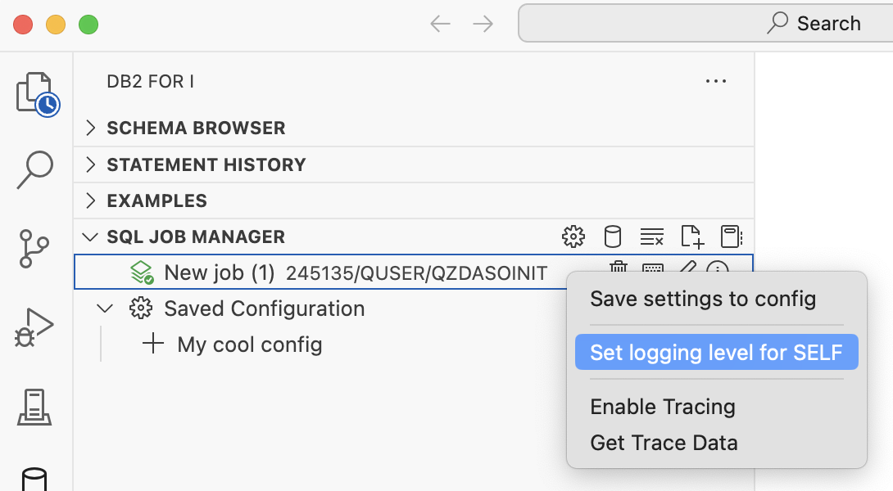

</Card></CardGrid>

##### Turn on SELF for all new jobs

<CardGrid>
<Card>

You can also ensure that any new job started by the SQL Job Manager has SELF already enabled. Click the ⚙️ (cog/settings) icon in the SQL Job Manager view. This will open the VS Code settings tab showing the SELF configuration options. You can then set the default logging mode.

<Aside type="note">
This will not change any already running job.
</Aside>

</Card><Card>

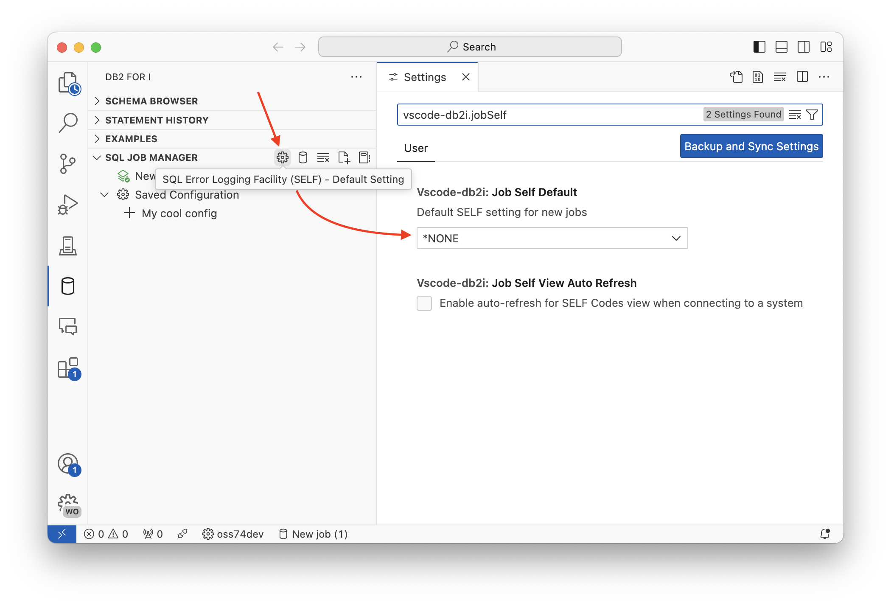

</Card></CardGrid>

#### 2. Using the error view

The SELF view can be found next to the result set view. It is collapsed by default, and clicking on it can be expanded.

Each item in the SELF view is for a specific `SQLCODE` which is displayed in parenthesis. The `SQLCODE` tracks the actual error or warning triggered by a given SQL statement. 

- An error `SQLCODE` must be preceded by a single minus sign (`-`).
- A warning `SQLCODE` can be preceded by an optional plus sign (`+`).

When an item is expanded or hovered over, information about the `SQLCODE` is displayed such as the Job Name, Call Stack, Additional Details, and the SQL statement. The counter on the right of each item denotes the number of occurrences (🔥) of the specific `SQLCODE`. Once the number of occurrences for a given code is greater than 100, we display 💯.

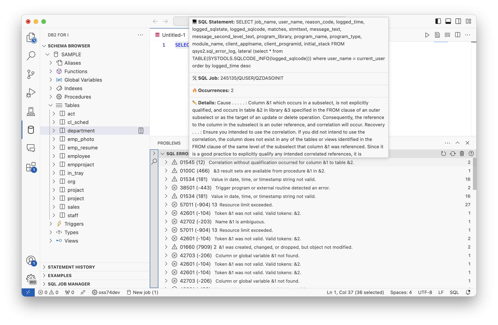

<Aside type="note">
If you are unable to locate the SELF view, you can use F1→filter 'focus SELF'.
</Aside>

#### 3. Capturing errors from programs

This part will demostrate how to capture errors from ILE programs that utilise embedded SQL.

<CardGrid>
<Card>

Create a new member in a source file, or create a streamfile in the IFS, and give it the attribute/extension `.sqlrpgle`. Fill the member with the following content, and then compile it using the Create SQL RPGLE program Action (`CRTSQLRPGI` command).

<Aside type="note">
To create a new member, navigate to the Object Browser, add a `*SRCPF` filter to a schema/library you are working with, right click on the filter and create a source file, then right click on the source file and create a new member.
</Aside>

</Card><Card>

```rpgle
**free

dcl-s mystatement varchar(100);

mystatement = 'select * from scooby.dooby';

exec sql execute immediate :mystatement;

return;
```

</Card></CardGrid>

Then, SQL can be used to call the program as if it were a procedure.

This is only recommended for the purposes of this workshop: `call yourlib.thesqlpgm()`.

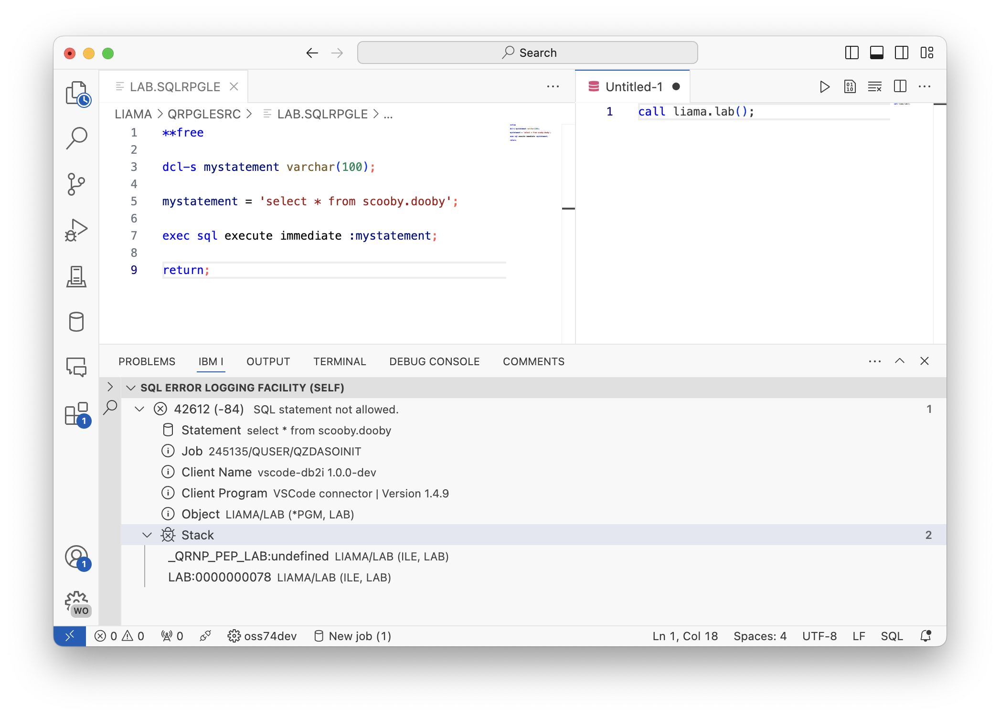

<Aside type="note">
If no error appeared:

1. ensure that SELF is enabled on the selected job with `*ALL` mode.
2. either refresh the SELF view manually, or turn on auto refresh - both are buttons on the SELF view panel.
</Aside>

#### 4. Using SELF outside of VS Code

The SELF view will show any errors captured by the same user that is connected inside of Visual Studio Code. You can use the SQL statement to set the SELF mode in any job where SQL can be run. Then, when logs occur in those jobs, they will appear in the SELF view.

```sql
SET SYSIBMADM.SELFCODES = '*ALL';
```

---

## Notebooks

### Intro

Notebooks are...

### Tasks

#### 1. Creating your first Notebook

#### 2. Using different cell types

#### 3. Saving and sharing Notebooks

#### 4. Charting with Notebooks

#### 5. Chart tooltips

#### 6. Chart datapoints

#### 7. Exporting Notebooks

#### 8. Opening Notebooks from SQL files
