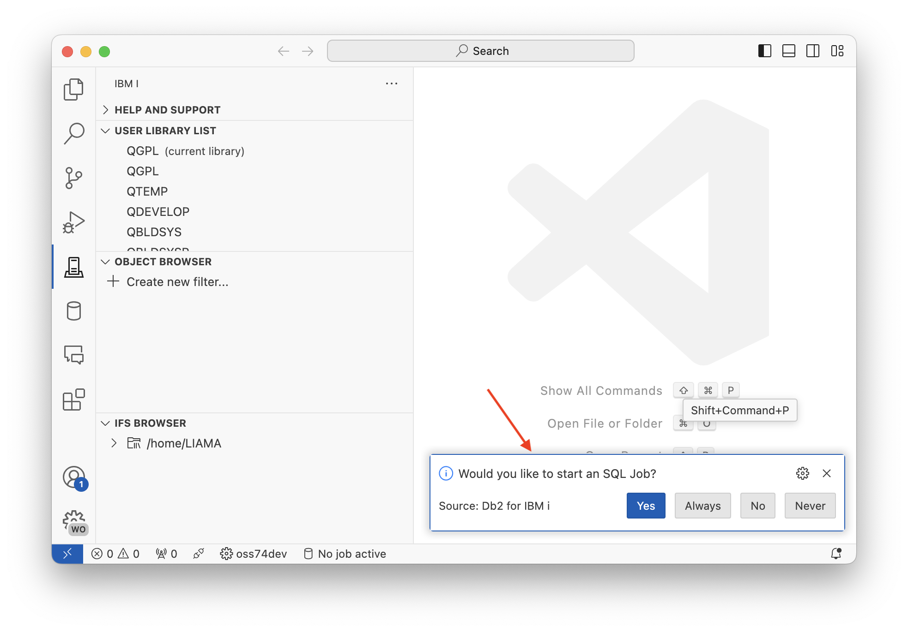
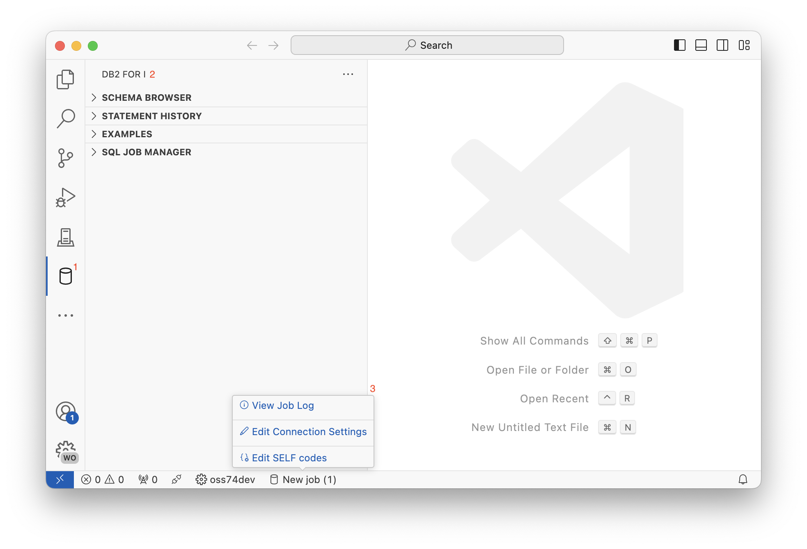
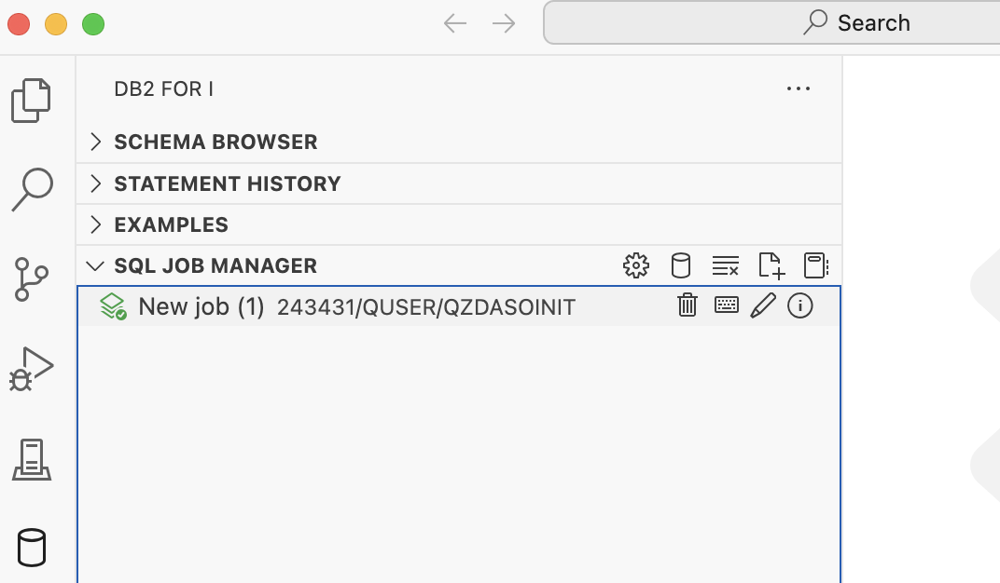
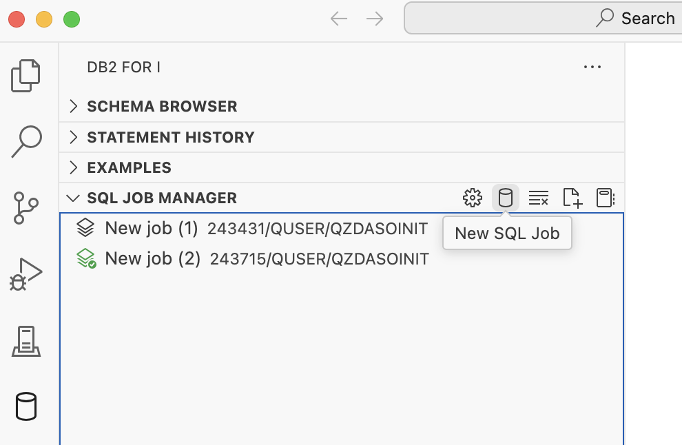
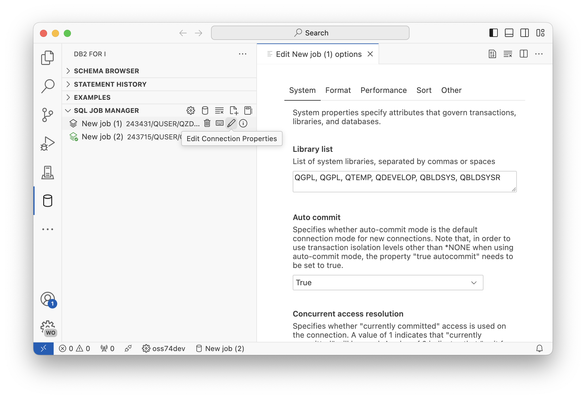
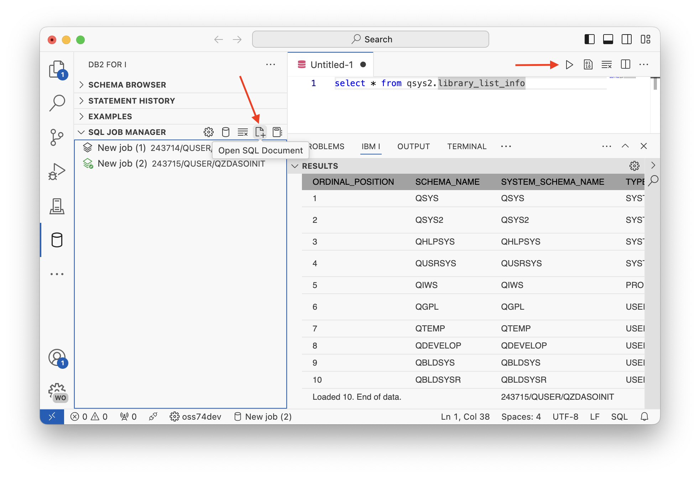
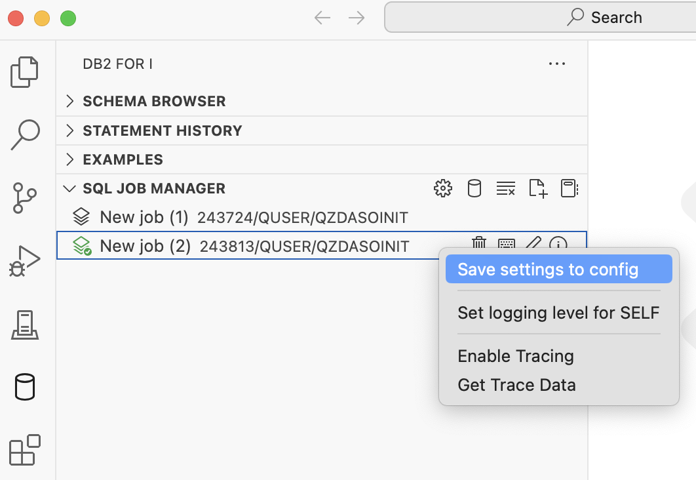
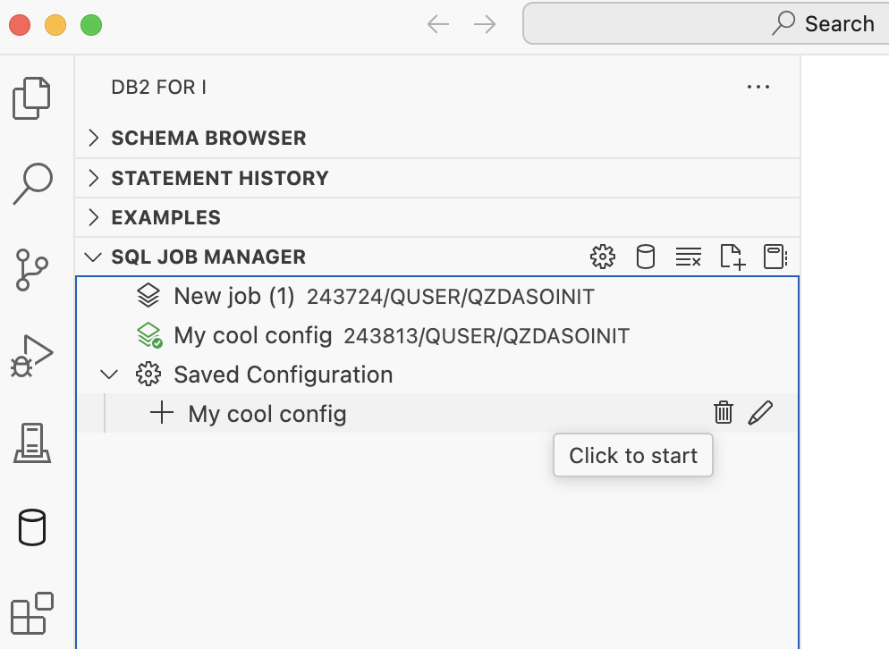
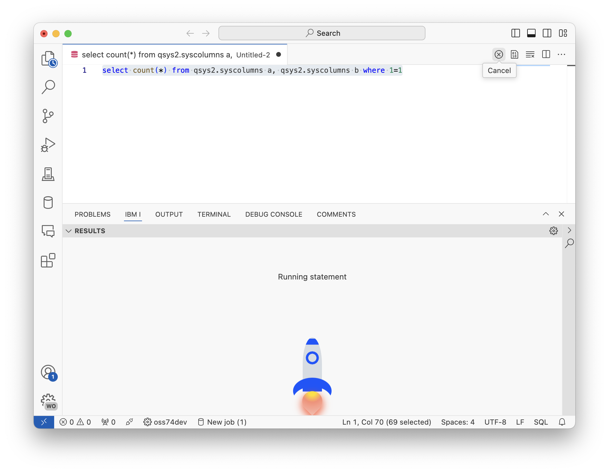
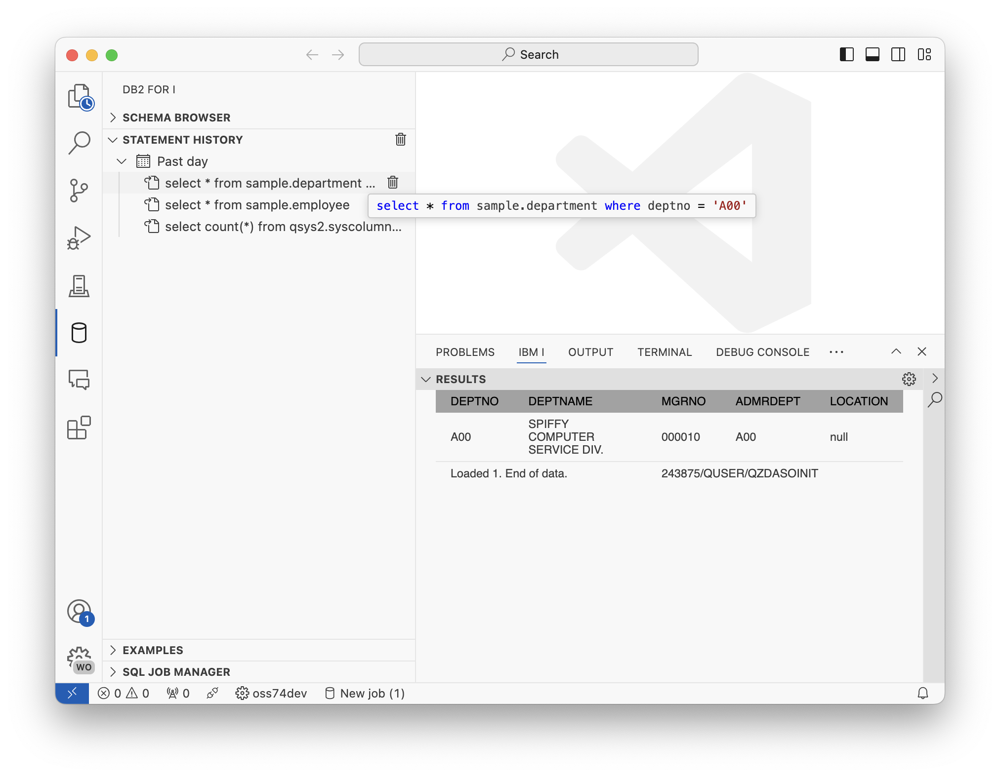

import { Aside, CardGrid, Card } from '@astrojs/starlight/components';

## Outline

* requirements
* Connecting to a system
* Using the job manager
* Executing statements - running statements regularly, running in a view, statement history, cancelling a statement, dealing with host variables, commitment control UI
* Writing SQL - content assist for schemas, table columns, signature info for functions/procedures
* Exporting data - cover the different types of export modes
* Schema browser - adding/removing entries, browsing schemas, viewing different object types, generating SQL, right click options
* Visual explain - explain types, explaining a statement, how to read the data, exporting the data, configuring which nodes to highlight, generating create index statements
* SELF - what is self, how to enable it, using the error view, creating an intentional error, turning SELF on outside of VS Code
* Notebooks - what is a notebook, creating your first notebooks, different cell types, saving and sharing notebooks, charting with notebooks, chart tooltips, chart * datapoints, exporting notebooks, opening a notebook from SQL files

---

## Requirements

This is a BYOD (bring your own device) workshop and some software and accounts are required.

### Tasks

#### Install Visual Studio Code

We are using VS Code to write our code. It is a free, open-source editor with great extensibility.

[Download it here for free](https://code.visualstudio.com/download).

#### Install Code for IBM i and the Db2 for i extension

We are using the Code for IBM i extension to connect to IBM i systems, and then using the Db2 for IBM i extension to work with the database.

**After you have installed Visual Studio Code**, then go ahead and install the [Code for IBM i extension](https://marketplace.visualstudio.com/items?itemName=HalcyonTechLtd.code-for-ibmi) and the [Db2 for IBM i extension](https://marketplace.visualstudio.com/items?itemName=HalcyonTechLtd.vscode-db2i), or, to make life easier in the future, install the [IBM i Development pack](https://marketplace.visualstudio.com/items?itemName=HalcyonTechLtd.ibm-i-development-pack) which contains those extensions and more.

#### Access to an IBM i

If you are doing this workshop as part of a hosted lab, then a user profile and system will be provided to you. If you're using your own system, then ensure SSH is running on your system. [Check out the requirements](../../).

---

## Goals

The main goal of this workshop is to understand how you can use Visual Studio Code to make it easier to work with the database while you work on developing applications.

---

## Connecting to a system

### Tasks

Using the Code for IBM i extension, you can create a new connection to an IBM i system.


If the database extension has never been seen before, you will see a popup asking if you'd like to start an SQL Job. For now, select 'Yes' or 'Always'. More will be covered on this later.



### Db2 for i User Interface



There are three areas that should be known when using the database extension in Visual Studio Code:

1. This database icon is where the database extension can be found inside of VS Code. Clicking it will load the available database panels.
2. When the database extension is select, the panels will show here. Most functionality can be found here.
3. The database extension has a quick pick item on the status bar, which the user can hover over to quickly access specific information.

---

## Using the job manager

### Intro

<CardGrid>
<Card>

The job manager is used to maintain different jobs, all which can be used to execute different SQL statements. You can spin up a new job by clicking the ⛁ (database) icon. Notice that the current job (in the screenshot) has the icon highlighted green. The highlighted job indicates the job that is going to be used when running SQL statements in VS Code. We call this the 'selected job'.

Each job has a set of icons when hovering over the item. Each job has unique JDBC settings, all which can be edited by clicking on the ✎ (pencil) icon. You can also see the job log of a job by selecting on the ℹ (info) button.

There are also additional buttons to open new SQL documents and notebooks.

</Card><Card>



</Card></CardGrid>

### Tasks

#### 1. Spin up two jobs

<CardGrid>
<Card>

For this task, we are going to spin up two jobs that have unique settings for when we run SQL statements.

You can spin up a new job by clicking the ⛁ (database) icon.

<Aside type="note">
The selected job will change when you create new jobs.
</Aside>

</Card><Card>



</Card></CardGrid>

#### 2. Configure the jobs

<CardGrid>
<Card>

Click on the ✎ (pencil) icon of the first job and see that a new tab opens where JDBC settings can be edited.

For a simple change, edit the library list entry under the System tab. **Scroll to the bottom of the page and select 'Apple changes'** to save. The job will be restarted when the changes are applied.

Do this for both jobs that you have.

</Card><Card>



</Card></CardGrid>

#### 3. Execute statements on both jobs

<CardGrid>
<Card>

Use the 'Open SQL document' on the SQL Job Manager view to create an empty SQL document. This new document can be used to test the library list change with an SQL statement:

```sql
select * from qsys2.library_list_info
```

To execute the statement, either the ▶️ (play) button can be pressed - or the shortcut Control/Command+R - can be used to execute the statement. The result set should appear below the SQL document.

Do this with both SQL jobs that were started.

</Card><Card>



</Card></CardGrid>

<Aside type="note">
When selecting on a job in the SQL Job Manager, it becomes the selected job, and will be used when the user executes an SQL statement.
</Aside>

#### 4. Save your job configuration

<CardGrid>
<Card>

Once a job has been configured to your liking, you are able to save the configuration so next time you start a job the settings will already be applied.

Right click on a job and select 'Save settings into config'. This will allow you to provide a name for the configuration.

</Card><Card>



</Card></CardGrid>

<CardGrid>
<Card>

A new group will appear in the SQL Job Manager with your saved configurations.

* click on the configuration to start a new job with that configuration
* use the ✎ (pencil) icon to edit the configuration
* use the 🗑️ (trash/bin) icon to delete the configuration

</Card><Card>



</Card></CardGrid>

### Takeaways

Here are the main items to remember from this section:

* SQL statements run in a unique job
* The user can maintain multiple jobs through the SQL Job Manager
* The user can change the selected job by clicking on it. The selected job is highlighted with a checkmark

---

## Executing statements

### Intro

As discovered in the last section, it is possible to run statements in an SQL document with the ▶️ (play) button, or with the Command/Control+R keyboard shortcut. But there is more, like running statements in a unique view, seeing the statement history, and managing commitment control.

### Tasks

#### 1. Executing statements

<CardGrid>
<Card>

Use the 'Open SQL document' on the SQL Job Manager view to create an empty SQL document. When the active editor is an SQL file (usually the `.sql` extension), then the ▶️ (play) button will appear. 

Clicking the ▶️ (play) button will show a drop down, and the first entry in the list is the action to execute the statement. This shows the view in the lower panel with a scrollable result set.

</Card><Card>


</Card></CardGrid>

#### 2. Cancelling a statement

<CardGrid>
<Card>

When executing a statement, the play button will turn into a ⓧ (cancel) button, which doesn't immediately cancel, but instead requests that job should cancel the current running statement.

Try executing this statement, then use the ⓧ (cancel) button to stop it:

```sql
select count(*) from qsys2.syscolumns a, qsys2.syscolumns b where 1=1
```

</Card><Card>



</Card></CardGrid>

#### 3. Using statement history

<CardGrid>
<Card>

Every time you execute a statement, then the statement will be prepended to the statement history so it can be accessed again quickly in the future. Statements in history are grouped by time period; last day, last week, last month, etc. Hovering over an entry will show it and clicking on it will open it into a brand new document. Single items can be cleared from history, and the entire history can also be cleared.

</Card><Card>



</Card></CardGrid>

#### 5. Managing commitment control

VS Code has a simple UI to show if your job has changes pending to commit in your job. In the screenshot an update statement has been execute, and the result view shows that 1 row was updated. When your job has committment control setup, the hotbar item will highlight when there are pending changes in your job. Hovering on the hotbar item with your current job will show new Commit and Rollback buttons.

<Aside type="note">
For this, **commitment control will need to be turned on for your job**. Edit your job settings, and under the System tab, set 'Auto commit' to False, 'Transaction isolation' to 'Read uncommitted' and 'True autocommit' to false.
</Aside>


---

## Writing SQL

### Intro

Seeing results is useful, but you become an expert when you know how to find out the information you want. By understanding how the content assist works in Visual Studio Code, you can practically navigate entire schemas while you're writing SQL statements.

### Tasks

#### 1. Looking for schemas

#### 2. Looking at objects in schemas

#### 3. Columns from tables, views, and table functions

#### 4. Procedure and function call signatures

#### 5. Dealing with host variables

```sql
select * from qsys2.columns
where 
    data_type = :theType and
    is_nullable = ?
limit 10;
```

---

## Exporting data

### Intro

The Db2 for IBM i extension provides simple ways to export result sets to multiple formats. The SQL processor has support for something called a 'statement prefix', which tells the SQL runner how to process the statement. ACS has support for the `cl` prefix, but VS Code adds to that by supporting `csv`, `json` and `sql`.

### Task

Try executing a statement to generate a CSV document, JSON document and SQL insert statement:

```sql
-- result set as normal table
select * from sample.employee;

-- result set as JSON, will open in a new file
json: select * from sample.employee;

-- result set as CSV, will open in a new file
csv: select * from sample.employee;

-- result set as SQL insert statement
sql: select * from sample.employee;

-- run CL commands. output is directed to IBM i output channel
cl: dspffd sample/employee
```